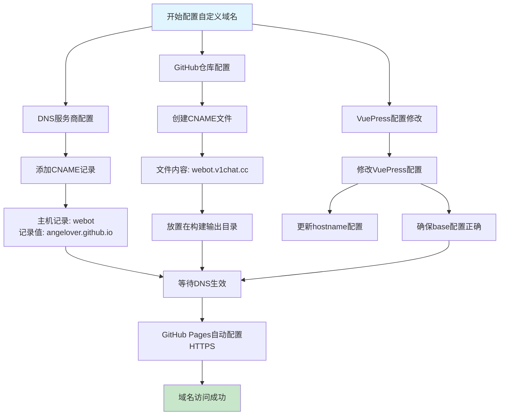

# GitHub Pages 自定义域名配置完整指南

## 配置概述

将 `webot.v1chat.cc` 指向您的GitHub Pages站点需要完成以下步骤：

## 配置流程图



## 详细配置步骤

### 1. DNS解析配置（在域名服务商处）

#### 方法一：CNAME记录（推荐）
```
记录类型：CNAME
主机记录：webot
记录值：angelover.github.io
TTL：600（或保持默认）
```

#### 方法二：A记录（备选）
如果必须使用A记录，配置如下：
```
记录类型：A
主机记录：webot
记录值：185.199.108.153
记录值：185.199.109.153
记录值：185.199.110.153
记录值：185.199.111.153
TTL：600（或保持默认）
```

### 2. GitHub仓库配置

#### 2.1 创建CNAME文件
在项目中需要创建一个CNAME文件，内容为您的域名：

**文件路径**：`docs/.vuepress/public/CNAME`
**文件内容**：
```
webot.v1chat.cc
```

#### 2.2 修改GitHub Actions确保CNAME文件被正确部署
当前的GitHub Actions配置已经会自动将 `docs/.vuepress/dist` 目录部署到 `gh-pages` 分支，只需确保CNAME文件在构建后存在于dist目录中。

### 3. VuePress配置修改

#### 3.1 修改 `docs/.vuepress/config.js`
```javascript
export default defineUserConfig({
  blog: false,
  lang: 'zh-CN',
  // 使用自定义域名，不需要base配置
  // base: '/WeBotDoc/', // 注释掉或删除这行
  
  head: [
    [
      'link', { rel: 'icon', href: '/images/logo.png' },
    ]
  ],
  locales: {
    '/': { lang: 'zh-CN', title: 'NcatBot 文档' }
  },
  theme: plumeTheme({
    // 修改hostname为自定义域名
    hostname: 'https://webot.v1chat.cc',
    docsRepo: 'https://github.com/Isaaczhr/NcatBotDocs',
    docsBranch: 'master',
    docsDir: 'docs',
    // ... 其他配置保持不变
  }),
  bundler: viteBundler(),
})
```

### 4. 验证和测试步骤

#### 4.1 DNS解析验证
使用以下命令验证DNS解析是否正确：
```bash
nslookup webot.v1chat.cc
# 或者
dig webot.v1chat.cc
```

#### 4.2 部署验证
1. 推送代码到仓库
2. 等待GitHub Actions完成构建
3. 检查gh-pages分支是否包含CNAME文件
4. 访问 `https://webot.v1chat.cc` 验证网站是否正常

### 5. 常见问题及解决方案

#### 5.1 DNS生效时间
- CNAME记录通常需要几分钟到24小时生效
- 可以使用在线DNS检测工具验证解析状态

#### 5.2 HTTPS配置
- GitHub Pages会自动为自定义域名配置HTTPS
- 首次配置可能需要等待几分钟

#### 5.3 404错误解决
使用自定义域名后，之前的base路径问题将自动解决，因为：
- 不再需要 `/WeBotDoc/` 路径前缀
- 静态资源路径将直接从根域名开始

## 配置时间线

```mermaid
gantt
    title 域名配置时间线
    dateFormat  X
    axisFormat %s

    section DNS配置
    设置CNAME记录     :done, dns, 0, 1
    DNS传播等待      :active, dns-wait, 1, 60
    
    section GitHub配置  
    创建CNAME文件    :done, cname, 0, 1
    修改VuePress配置  :done, config, 1, 2
    推送代码        :push, 2, 3
    
    section 自动化部署
    GitHub Actions构建 :build, after push, 5
    GitHub Pages部署   :deploy, after build, 3
    
    section 验证测试
    域名访问测试     :test, after deploy, 2
    功能验证        :verify, after test, 5
```



## 总结

完成以上配置后，您的网站将可以通过 `https://webot.v1chat.cc` 访问，并且会自动解决之前的404静态资源问题。

**关键优势**：
- 解决了base路径配置问题
- 提供更专业的访问域名  
- 自动HTTPS支持
- 更好的SEO表现