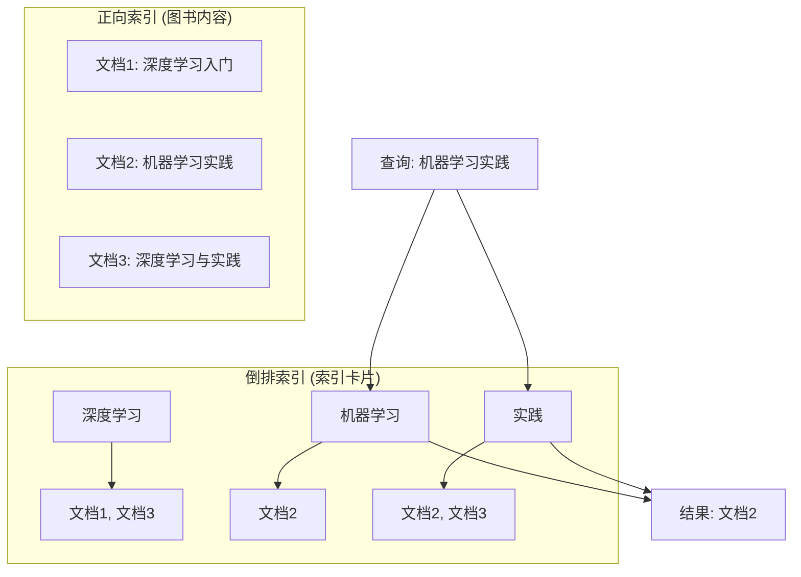

> 🧭 **信息检索 (IR) 是整个搜广推世界的起点，它要解决的是一个最根本的问题：当用户表达需求时，我们如何从亿万信息中，快速找到一个相关的候选集。**

想象一下，整个互联网是一个巨大的、无序的图书馆。信息检索系统就像是这位图书馆的"超级管理员"。它的核心使命，就是在你（用户）提出一个需求（Query）后，帮你**高效地完成"找书"这个动作**。

这个看似简单的"找书"动作，正是搜索、推荐、广告三大场景的共同起点，我们称之为**召回（Recall）**。

-   **在搜索中**，你的Query是明确的搜索词，比如"如何学习深度学习"。
-   **在推荐中**，你的Query是你"本人"——你的历史行为、偏好、画像就是系统输入的无声Query。
-   **在广告中**，Query可以是你的搜索词，也可以是你正在浏览的内容。

因此，理解IR，就是理解所有个性化信息服务的"第一公里"。

## 🏗️ IR系统的核心思想：倒排索引

为了能快速找到包含特定词语的书，任何一个聪明的图书管理员都不会一本一本地去翻。他会提前准备一个"索引卡片"，上面记录着每个词语出现在了哪些书的哪些页码。

这个"索引卡片"，在信息检索中被称为**倒排索引 (Inverted Index)**。

**倒排索引的威力**：它把"遍历所有文档"这个不可能完成的任务，变成了"查找几个词条并做个集合运算"的高效操作，从根本上解决了信息检索的"快"的问题。

## 📈 IR技术的演进：从"字面匹配"到"意图理解"

仅仅"快"是不够的，用户要的是"准"。IR技术的演进史，就是一部不断提升"准度"的探索史。

::: tabs

@tab 1.0 时代：词法匹配 (Lexical Matching)
**核心思想**：一个词在文档中出现次数越多、在所有文档中越稀有，就越重要。
-   **代表技术**：`TF-IDF`、`BM25`
-   **工作方式**：基于词频和文档频率进行打分，完全依赖字面匹配。
-   **优势**：简单、快速、可解释。
-   **局限**：无法理解同义词（如"土豆"和"马铃薯"），也无法理解上下文的语义。这是典型的"字面相关，但语义不相关"。

@tab 2.0 时代：语义匹配 (Semantic Matching)
**核心思想**：将词、句子、文档都映射到一个高维向量空间（Embedding），通过计算向量间的距离来判断语义相似度。这正是您熟悉的深度学习大显身手的地方。
-   **代表技术**：`Word2Vec`、`BERT` 等预训练语言模型
-   **工作方式**：把用户查询和所有文档都"向量化"，然后检索与查询向量"靠得最近"的文档向量。
-   **优势**：能理解同义、近义、反义等复杂语义关系，解决了词法匹配的根本缺陷。
-   **局限**：计算成本高，需要强大的模型和算力支撑。

@tab 3.0 时代：生成式检索 (Generative Retrieval)
**核心思想**：不再只是"寻找"现有的答案，而是"生成"一个最符合用户意图的答案。
-   **代表技术**：`RAG (检索增强生成)`
-   **工作方式**：首先，用语义匹配技术检索出一批相关文档片段（作为背景知识）；然后，让一个大语言模型（LLM）阅读这些背景知识，并像一个专家一样，直接生成一个精准、流畅的答案给用户。
-   **优势**：从"给你一堆链接自己看"，进化到了"直接告诉你答案是什么"，是用户体验的革命性提升。
-   **局限**：对LLM的能力要求极高，存在产生"幻觉"（捏造事实）的风险。
:::

## 🎯 IR在搜广推中的角色定位

信息检索作为"召回"阶段的核心技术，在不同场景下有不同的侧重点：

| 场景 | IR的核心任务 | 技术挑战 |
| :--- | :--- | :--- |
| **搜索 (Search)** | **精准性优先**：严格根据用户查询，找到最权威、最相关的结果。 | 如何深刻理解用户的查询意图，处理歧义和模糊查询。 |
| **推荐 (Recommendation)** | **个性化匹配**：将用户画像作为查询，找到符合其长期和短期兴趣的物品。 | 如何平衡准确性、多样性和新颖性，避免信息茧房。 |
| **广告 (Ads)** | **商业化平衡**：在用户、广告主、平台三者间找到利益平衡点，匹配最可能转化的广告。 | 如何在保证用户体验的同时，最大化平台的商业收益。 |

## 🔍 搜广推三大领域的核心异同

虽然搜索、推荐、广告都基于信息检索技术，但它们在本质上有着显著的差异：

| 对比维度 | 搜索 (Search) | 推荐 (Recommendation) | 广告 (Ads) |
|---------|---------------|---------------------|-----------|
| **用户意图** | 明确主动意图 "我要找X" | 隐含被动接受 "给我看看有什么" | 潜在商业需求 "这对我有用吗？" |
| **商业模式** | 信息获取效率 搜索广告、会员服务 | 内容消费体验 用户时长、内容付费 | 商业转化效果 广告投放、佣金分成 |
| **评估体系** | 准确性优先 NDCG、MAP、点击率 | 多样性平衡 精确率+多样性+新颖性 | 商业效果导向 CTR、CVR、ROI |

## 🔮 IR技术的未来

未来的IR系统将不再仅仅是一个"查找工具"，而是一个"认知智能体"。
-   **多模态融合**：能同时理解文本、图像、声音、视频，实现跨模态的检索。
-   **对话式交互**：能像人类一样，通过多轮对话逐步澄清和满足用户的复杂需求。
-   **主动探索**：能预判用户的潜在需求，主动提供信息和服务。

## 📖 **延伸阅读**

1. [《信息检索导论》- 斯坦福大学](https://nlp.stanford.edu/IR-book/): 信息检索领域的经典教材，免费在线阅读
2. [Elasticsearch官方文档](https://www.elastic.co/guide/en/elasticsearch/reference/current/index.html): 现代搜索引擎的实用指南
3. [BERT论文 - Google AI](https://arxiv.org/abs/1810.04805): 深度语义匹配的里程碑论文
4. [Faiss - Facebook AI](https://github.com/facebookresearch/faiss): 高效相似性搜索和聚类的开源库
5. [LangChain RAG教程](https://python.langchain.com/docs/use_cases/question_answering): 检索增强生成的实践指南

> 🧠 **思考题**
> 
> 1.  为什么在推荐场景中，用户的"画像"可以被看作是一种"查询"？它和搜索查询有什么异同？
> 2.  语义匹配（向量检索）虽然强大，但完全抛弃词法匹配（倒排索引）可行吗？为什么现代搜索引擎往往是两者结合？
> 3.  RAG（检索增强生成）在给你直接答案的同时，也可能"一本正经地胡说八道"（幻觉）。你认为可以设计什么机制来验证或减轻这种风险？
> 4.  从IR（召回）的角度看，你认为搜索、推荐、广告三个场景，哪个对"多样性"的要求最高，哪个对"精准性"的要求最高？为什么？

::: tip 🎉 章节小结
信息检索（IR）是搜广推系统的"发动机"和"第一公里"，它通过倒排索引和向量检索等技术，从海量信息中高效地召回一个相关的候选集。其技术演进的核心脉络，就是从简单的"字面匹配"走向深刻的"语义理解"，并最终在LLM时代迈向"生成答案"的全新范式。无论技术如何变迁，IR连接用户需求与信息资源的"桥梁"角色，始终是其不变的本质。
:::

---

> "信息检索的本质，是在无穷的信息宇宙中，为每一个迷航的意图，点亮一串归航的星火。"

