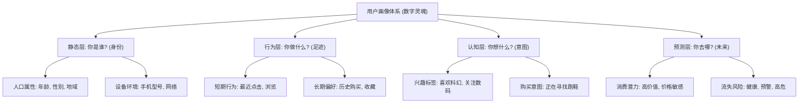

> 🎭 **用户画像，就是为每一个冰冷的用户ID，塑造一个鲜活的"数字灵魂"。它是系统用来"认识你、理解你、服务你"的基石。**

在前一章，我们知道了信息检索（IR）可以根据用户的查询（Query）返回相关内容。但一个新的问题随之而来：当两个不同的人搜索同一个词，比如"Jaguar"，系统应该返回汽车还是美洲豹？

要做出智能的判断，系统必须先"认识"这两个用户。这就是用户画像（User Profiling）的核心价值：**为个性化服务提供决策依据**。

用户画像的本质，就是把用户在数字世界中留下的各种零散、无序的"足迹"（行为数据），通过分析和建模，整合、提炼成一个结构化的、可被机器理解的"身份档案"。

## 🏗️ 画像的层次：从"你是谁"到"你将往何处去"

一个完整的用户画像体系，通常像洋葱一样，是分层的。从外到内，时效性越来越强，预测性也越来越强。

这个分层结构决定了个性化服务的深度：
-   **静态层**：实现粗粒度的用户分群和定向，比如"给上海地区的用户推送本地新闻"。
-   **行为/认知层**：实现精准的个性化推荐，比如"给最近浏览过科幻电影的用户推荐《沙丘2》"。
-   **预测层**：实现主动的、前瞻性的运营和关怀，比如"为有流失风险的用户发放一张挽留优惠券"。

## 📈 画像的构建技术：从"贴标签"到"塑灵魂"

构建画像的技术，也经历了从简单统计到深度学习的演进。

::: tabs

@tab 1.0 时代：规则与统计 (贴标签)
**核心思想**：基于明确的规则和统计阈值为用户"贴标签"。
-   **工作方式**：
    -   `IF` 用户近30天购买次数 > 5 `THEN` 标签="高频买家"
    -   `IF` 用户最后登录时间 > 90天 `THEN` 标签="流失用户"
-   **优势**：简单、直观、可解释性强。
-   **局限**：标签体系僵化，无法捕捉用户的细微和动态变化，是一种"粗线条"的描述。

@tab 2.0 时代：机器学习 (建模型)
**核心思想**：使用传统机器学习算法来做更精细的分类和聚类。
-   **代表技术**：
    -   `K-Means`：将用户聚类成不同的群体，如"价格敏感型"、"品质追求型"。
    -   `逻辑回归/SVM`：预测用户的属性，如根据行为预测性别、年龄段。
-   **优势**：比规则法更精细，能发现一些隐藏的模式。
-   **局限**：仍然依赖大量的人工特征工程。

@tab 3.0 时代：深度学习 (塑灵魂)
**核心思想**：不再满足于零散的标签，而是用一个高维向量（Embedding）来完整地"表示"一个用户。这个**User Embedding**就是用户的"数字灵魂"。
-   **工作方式**：构建一个深度学习模型（如双塔模型），将用户的ID、行为序列、静态属性等所有信息作为输入，最终输出一个统一的、稠密的向量。
-   **优势**：
    1.  **信息高度浓缩**：一个向量包含了用户的全部信息，远比零散标签强大。
    2.  **关系可度量**：可以在向量空间中计算用户的相似度。两个"志同道合"的用户，他们的向量在空间中的距离会非常近。
    3.  **端到端学习**：无需繁琐的人工特征工程，模型可以自动捕捉最有用的信息。

@tab 4.0 时代：LLM增强 (能对话)
**核心思想**：利用大语言模型（LLM）的常识推理和自然语言理解能力，从用户的行为序列中洞察更深层次的、甚至是常识性的意图。
-   **工作方式**：一个用户最近看了"婴儿床"，搜索了"纸尿裤"，收藏了"吸奶器"。传统的画像系统可能只会给他打上"母婴"标签。而LLM可以直接推理出他处于"新手父母"这个**人生阶段 (Life Stage)**，从而可以推荐更精准的服务，比如"新生儿护理课程"。
-   **优势**：让用户画像从"知道你喜欢什么"，进化到了"理解你正在经历什么"。
:::

## 🎯 用户画像在搜广推中的应用

用户画像是个性化系统的"中央厨房"，为所有下游应用提供"原料"。

| 场景 | 画像扮演的角色 | 典型应用 |
| :--- | :--- | :--- |
| **搜索 (Search)** | **意图澄清器** | 同样是搜索"苹果"，给数码爱好者返回iPhone，给吃货返回水果。|
| **推荐 (Recommendation)** | **需求的代理** | 用户画像本身就是"查询"，系统召回与这个"查询"最匹配的物品。|
| **广告 (Ads)** | **精准的靶心** | 作为受众定向（Targeting）的核心依据，让广告精准触达目标人群。|

## 🔒 隐私与伦理：不可触碰的红线

用户画像技术是一把双刃剑，它在提供便利的同时，也带来了隐私泄露的风险。因此，现代用户画像系统必须建立在**尊重和保护用户隐私**的基础之上。
-   **数据最小化原则**：只收集业务所必需的最少信息。
-   **用户知情同意**：明确告知用户数据用途，并允许用户管理或删除自己的画像。
-   **隐私保护计算**：采用差分隐私、联邦学习等技术，在不接触原始数据的情况下完成模型训练，做到"数据可用但不可见"。

---

## 📖 **延伸阅读**

1. [美团技术博客 - 用户画像实践](https://tech.meituan.com/tags/%E7%94%A8%E6%88%B7%E7%94%BB%E5%83%8F.html): 工业界用户画像的实际案例
2. [推荐系统实战 - 项亮](https://book.douban.com/subject/10769749/): 了解用户画像在推荐系统中的应用
3. [Scikit-learn用户指南](https://scikit-learn.org/stable/user_guide.html): 机器学习算法的实用参考

> 🧠 **思考题**
> 
> 1.  同样是描述用户的"数字灵魂"，你认为"标签体系"和"User Embedding"这两种画像技术，各自最大的优缺点是什么？
> 2.  一个用户的画像是应该"实时更新"还是"定期更新"？请举例说明什么场景适合高时效性，什么场景又不需要。
> 3.  如果让你来设计一个电商APP的用户画像系统，你会优先考虑构建用户的哪些画像标签或维度？为什么？
> 4.  在完全不侵犯用户隐私（例如，所有计算都在用户手机本地完成）的前提下，你认为还能构建起有效的用户画像吗？可能会用到什么技术？

::: tip 🎉 章节小结
用户画像是个性化服务的核心与前提，它将零散的用户行为数据转化为结构化的、可被机器理解的"数字灵魂"。其技术演进，经历了从"贴标签"的规则统计，到"塑灵魂"的深度学习Embedding，再到LLM增强的"共情理解"的飞跃。一个优秀的用户画像体系，不仅要准确、实时地描绘用户，更要在提供极致个性化体验的同时，坚守住用户隐私和伦理的底线。
:::

---

> "真正的个性化，并非给用户他想要的，而是替用户想到他没说出口的。"
