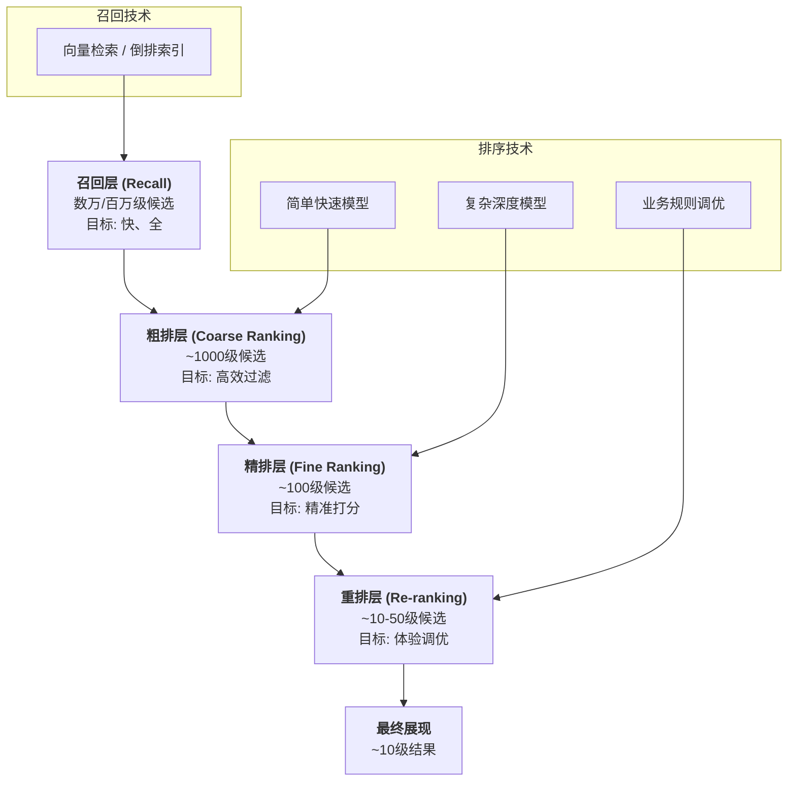

> 🏆 **如果说"召回"是海选，"排序"就是决赛。它决定了最终哪些内容能登上"领奖台"，以什么样的顺序呈现在用户面前。这是整个搜广推系统中，距离商业目标和用户体验最近的一环。**

在前两章，我们了解了如何通过**信息检索（召回）** 从海量信息中找到一个相关的候选集（比如1000个商品），以及如何通过**用户画像**来深刻理解用户的偏好。

现在，排序（Ranking）要做的，就是在这1000个候选商品中，运用复杂的模型，进行**精准到毫厘的价值预估**，然后挑选出最符合用户心意、也最符合平台利益的10个，并以最佳顺序呈现出来。

排序是整个系统的"临门一脚"，它直接决定了用户的去留和平台的收入。

## 🏗️ 工业界标准范式：多阶段排序"漏斗"

面对上千个候选物，直接用一个极其复杂的深度学习模型去逐一打分，在计算成本和响应时间上是不可接受的。因此，工业界普遍采用的是一套 **"分层过滤"** 的漏斗式架构。

这个漏斗架构的设计哲学，是在**效果、成本、延迟**三者之间做极致的权衡：
-   **粗排层**：用简单快速的模型，快速淘汰掉90%明显不相关的候选者
-   **精排层**：用复杂精准的模型，对剩下的候选者进行精确价值预估
-   **重排层**：基于业务规则和用户体验，进行最终的排序调优

## 📈 排序的核心挑战：从"匹配"到"预测"

排序系统面临的根本挑战，是要从"相关性匹配"进化到"行为预测"：

::: tabs

@tab 相关性匹配
- **目标**：找到与用户查询最相关的内容
- **方法**：基于内容特征的相似度计算
- **代表场景**：搜索引擎的网页排序
- **局限**：无法捕捉用户的个性化偏好

@tab 行为预测  
- **目标**：预测用户对内容的行为倾向
- **方法**：基于机器学习的点击率/转化率预估
- **代表场景**：推荐系统的个性化排序
- **优势**：能够实现真正的个性化服务

@tab 多目标优化
- **目标**：平衡多个业务指标和用户体验
- **方法**：多任务学习和约束优化
- **代表场景**：信息流推荐的综合排序
- **挑战**：需要在准确性、多样性、公平性间取得平衡
:::

## 🎯 Learning to Rank：排序问题的建模范式

从机器学习的角度看，排序问题有三种主流的建模思路：

| 范式 | 核心思想 | 优势 | 局限 | 应用场景 |
|------|----------|------|------|----------|
| **Pointwise** | 独立预测每个项目的相关性分数 | 简单直接，易于实现 | 忽略项目间的相对关系 | 点击率预估 |
| **Pairwise** | 预测两个项目之间的相对顺序 | 直接建模排序关系 | 计算复杂度高 | 搜索结果排序 |
| **Listwise** | 直接优化整个列表的排序质量 | 最接近排序本质 | 实现难度大 | 学术研究 |

在工业界，**Pointwise** 因其简单高效，是目前最主流的应用范式。

## 🔮 排序系统的未来趋势

排序技术正在朝着更加智能化和个性化的方向发展：

- **多模态融合**：结合文本、图像、视频等多种信息进行排序
- **实时个性化**：根据用户当前上下文动态调整排序策略  
- **可解释性增强**：让用户理解为什么会看到这样的排序结果
- **长期价值优化**：从短期点击优化向长期用户价值优化转变

## 📖 **延伸阅读**

1. [《机器学习》- 周志华](https://book.douban.com/subject/26708119/): 机器学习的经典教材，涵盖排序学习基础
2. [TensorFlow推荐系统教程](https://www.tensorflow.org/recommenders): Google官方的推荐系统开发指南  
3. [XGBoost官方文档](https://xgboost.readthedocs.io/en/stable/): 梯度提升树的工业级实现

> 🧠 **思考题**
> 
> 1. 为什么排序系统要采用多阶段漏斗架构，而不是一步到位？
> 2. 在什么情况下，相关性匹配比行为预测更重要？
> 3. 如何理解排序系统中"个性化"与"多样性"的关系？

::: tip 🎉 章节小结
排序是搜广推系统的"最后一公里"，它将召回的候选集转化为用户最终看到的结果。多阶段漏斗架构是工业界的标准范式，在效果、成本、延迟间取得了最佳平衡。排序的核心，是从简单的相关性匹配进化到复杂的行为预测和多目标优化。理解排序，就是理解搜广推系统如何做出最终的、最关键的决策。
:::

---

> "排序的艺术，在于用算法的理性，去洞察人性的感性。"