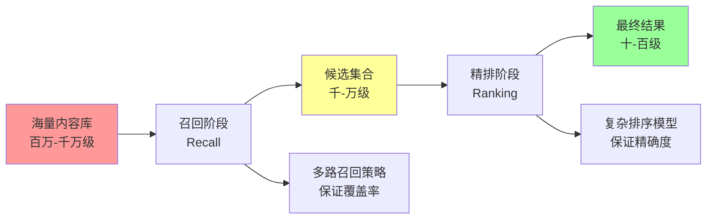
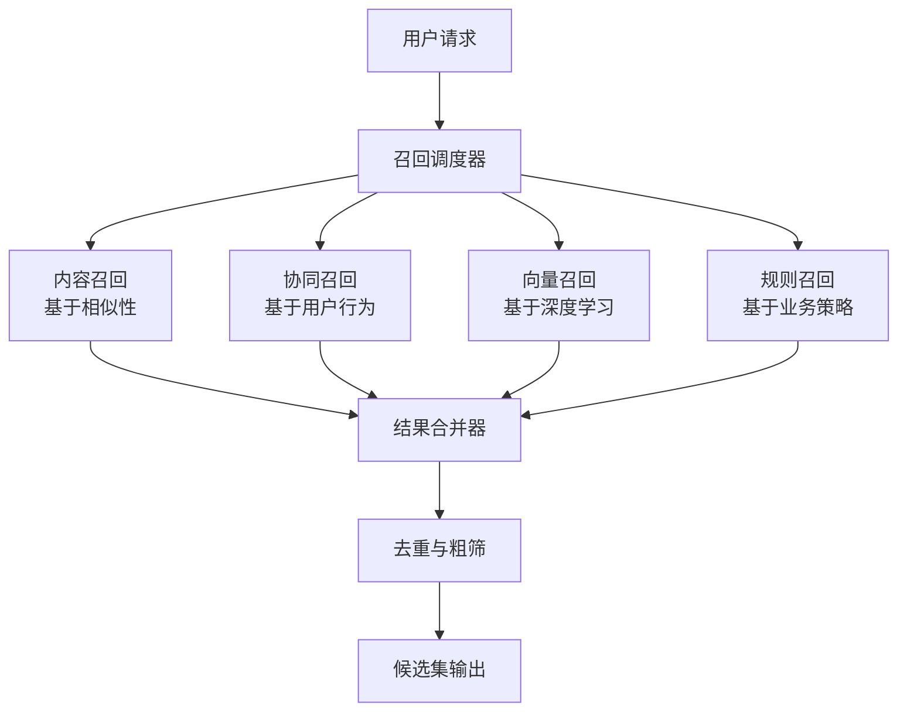
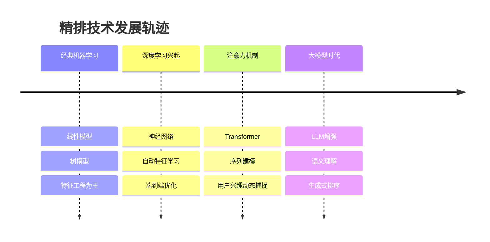

> 🎯 **召回与精排就像是漏斗的两个关键环节**——召回决定了"能找到什么"，精排决定了"优先看到什么"。两者缺一不可，共同构成了现代搜广推系统的核心流水线。

在前面的章节中，我们已经理解了排序（Ranking）是做出最终决策的算法核心。你可能会好奇：既然排序已经能够对所有候选内容进行精准打分，为什么还需要"召回"这个环节？为什么不能直接对所有内容进行排序？

答案就在**效率与效果的权衡**之中。这就引出了现代搜广推系统最核心的设计思想：**"两步走"战略**。

## 🔍 核心概念：从理解到实践

### 什么是召回（Recall）？

召回是信息检索系统的**第一道关卡**，它的使命是从海量信息中快速筛选出**可能相关**的候选集合。召回追求的是**覆盖性**而非精确性——宁可多选，不可漏选。

::: tip 召回的核心特征
- **目标**：最大化相关内容的覆盖率
- **策略**：多路并行，广撒网  
- **性能要求**：高效率，低延迟
- **评判标准**：是否遗漏了用户真正感兴趣的内容
:::

### 什么是精排（Precision Ranking）？

精排是信息检索系统的**精细化处理**环节，它的使命是对召回的候选集进行**精确排序**，确保最相关、最有价值的信息排在前面。精排追求的是**精确性**和**个性化**。

::: tip 精排的核心特征
- **目标**：最大化排序结果的精确度
- **策略**：复杂模型，精细计算
- **性能要求**：高精度，个性化
- **评判标准**：用户是否点击了排在前面的结果
:::

## 🌊 召回与精排的协同关系

### 协同工作的设计哲学

| 对比维度 | 召回阶段 | 精排阶段 |
|----------|----------|----------|
| **主要目标** | 找全（覆盖率） | 找准（精确度） |
| **计算复杂度** | 低复杂度 | 高复杂度 |
| **候选规模** | 缩减90%+ | 精选Top结果 |
| **模型特点** | 简单快速 | 复杂精确 |
| **优化重点** | 多样化策略 | 个性化建模 |

## 🎣 召回系统：多路并发的智慧

### 为什么需要多路召回？

单一的召回策略往往存在**视角局限性**。比如：
- 仅基于内容相似性的召回，可能错过用户的新兴趣
- 仅基于协同过滤的召回，难以推荐新物品
- 仅基于热门度的召回，缺乏个性化

因此，现代召回系统采用**多路并行**的策略：

### 召回的核心技术类型

::: tabs

@tab 基于内容的召回
- **原理**：内容相似则用户可能感兴趣
- **技术**：TF-IDF、词向量、语义匹配
- **优势**：冷启动友好，可解释性强
- **局限**：难以发现用户潜在兴趣变化

@tab 基于协同过滤的召回  
- **原理**：相似用户的偏好具有参考价值
- **技术**：用户CF、物品CF、矩阵分解
- **优势**：能发现跨领域的关联性
- **局限**：存在冷启动问题，计算复杂

@tab 基于深度学习的召回
- **原理**：学习用户和物品的深层表示
- **技术**：双塔模型、序列建模、图神经网络
- **优势**：表征能力强，端到端优化
- **局限**：模型复杂度高，可解释性差

@tab 基于规则的召回
- **原理**：结合业务逻辑和运营策略
- **技术**：热门榜单、地域推荐、时效性推荐
- **优势**：灵活可控，保证基础体验
- **局限**：依赖人工规则，缺乏个性化
:::

## 🎯 精排系统：千军万马过独木桥

精排系统面临的是一个**资源受限下的最优选择问题**：如何在有限的展示位置上，选出最符合用户需求和平台目标的内容？

### 精排的核心挑战

- **个性化程度**：如何准确理解每个用户的独特偏好？
- **实时性要求**：如何在毫秒级别内完成复杂的排序计算？
- **多目标平衡**：如何平衡准确性、多样性、新颖性、公平性？
- **长期优化**：如何兼顾短期点击和长期用户价值？

### 精排的技术演进方向

## 🔄 召回与精排的协同优化

### 传统模式 vs 现代模式

**传统模式**：召回和精排各自为政
- 召回系统：只关心能否找到相关内容
- 精排系统：只关心如何排序已有候选

**现代模式**：端到端联合优化
- 共享用户表示：召回和精排使用一致的用户embedding
- 联合训练：同时优化召回准确性和排序质量
- 反馈循环：精排结果指导召回策略调整

### 质量评估思路

由于这是概念介绍章节，我们只需要理解评估的**基本思路**，具体指标后续章节会详细讲解：

**召回阶段评估重点**：
- 是否遗漏了用户真正感兴趣的内容？
- 召回的候选集是否足够多样化？
- 系统响应速度是否满足要求？

**精排阶段评估重点**：
- 排在前面的结果用户是否更愿意点击？
- 整体的用户体验是否得到提升？
- 不同用户群体是否都得到了公平对待？

## 🚀 未来发展趋势

### LLM时代的召回精排革命

**语义理解增强**：
- 更准确的用户意图识别
- 更深层的内容语义理解
- 跨模态的信息融合

**交互方式变革**：
- 从被动推荐到主动对话
- 从单轮交互到多轮精化
- 从结果展示到解释推理

## 📖 延伸阅读

1. [推荐系统实战 - 项亮](https://book.douban.com/subject/10769749/): 理解召回和精排在推荐系统中的作用
2. [《信息检索导论》- 斯坦福](https://nlp.stanford.edu/IR-book/): 从信息检索角度理解召回和精排
3. [Whoosh - Python搜索库](https://whoosh.readthedocs.io/en/latest/): 轻量级全文搜索引擎，学习倒排索引原理
4. [Annoy - Spotify开源](https://github.com/spotify/annoy): 近似最近邻搜索库，理解向量召回
5. [YouTube推荐系统论文](https://research.google/pubs/pub45530/): 了解工业界召回精排的经典案例

> 🧠 **思考题**
> 
> 1. 为什么不能用一个模型同时解决召回和精排问题？
> 2. 在什么场景下，召回的重要性会超过精排？
> 3. 如何平衡召回阶段的"全面性"和精排阶段的"精确性"？

::: tip 🎉 章节小结
召回与精排是搜广推系统的"黄金搭档"，召回负责从海量信息中找到可能相关的候选集，精排负责从候选集中选出最优结果。这种"两步走"的设计，既保证了系统的效率，又确保了结果的质量。理解召回与精排的协同关系，是掌握现代信息检索系统的关键。
:::

---

> "召回决定了可能性的边界，精排决定了现实的选择。"
