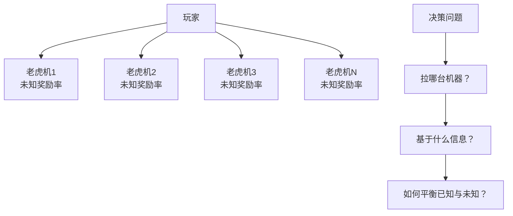

> 🎰 **探索与利用就像是人生的永恒选择题**——是选择已知的安全路径（利用），还是去尝试未知的可能性（探索）？这个古老的哲学问题，在推荐系统中有了精确的数学解答。

通过前面几章的学习，我们已经构建了搜广推系统的技术全貌。但是，一个更深层次的问题随之而来：**当我们已经知道用户喜欢什么的时候，我们应该一直推荐他喜欢的内容吗？**

这看似是一个简单的问题，实则触及了推荐系统的**哲学内核**。如果我们总是推荐用户"已知喜欢"的内容，用户会陷入信息茧房；但如果我们推荐太多"未知"的内容，用户可能会因为不感兴趣而离开。

这就是 **探索与利用（Exploration & Exploitation）** 要解决的核心问题。

## 🌟 从生活场景理解E&E：选择餐厅的智慧

让我们从一个生活中的例子来理解这个问题：

**场景**：你刚到一个新城市，需要选择晚餐的餐厅。

::: tabs

@tab 纯利用策略
**策略**：总是去你已经知道好吃的那家餐厅

**优点**：
- 确定能吃到满意的晚餐
- 不会踩雷，体验稳定

**缺点**：
- 永远发现不了更好的餐厅
- 生活变得单调乏味
- 错过了很多美食机会

**推荐系统类比**：总是推荐用户历史上点击过的同类内容

@tab 纯探索策略
**策略**：每天都尝试不同的新餐厅

**优点**：
- 有机会发现意想不到的美食
- 生活充满新鲜感和惊喜

**缺点**：
- 经常可能踩雷，吃到难吃的
- 浪费时间和金钱
- 用户体验不稳定

**推荐系统类比**：总是推荐用户从未接触过的全新内容

@tab 平衡策略
**策略**：大部分时候去熟悉的好餐厅，偶尔尝试新的

**优点**：
- 保证基本的用餐体验
- 又能发现新的好餐厅
- 在稳定中寻求突破

**挑战**：
- 如何决定什么时候探索？
- 如何选择值得尝试的新餐厅？
- 如何平衡安全和冒险？

**推荐系统类比**：在推荐用户喜欢的内容基础上，适当引入新颖内容
:::

## 🎯 推荐系统中的E&E困境

### 现实中的具体问题

让我们看看推荐系统在实际应用中面临的具体困境：

**问题1：新用户冷启动**
- **场景**：一个新注册的用户，我们对他一无所知
- **困境**：没有历史数据可以"利用"，只能"探索"
- **挑战**：如何快速了解用户偏好，又不让用户因为推荐不准而流失？

**问题2：新内容曝光**
- **场景**：平台上新发布了一篇文章或一个视频
- **困境**：没有人看过，不知道质量如何
- **挑战**：如何给新内容机会，又不影响用户体验？

**问题3：用户兴趣演化**
- **场景**：用户的兴趣随时间发生变化
- **困境**：一直推荐历史喜欢的内容，可能已经过时
- **挑战**：如何及时发现用户兴趣的变化？

**问题4：信息茧房避免**
- **场景**：用户只看到同质化的内容
- **困境**：算法越来越"了解"用户，推荐越来越窄
- **挑战**：如何在个性化和多样性之间取得平衡？

## 🎲 多臂老虎机：让选择变成数学问题

为了系统地解决E&E问题，我们需要一个数学框架。 **多臂老虎机（Multi-Armed Bandit）** 就是这样一个经典模型。

### 为什么叫"多臂老虎机"？

想象一下赌场里的老虎机：
- 每台老虎机有一个"手臂"，拉动后会给出奖励
- 不同老虎机的奖励概率不同，但你不知道
- 你有限的硬币，如何分配才能获得最大奖励？

### 推荐系统中的"多臂老虎机"

将这个模型映射到推荐系统：
- **每个"手臂"**：一个可以推荐的内容
- **"拉动手臂"**：将内容推荐给用户
- **"奖励"**：用户的反馈（点击、点赞、购买等）
- **"奖励概率"**：用户对该内容感兴趣的概率

**核心挑战**：在不知道每个内容真实吸引力的情况下，如何选择推荐哪些内容？

## 🧠 解决E&E问题的基本思路

### 衡量策略好坏：遗憾值概念

**什么是遗憾值？**

简单来说，遗憾值就是"我们的选择"与"最优选择"之间的差距。

**生活例子**：
- 你选择了一家餐厅，满意度是7分
- 如果你选择了最好的那家餐厅，满意度能达到9分
- 那么这次选择的"遗憾值"就是 9-7=2分

**推荐系统例子**：
- 你推荐了内容A，用户点击率是0.1
- 如果推荐最佳内容B，点击率能达到0.3
- 这次推荐的遗憾值就是 0.3-0.1=0.2

**好策略的标准**：累积的遗憾值增长得越来越慢，最终接近零。

### 三种基本解决思路

::: tabs

@tab 乐观策略：UCB算法
**核心思想**：对不确定的选项保持乐观态度

**人话解释**：
"我对这家新餐厅不太了解，但也许它是隐藏的宝藏。不确定的时候，我倾向于给它一个机会。"

**算法逻辑**：
- 对每个选项，计算"平均表现 + 不确定性奖励"
- 不确定性越大，奖励越高
- 选择总分最高的选项

**适用场景**：当你想要系统性地探索所有可能性时

@tab 概率策略：ε-贪心
**核心思想**：以小概率随机尝试新选项

**人话解释**：
"大部分时候我去熟悉的好餐厅，但偶尔（比如10%的时间）我会随机尝试一家新餐厅。"

**算法逻辑**：
- 90%的时间选择目前最好的选项（利用）
- 10%的时间随机选择其他选项（探索）
- 可以调整这个比例

**适用场景**：简单易懂，适合快速原型验证

@tab 贝叶斯策略：Thompson采样
**核心思想**：基于概率分布进行智能采样

**人话解释**：
"我对每家餐厅都有一个'可能好吃程度'的概率估计。根据这个估计，我按概率选择餐厅。越可能好吃的，被选中的概率越高。"

**算法逻辑**：
- 为每个选项维护一个"好坏程度"的概率分布
- 根据过往经验不断更新这个分布
- 基于当前分布进行采样选择

**适用场景**：理论性质好，实际效果通常很优秀
:::

## 🎯 现实应用中的考量

### 个性化E&E：不是所有用户都一样

在餐厅例子中，我们假设每个人对餐厅的喜好是一样的。但现实中：
- 有人喜欢川菜，有人喜欢粤菜
- 有人喜欢实惠，有人不在乎价格
- 有人爱冒险，有人偏保守

**推荐系统也是如此**：
- 不同用户对同样内容的兴趣不同
- 需要结合用户特征进行个性化的E&E
- 这就是 **上下文老虎机（Contextual Bandit）** 的概念

### 多目标平衡：不只是点击率

现实中的推荐系统需要平衡多个目标：

**短期目标 vs 长期目标**：
- 短期：提高点击率、转化率
- 长期：用户留存、平台生态健康

**个人利益 vs 整体利益**：
- 个人：给用户推荐最感兴趣的内容
- 整体：给新创作者和优质内容更多机会

**效率 vs 公平**：
- 效率：推荐最可能成功的内容
- 公平：避免马太效应，给所有内容公平机会

## 🚀 LLM时代的新可能

### 从数值优化到语义理解

传统的E&E主要基于数值特征，但LLM带来了新的可能：

**传统方式**：
"用户A喜欢类目'科技'的内容，相似度0.8"

**LLM增强方式**：
"用户A最近在关注人工智能发展，特别是对AI安全和伦理问题感兴趣。可以推荐一些讨论AI监管政策的深度分析文章。"

**优势**：
- 更深层的语义理解
- 更准确的意图推断
- 更自然的探索方向

### 可解释的探索推荐

**传统推荐**：
"因为你可能感兴趣，所以推荐这个。"

**可解释探索**：
"基于你对科技新闻的兴趣，我想你可能也会喜欢这篇关于生物技术的文章。虽然领域不同，但都涉及前沿科学，让我们看看是否能为你打开新的兴趣领域。"

## 📖 延伸阅读

1. [《强化学习导论》- Sutton & Barto](https://web.stanford.edu/class/psych209/Readings/SuttonBartoIPRLBook2ndEd.pdf): 理解E&E问题的理论基础，免费PDF
2. [推荐系统实战 - 项亮](https://book.douban.com/subject/10769749/): 了解E&E在推荐系统中的实际应用
3. [Vowpal Wabbit - 微软开源](https://vowpalwabbit.org/): 支持上下文老虎机的在线学习平台
4. [OpenAI Gym Bandits](https://github.com/JKCooper2/gym-bandits): 多臂老虎机的强化学习环境

> 🧠 **思考题**
> 
> 1. 在你日常使用的APP中，你能观察到哪些"探索"的痕迹？它们是如何平衡探索和利用的？
> 2. 如果你是一个新餐厅的老板，你会希望推荐系统如何对待你的餐厅？
> 3. 什么情况下，用户会更愿意接受"探索性"的推荐？什么情况下会更抗拒？
> 4. LLM如何改变我们对"探索"的理解？语义理解能带来哪些新的探索可能？

::: tip 🎉 章节小结
探索与利用是推荐系统的"灵魂拷问"：是满足用户当下的明确需求，还是挖掘用户潜在的未知兴趣？通过餐厅选择的生活化例子，我们理解了E&E问题的本质。多臂老虎机为这个问题提供了数学框架，而各种算法策略则提供了实用的解决方案。在LLM时代，E&E正在从简单的数值优化进化为语义理解和智能推理。理解E&E，就是理解如何让推荐系统既聪明又有远见。
:::

---

> "探索是为了发现未知的美好，利用是为了珍惜已知的价值。"
