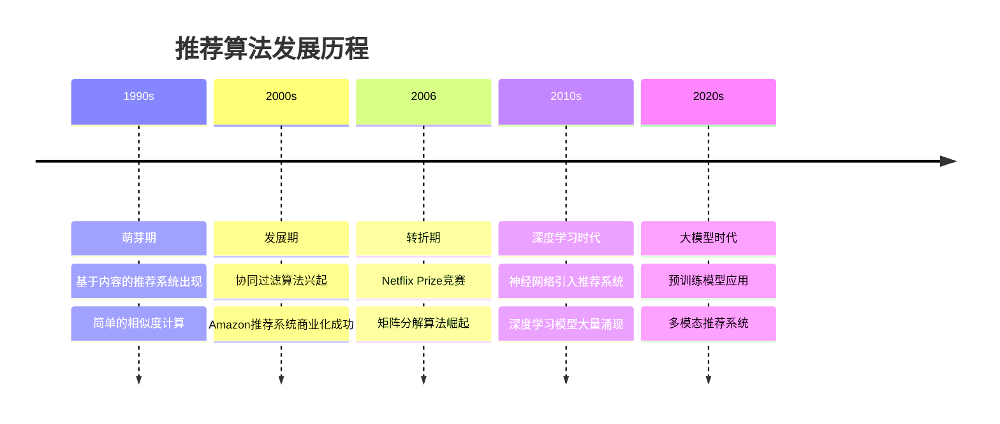
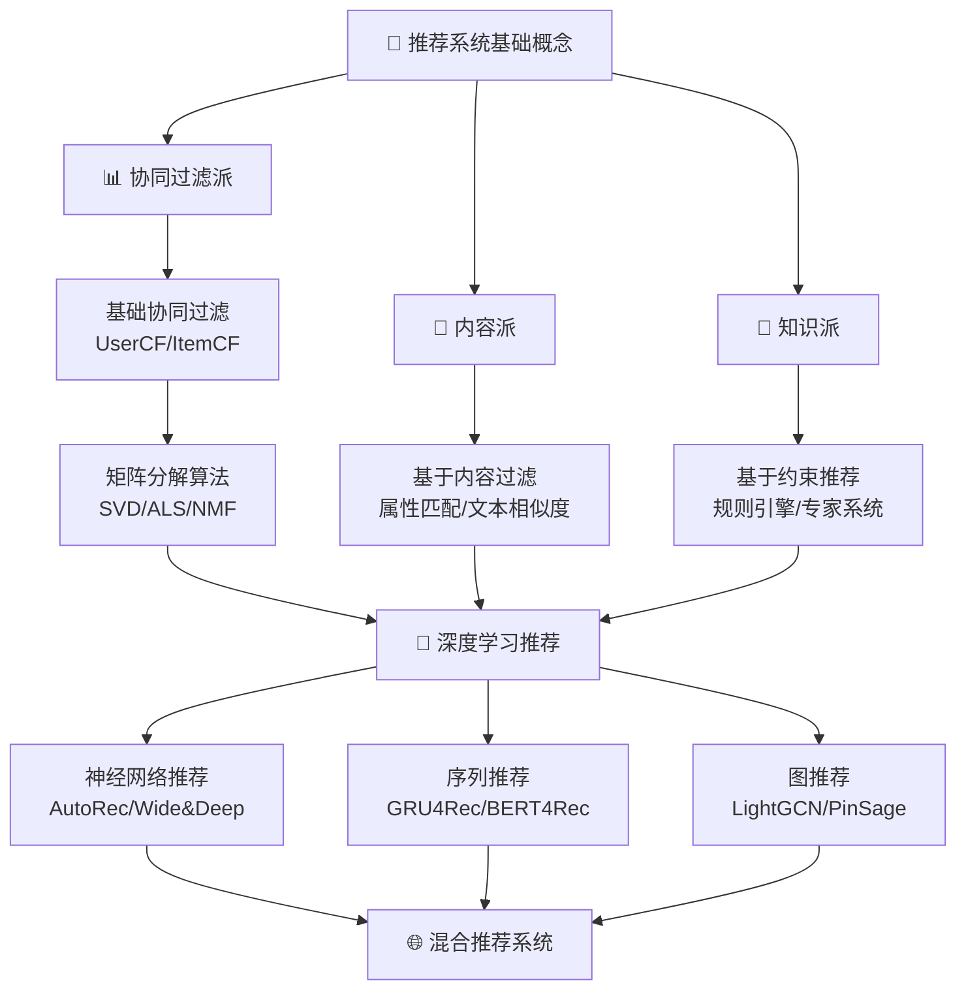

在推荐系统的江湖中，存在着各种"门派"，每个门派都有其独特的"武功心法"和适用场景。正如武侠小说中的少林派、武当派各有千秋，推荐算法也形成了不同的流派，各自在不同的应用场景中发光发热。

## 🏛️ 推荐算法四大门派详解

在深入比较之前，我们先来明确定义推荐系统中的四大主要门派：

### 📊 协同过滤派 (Collaborative Filtering)

**核心理念**：物以类聚，人以群分

协同过滤派认为：
- 相似的用户会喜欢相似的物品（用户协同过滤 UserCF）
- 被相似用户喜欢的物品是相似的（物品协同过滤 ItemCF）

**典型做法**：
- 收集用户对物品的评分、点击、购买等行为数据
- 计算用户之间或物品之间的相似度
- 基于相似度进行推荐

**经典算法**：UserCF、ItemCF、矩阵分解(SVD、ALS、NMF)

### 📝 内容派 (Content-Based)

**核心理念**：投其所好，按图索骥

内容派认为：
- 用户会喜欢与其历史偏好相似的物品
- 物品的内容属性决定了用户是否喜欢

**典型做法**：
- 分析物品的内容特征（文本、类别、标签等）
- 构建用户的兴趣画像
- 推荐与用户历史行为内容相似的物品

**经典算法**：基于内容的过滤算法、基于属性的推荐
**常用技术工具**：TF-IDF（文本特征提取）、余弦相似度（相似度计算）、朴素贝叶斯（分类建模）

### 🧠 知识派 (Knowledge-Based)

**核心理念**：专家指导，规则至上

知识派认为：
- 推荐应该基于领域专家知识和明确规则
- 通过逻辑推理得出推荐结果

**典型做法**：
- 构建领域知识库和规则库
- 分析用户需求和约束条件
- 通过推理引擎生成推荐

**经典算法**：基于约束的推荐、基于案例的推荐、知识图谱推荐
**常用技术工具**：规则引擎、专家系统、知识图谱技术

### 🌐 混合派 (Hybrid)

**核心理念**：博采众长，兼收并蓄

混合派认为：
- 单一方法都有局限性
- 结合多种方法可以取长补短

**典型做法**：
- 加权混合：给不同算法结果加权平均
- 切换混合：根据情况选择不同算法
- 分层混合：在不同层面应用不同算法

**经典算法**：加权混合推荐、切换混合推荐、级联混合推荐

## 🔍 关键概念解释

### 数据稠密度 (Data Density)

在推荐系统中，**稠密度**指的是用户-物品交互矩阵中非零元素的比例：

$$\text{稠密度} = \frac{\text{用户实际交互次数}}{\text{用户数} \times \text{物品数}} \times 100\%$$

**举例说明**：
- 1000个用户，1000个商品 → 理论上有1,000,000个可能的交互
- 实际只有5000次交互 → 稠密度 = 5000/1,000,000 = 0.5%

**实际情况**：
- 电商平台通常稠密度 < 1%（用户只购买很少一部分商品）
- 音乐平台稠密度可能稍高，但也rarely > 5%
- 社交媒体点赞行为稠密度相对较高

::: tip 为什么关心稠密度？
- **稠密度很低**：协同过滤效果差，因为找不到足够相似用户
- **稠密度适中**：协同过滤效果最好
- **稠密度很高**：数据噪声多，需要更复杂算法
:::

## ⚖️ 四大门派对比分析

### 按数据依赖维度分类

| 门派 | 主要数据来源 | 优势 | 劣势 | 适用场景 |
|------|-------------|------|------|----------|
| **协同过滤派** | 用户行为数据 | 无需内容特征，能发现隐含偏好 | 冷启动问题，需要大量交互数据 | 用户行为丰富的平台 |
| **内容派** | 物品属性特征 | 解决新物品冷启动，可解释性强 | 需要高质量特征，容易过度专业化 | 内容属性丰富的场景 |
| **知识派** | 领域知识规则 | 准确性高，逻辑清晰，可控性强 | 知识获取困难，扩展性差 | 专业领域，规则明确的场景 |
| **混合派** | 综合多种数据 | 取长补短，效果通常最佳 | 系统复杂，参数调优困难 | 大型商业系统 |

### 算法门派的进化史

## ⚔️ 各门派的"武功心法"

### 初级心法 - 基础算法门派

::: info 入门推荐
这些算法简单易懂，是推荐系统的基石，适合初学者理解推荐系统的基本原理。
:::

#### 1. 最近邻算法 (Neighborhood-based)
- **核心思想**：找到相似的用户或物品进行推荐
- **计算复杂度**：$O(n^2)$ 到 $O(n \log n)$
- **应用场景**：用户规模不太大的场景

#### 2. 流行度推荐 (Popularity-based)
- **核心思想**：推荐热门物品
- **计算复杂度**：$O(n \log n)$
- **应用场景**：冷启动、新用户推荐

### 中级心法 - 机器学习门派

::: warning 注意事项
中级算法需要一定的机器学习基础，特别是矩阵运算和优化理论知识。
:::

#### 1. 矩阵分解算法 (Matrix Factorization)
- **核心公式**：$R \approx UV^T$
- **优化目标**：$\min_{U,V} ||R - UV^T||_F^2 + \lambda(||U||_F^2 + ||V||_F^2)$
- **代表算法**：SVD, NMF, ALS

#### 2. 因子分解机 (Factorization Machines)
- **核心思想**：特征交互建模
- **优势**：处理稀疏数据，特征组合

### 高级心法 - 深度学习门派

::: caution 修炼须知
深度学习门派需要大量数据和计算资源，同时要注意过拟合问题。
:::

#### 1. 神经网络推荐算法
- **专门推荐算法**：AutoRec、Deep Collaborative Filtering、Wide & Deep、DeepFM
- **技术基础**：多层感知机、自编码器等神经网络架构

#### 2. 序列推荐算法
- **专门推荐算法**：GRU4Rec、Caser、SASRec、BERT4Rec
- **技术基础**：RNN、LSTM、GRU、Transformer等序列建模技术

#### 3. 图推荐算法
- **专门推荐算法**：PinSage、GraphRec、LightGCN、NGCF
- **技术基础**：GraphSAGE、GCN等图神经网络技术

## 📚 门派选择的"九阳真经"

选择合适的推荐算法门派需要考虑以下因素：

### 数据维度分析

**数据规模评估框架**：

| 数据特征 | 推荐门派 | 理由 |
|----------|----------|------|
| 用户 < 1K, 物品 < 1K | 基础协同过滤 | 数据量小，基础算法足够 |
| 交互矩阵稠密度 < 1% | 矩阵分解 + 内容派 | 稀疏数据需要降维 + 内容特征补充 |
| 用户 > 10W, 交互丰富 | 深度学习门派 | 大规模数据，深度学习优势明显 |
| 新物品频繁上线 | 内容派 + 混合派 | 解决冷启动问题 |

### 业务场景匹配

| 业务场景 | 推荐门派 | 理由 |
|----------|----------|------|
| 电商商品推荐 | 协同过滤 + 内容派 | 商品相对稳定，内容特征丰富 |
| 视频内容推荐 | 序列建模 + 协同过滤 | 用户观看有时序性 |
| 新闻推荐 | 内容派 + 实时学习 | 内容时效性强，特征重要 |
| 社交推荐 | 图神经网络 + 协同过滤 | 社交关系图结构明显 |

## 🛤️ 门派修炼路径

::: tip 学习建议
建议按照由浅入深的顺序学习各个门派，先掌握基础理论，再实践复杂算法。
:::

## 📖 延伸阅读

### 经典教材
- **《推荐系统实践》** - 项亮著，推荐系统入门经典
- **《Recommender Systems: An Introduction》** - Jannach等著
- **《推荐系统》** - 王喆著，系统性介绍现代推荐技术

### 重要论文
- **协同过滤经典**：Sarwar et al. "Item-based collaborative filtering recommendation algorithms" (2001)
- **矩阵分解里程碑**：Koren et al. "Matrix factorization techniques for recommender systems" (2009)
- **深度学习开山**：He et al. "Neural collaborative filtering" (2017)

### 开源项目
- **Surprise**: Python推荐系统库，适合学习和原型开发
- **LibRecommender**: 全面的推荐算法实现
- **RecBole**: 统一、全面、高效的推荐算法库

> 🧠 **思考题**
>
> 1. **算法选择题**：假设你负责一个新的短视频APP的推荐系统设计，用户和内容都在快速增长，你会选择哪个门派的算法？为什么？
>
> 2. **冷启动问题**：对于一个全新的用户，不同门派的算法如何解决冷启动问题？各有什么优缺点？
>
> 3. **稠密度影响**：为什么当用户-物品交互矩阵稠密度小于1%时，纯协同过滤算法效果会很差？应该如何改进？
>
> 4. **实时性要求**：如果业务要求推荐结果必须实时更新(如新闻推荐)，哪些门派的算法更适合？需要做哪些技术优化？
>
> 5. **可解释性需求**：在金融风控场景下，推荐系统需要很强的可解释性，你会选择哪个门派？如何平衡准确性和可解释性？

