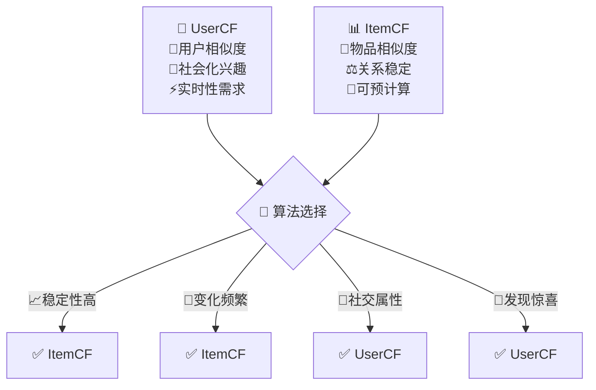

协同过滤是推荐系统中最经典、最直观的算法之一。它的核心思想简单而深刻：**具有相似兴趣的用户可能会喜欢相似的物品，而被相似用户喜欢的物品也可能具有相似性**。这种"人以群分，物以类聚"的朴素思想，却在推荐系统中发挥着巨大的威力。

## 🧠 协同过滤的哲学思想

::: tip 核心理念
协同过滤基于一个朴素的假设：用户的兴趣具有群体性，相似的用户会对相似的物品产生相似的偏好。
:::

### 基本假设

1. **用户一致性假设**：用户的兴趣偏好在短期内相对稳定
2. **用户相似性假设**：相似用户对物品的偏好相似
3. **物品相似性假设**：相似物品会被相似的用户群体喜欢
4. **传递性假设**：如果A和B相似，B和C相似，那么A和C也可能相似

### 协同过滤的数学表示

设用户集合为 $U = \{u_1, u_2, ..., u_m\}$，物品集合为 $I = \{i_1, i_2, ..., i_n\}$

用户-物品评分矩阵：
$$R_{m \times n} = \begin{pmatrix}
r_{1,1} & r_{1,2} & \cdots & r_{1,n} \\
r_{2,1} & r_{2,2} & \cdots & r_{2,n} \\
\vdots & \vdots & \ddots & \vdots \\
r_{m,1} & r_{m,2} & \cdots & r_{m,n}
\end{pmatrix}$$

其中 $r_{u,i}$ 表示用户 $u$ 对物品 $i$ 的评分，未评分的地方为空值。

## ⚔️ 协同过滤的两大门派

### 基于用户的协同过滤 (User-based CF)

::: info 用户视角
"告诉我你的朋友是谁，我就知道你是什么样的人"
:::

**核心思想**：找到与目标用户兴趣相似的用户群体，推荐这些相似用户喜欢但目标用户未接触过的物品。

**算法步骤**：
1. 计算用户之间的相似度
2. 找到最相似的K个用户（邻居）
3. 基于邻居的偏好预测目标用户的偏好
4. 推荐评分最高的物品

**用户相似度计算**：

皮尔逊相关系数：
$$sim(u,v) = \frac{\sum_{i \in I_{uv}}(r_{u,i} - \bar{r_u})(r_{v,i} - \bar{r_v})}{\sqrt{\sum_{i \in I_{uv}}(r_{u,i} - \bar{r_u})^2} \sqrt{\sum_{i \in I_{uv}}(r_{v,i} - \bar{r_v})^2}}$$

其中 $I_{uv}$ 是用户 $u$ 和 $v$ 共同评分的物品集合。

**评分预测**：
$$\hat{r}_{u,i} = \bar{r_u} + \frac{\sum_{v \in N(u)} sim(u,v) \cdot (r_{v,i} - \bar{r_v})}{\sum_{v \in N(u)} |sim(u,v)|}$$

### 基于物品的协同过滤 (Item-based CF)

::: info 物品视角
"物以类聚：相似的物品会被相似的用户群体喜欢"
:::

**核心思想**：计算物品之间的相似度，推荐与用户历史偏好物品相似的物品。

**物品相似度计算**：

余弦相似度：
$$sim(i,j) = \frac{\sum_{u \in U_{ij}} r_{u,i} \cdot r_{u,j}}{\sqrt{\sum_{u \in U_{ij}} r_{u,i}^2} \sqrt{\sum_{u \in U_{ij}} r_{u,j}^2}}$$

调整余弦相似度：
$$sim(i,j) = \frac{\sum_{u \in U_{ij}} (r_{u,i} - \bar{r_u}) \cdot (r_{u,j} - \bar{r_u})}{\sqrt{\sum_{u \in U_{ij}} (r_{u,i} - \bar{r_u})^2} \sqrt{\sum_{u \in U_{ij}} (r_{u,j} - \bar{r_u})^2}}$$

## 🔧 协同过滤的实现细节

### 相似度度量方法详细对比

#### 用户相似度计算

**皮尔逊相关系数**：
$$sim_{pearson}(u,v) = \frac{\sum_{i \in I_{uv}}(r_{u,i} - \bar{r_u})(r_{v,i} - \bar{r_v})}{\sqrt{\sum_{i \in I_{uv}}(r_{u,i} - \bar{r_u})^2} \sqrt{\sum_{i \in I_{uv}}(r_{v,i} - \bar{r_v})^2}}$$

**余弦相似度**：
$$sim_{cosine}(u,v) = \frac{\sum_{i \in I_{uv}} r_{u,i} \cdot r_{v,i}}{\sqrt{\sum_{i \in I_{uv}} r_{u,i}^2} \sqrt{\sum_{i \in I_{uv}} r_{v,i}^2}}$$

**调整余弦相似度**：
$$sim_{adj\_cosine}(u,v) = \frac{\sum_{i \in I_{uv}}(r_{u,i} - \bar{r_i})(r_{v,i} - \bar{r_i})}{\sqrt{\sum_{i \in I_{uv}}(r_{u,i} - \bar{r_i})^2} \sqrt{\sum_{i \in I_{uv}}(r_{v,i} - \bar{r_i})^2}}$$

#### 物品相似度计算

**余弦相似度**：
$$sim_{cosine}(i,j) = \frac{\sum_{u \in U_{ij}} r_{u,i} \cdot r_{u,j}}{\sqrt{\sum_{u \in U_{ij}} r_{u,i}^2} \sqrt{\sum_{u \in U_{ij}} r_{u,j}^2}}$$

**调整余弦相似度**：
$$sim_{adj\_cosine}(i,j) = \frac{\sum_{u \in U_{ij}} (r_{u,i} - \bar{r_u}) \cdot (r_{u,j} - \bar{r_u})}{\sqrt{\sum_{u \in U_{ij}} (r_{u,i} - \bar{r_u})^2} \sqrt{\sum_{u \in U_{ij}} (r_{u,j} - \bar{r_u})^2}}$$

#### 相似度度量综合比较

| 相似度度量 | 计算复杂度 | 优势 | 劣势 | UserCF适用 | ItemCF适用 |
|------------|------------|------|------|------------|------------|
| **皮尔逊相关系数** | $O(n)$ | 消除用户偏见，关注趋势 | 需要足够共同评分 | ✅ 显式评分 | ✅ 评分预测 |
| **余弦相似度** | $O(n)$ | 计算简单，几何意义清晰 | 忽略评分尺度差异 | ✅ 隐式反馈 | ✅ 隐式反馈 |
| **调整余弦相似度** | $O(n)$ | 消除偏见，标准化处理 | 计算复杂度较高 | ✅ 评分不均 | ✅ 显式评分 |
| **杰卡德系数** | $O(1)$ | 计算极快，适合大规模 | 丢失评分强度信息 | ✅ 二值反馈 | ✅ 二值反馈 |
| **欧氏距离** | $O(n)$ | 直观易懂，空间概念 | 受维度影响大，稀疏敏感 | ❌ 不推荐 | ❌ 不推荐 |

### 核心算法框架

::: details 协同过滤算法实现框架
```python
import numpy as np
from scipy.spatial.distance import cosine
from sklearn.metrics.pairwise import cosine_similarity

class CollaborativeFiltering:
    def __init__(self, method='user_based', similarity='pearson', k=20):
        self.method = method
        self.similarity = similarity
        self.k = k
        self.similarity_matrix = None
        
    def fit(self, user_item_matrix):
        """训练协同过滤模型"""
        self.user_item_matrix = user_item_matrix
        
        if self.method == 'user_based':
            self.similarity_matrix = self._compute_user_similarity()
        else:  # item_based
            self.similarity_matrix = self._compute_item_similarity()
            
    def predict(self, user_id, item_id):
        """预测用户对物品的评分"""
        if self.method == 'user_based':
            return self._predict_user_based(user_id, item_id)
        else:
            return self._predict_item_based(user_id, item_id)
            
    def recommend(self, user_id, n_recommendations=10):
        """为用户推荐物品"""
        user_ratings = self.user_item_matrix[user_id]
        unrated_items = np.where(user_ratings == 0)[0]
        
        predictions = [(item_id, self.predict(user_id, item_id)) 
                      for item_id in unrated_items]
        predictions.sort(key=lambda x: x[1], reverse=True)
        
        return predictions[:n_recommendations]
```
:::

### 性能优化策略

**计算复杂度优化**：
- **预计算相似度矩阵**：离线计算并存储
- **近似计算**：使用LSH（局部敏感哈希）
- **稀疏矩阵优化**：使用scipy.sparse存储

**内存优化**：
- **增量更新**：只更新变化的部分
- **分块计算**：将大矩阵分块处理
- **数据压缩**：使用低精度浮点数

## ⚖️ 协同过滤的优缺点分析

### 优势特点

| 优势 | 说明 | 适用场景 |
|------|------|----------|
| **无需内容信息** | 只需要用户行为数据 | 内容特征难以提取的场景 |
| **发现隐含偏好** | 能够发现用户潜在兴趣 | 探索性推荐 |
| **简单直观** | 算法逻辑清晰易懂 | 快速原型开发 |
| **无领域限制** | 适用于任何推荐场景 | 通用推荐系统 |
| **群体智慧** | 利用集体智慧过滤信息 | 社交推荐 |

### 劣势挑战

| 劣势 | 说明 | 解决方案 |
|------|------|----------|
| **冷启动问题** | 新用户/物品缺乏数据 | 混合推荐、内容特征 |
| **数据稀疏性** | 用户-物品矩阵稀疏 | 矩阵分解、降维 |
| **可扩展性** | 计算复杂度高 | 近似算法、分布式计算 |
| **马太效应** | 热门物品更容易被推荐 | 多样性优化 |
| **实时性差** | 相似度计算耗时 | 预计算、缓存策略 |

### UserCF vs ItemCF 全面对比分析

#### 核心理念差异



#### 详细对比表

| 对比维度 | UserCF | ItemCF | 适用场景分析 |
|----------|--------|--------|--------------|
| **计算稳定性** | 中等 - 用户偏好易变 | 高 - 物品属性稳定 | 电商、内容平台选ItemCF |
| **可扩展性** | 差 - 用户数增长快 | 好 - 物品数相对少 | 大规模系统优选ItemCF |
| **实时性要求** | 高 - 需频繁更新 | 低 - 可预计算缓存 | 实时推荐场景选ItemCF |
| **推荐解释性** | 强 - "相似用户喜欢" | 强 - "相似物品推荐" | 两者都有良好解释性 |
| **新颖性发现** | 高 - 社群发现新趣味 | 中 - 基于历史相似性 | 探索发现选UserCF |
| **冷启动处理** | 差 - 新用户无历史 | 中 - 新物品较好处理 | 新用户多的场景难处理 |
| **长尾覆盖** | 中 - 依赖活跃用户 | 差 - 倾向热门相似 | 长尾挖掘UserCF稍好 |
| **计算复杂度** | $O(m^2 \times n)$ | $O(n^2 \times m)$ | 通常 $n < m$，ItemCF更快 |
| **存储复杂度** | $O(m^2)$ | $O(n^2)$ | 用户数通常>物品数 |
| **社交属性** | 强 - 基于用户关系 | 弱 - 基于物品属性 | 社交推荐优选UserCF |

#### 应用场景选择指南

| 业务场景 | 推荐算法 | 核心原因 | 典型应用 |
|----------|----------|----------|----------|
| **电商推荐** | ItemCF ⭐⭐⭐ | 商品稳定，用户多样 | Amazon商品推荐 |
| **社交媒体** | UserCF ⭐⭐⭐ | 社交关系，兴趣传播 | Facebook好友推荐 |
| **音视频平台** | 混合使用 | 内容稳定+用户互动 | Netflix, YouTube |
| **新闻推荐** | UserCF ⭐⭐ | 热点传播，时效性 | 今日头条 |
| **教育平台** | ItemCF ⭐⭐⭐ | 课程稳定，学习路径 | Coursera课程推荐 |
| **招聘平台** | UserCF ⭐⭐ | 求职偏好相似性 | LinkedIn职位推荐 |

#### 混合策略考虑

**线性组合**：
$$Score(u,i) = \alpha \cdot Score_{UserCF}(u,i) + (1-\alpha) \cdot Score_{ItemCF}(u,i)$$

**切换策略**：
- 新用户：使用ItemCF（基于热门物品）
- 活跃用户：使用UserCF（基于相似用户）
- 新物品：使用UserCF（基于内容特征相似用户）

## 🚀 协同过滤的改进与扩展

### 基础改进方法

1. **加权计算**：
   - 考虑用户活跃度权重
   - 引入时间衰减因子
   - 基于置信度的权重调整

2. **归一化处理**：
   - Z-score标准化：$\tilde{r}_{u,i} = \frac{r_{u,i} - \bar{r_u}}{\sigma_u}$
   - Min-Max归一化：$\tilde{r}_{u,i} = \frac{r_{u,i} - r_{u,min}}{r_{u,max} - r_{u,min}}$

3. **相似度融合**：
   - 多种相似度的加权组合
   - 基于场景的动态权重调整

### 高级扩展技术

1. **矩阵分解增强**：
   - SVD++ 结合隐式反馈
   - NMF 处理非负评分数据
   - 概率矩阵分解 (PMF)

2. **深度学习融合**：
   - Neural Collaborative Filtering
   - AutoEncoder-based CF
   - Graph Neural Networks

3. **多目标优化**：
   - 准确性与多样性平衡
   - 新颖性与流行度权衡
   - 公平性约束优化

## 💡 实际应用案例

### 电商推荐系统

**Amazon ItemCF 经典案例**：
- "购买了这个商品的用户还购买了..."
- 基于商品共现关系计算相似度
- 考虑商品类别、价格区间等约束

### 社交网络推荐

**Facebook UserCF 应用**：
- 基于好友关系的协同过滤
- 社交网络结构增强相似度计算
- 隐私保护下的协同推荐

### 音视频推荐

**Netflix 混合CF**：
- UserCF + ItemCF 的组合策略
- 考虑用户观看时序性
- 结合内容特征的混合推荐

## 🎯 协同过滤的未来发展

### 技术趋势

1. **联邦学习**：隐私保护下的协同过滤
2. **图神经网络**：更好地建模用户-物品关系
3. **强化学习**：动态调整推荐策略
4. **多模态融合**：结合文本、图像、音频信息

### 应用拓展

1. **跨域推荐**：利用多个领域的协同信息
2. **群组推荐**：为用户群体推荐
3. **时序推荐**：考虑时间动态性
4. **解释性推荐**：提供推荐理由

## 📊 协同过滤通用评估体系

### 离线评估指标

| 评估维度 | 指标 | 计算公式 | 参数说明 | 适用算法 |
|----------|------|----------|----------|----------|
| **准确性** | Precision@K | $\frac{\lvert R_K \cap T\rvert}{\lvert R_K\rvert}$ | $R_K$: 推荐列表, $T$: 测试集 | UserCF/ItemCF |
| **召回率** | Recall@K | $\frac{\lvert R_K \cap T\rvert}{\lvert T\rvert}$ | 覆盖用户真实兴趣的比例 | UserCF/ItemCF |
| **准确性** | RMSE | $\sqrt{\frac{1}{n}\sum_{i=1}^{n}(r_i - \hat{r_i})^2}$ | $r_i$: 真实评分, $\hat{r_i}$: 预测评分 | 评分预测 |
| **排序质量** | NDCG@K | $\frac{DCG@K}{IDCG@K}$ | $DCG$: 折扣累积增益, $IDCG$: 理想DCG | 推荐排序 |
| **覆盖率** | Catalog Coverage | $\frac{\lvert I_{rec}\rvert}{\lvert I_{all}\rvert}$ | $I_{rec}$: 被推荐物品, $I_{all}$: 全部物品 | 多样性评估 |
| **新颖性** | Intra-list Diversity | $\frac{1}{\lvert U\rvert}\sum_{u}\frac{2}{\lvert R_u\rvert(\lvert R_u\rvert-1)}\sum_{\substack{i,j \in R_u \\ i \neq j}}(1-sim(i,j))$ | 推荐列表内物品多样性 | 用户体验 |

### 在线A/B测试指标

**业务核心指标**：
- **点击率(CTR)**：用户点击推荐内容的比例
- **转化率(CVR)**：用户购买/使用推荐内容的比例
- **停留时长**：用户在推荐内容上的平均停留时间
- **用户活跃度**：推荐对用户使用频率的影响
- **用户留存**：推荐对用户长期留存的贡献

### 参数调优通用策略

**关键参数**：
- **邻居数量K**：10-50之间，平衡准确性和多样性
- **相似度阈值**：0.1-0.3，过滤低质量邻居
- **时间窗口**：平衡数据新鲜度和历史稳定性
- **正则化参数**：防止过拟合，提高泛化能力

---

*"协同过滤虽然简单，但它揭示了推荐系统的本质：利用集体智慧为个体提供个性化服务"*


