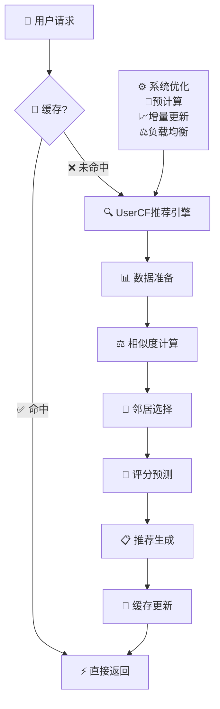

基于用户的协同过滤（User-based Collaborative Filtering, UserCF）是协同过滤算法家族中的经典成员，其核心理念是 **"告诉我你的朋友是谁，我就知道你是什么样的人"**。通过寻找兴趣相似的用户群体，为目标用户推荐其邻居用户喜欢但他尚未接触的物品。

## 🎯 UserCF的核心思想

::: tip 邻里效应
UserCF基于社会学中的"邻里效应"理论：相似的人往往有相似的行为模式和偏好。
:::

### 算法直觉

想象你在寻找一部好电影，你可能会：
1. 询问与你品味相似的朋友
2. 参考他们最近观看并推荐的电影
3. 从中选择你还没看过的电影

UserCF就是这个过程的数学化实现！

### 数学表达

给定用户-物品评分矩阵 $R_{m \times n}$，UserCF的目标是预测用户 $u$ 对物品 $i$ 的评分 $\hat{r}_{u,i}$：

$$\hat{r}_{u,i} = \bar{r_u} + \frac{\sum_{v \in N_k(u)} sim(u,v) \cdot (r_{v,i} - \bar{r_v})}{\sum_{v \in N_k(u)} |sim(u,v)|}$$

其中：
- $R_{m \times n}$ 是 $m$ 个用户对 $n$ 个物品的评分矩阵
- $\hat{r}_{u,i}$ 是预测的用户 $u$ 对物品 $i$ 的评分
- $\bar{r_u}$ 是用户 $u$ 的平均评分
- $\bar{r_v}$ 是用户 $v$ 的平均评分
- $r_{v,i}$ 是用户 $v$ 对物品 $i$ 的实际评分
- $N_k(u)$ 是与用户 $u$ 最相似的 $k$ 个用户集合
- $sim(u,v)$ 是用户 $u$ 和 $v$ 之间的相似度
- $|sim(u,v)|$ 表示相似度的绝对值（用于归一化）

## 📏 UserCF的核心算法

::: tip 参考协同过滤总览
详细的相似度计算方法请参考 [协同过滤总览](./2.collaborative_filtering.md#相似度度量方法详细对比) 中的完整对比分析。
:::

UserCF的关键在于准确计算用户间相似度，推荐选择：
- **显式评分场景**：优先使用皮尔逊相关系数
- **隐式反馈场景**：优先使用余弦相似度
- **评分分布不均**：考虑调整余弦相似度

## 💻 UserCF算法实现

::: details UserCF核心算法框架
```python
import numpy as np
from scipy.spatial.distance import cosine
from scipy.stats import pearsonr

class UserBasedCF:
    def __init__(self, similarity_method='pearson', k_neighbors=20):
        self.similarity_method = similarity_method
        self.k_neighbors = k_neighbors
        self.user_similarity_matrix = None
        
    def fit(self, user_item_matrix):
        """训练UserCF模型"""
        self.user_item_matrix = user_item_matrix.copy()
        self.user_mean_ratings = np.array([
            np.mean(row[row > 0]) if np.sum(row > 0) > 0 else 0 
            for row in user_item_matrix
        ])
        
        # 计算用户相似度矩阵
        self.user_similarity_matrix = self._compute_user_similarity()
        
    def predict_rating(self, user_id, item_id):
        """预测用户对物品的评分"""
        user_similarities = self.user_similarity_matrix[user_id]
        item_raters = np.where(self.user_item_matrix[:, item_id] > 0)[0]
        
        if len(item_raters) == 0:
            return self.user_mean_ratings[user_id]
            
        # 选择最相似的k个邻居
        similarities = user_similarities[item_raters]
        neighbor_indices = np.argsort(similarities)[-self.k_neighbors:]
        
        # 计算加权平均预测
        neighbor_similarities = similarities[neighbor_indices]
        neighbor_ratings = self.user_item_matrix[item_raters[neighbor_indices], item_id]
        neighbor_means = self.user_mean_ratings[item_raters[neighbor_indices]]
        
        valid_mask = neighbor_similarities > 0
        if np.sum(valid_mask) == 0:
            return self.user_mean_ratings[user_id]
            
        numerator = np.sum(
            neighbor_similarities[valid_mask] * 
            (neighbor_ratings[valid_mask] - neighbor_means[valid_mask])
        )
        denominator = np.sum(np.abs(neighbor_similarities[valid_mask]))
        
        return self.user_mean_ratings[user_id] + numerator / denominator
        
    def recommend_items(self, user_id, n_recommendations=10):
        """为用户推荐物品"""
        user_ratings = self.user_item_matrix[user_id]
        candidate_items = np.where(user_ratings == 0)[0]
        
        predictions = [(item_id, self.predict_rating(user_id, item_id)) 
                      for item_id in candidate_items]
        predictions.sort(key=lambda x: x[1], reverse=True)
        
        return predictions[:n_recommendations]
```
:::

## 🎪 UserCF的应用场景与特点

### 适用场景分析

| 应用领域 | 适用原因 | 注意事项 |
|----------|----------|----------|
| **社交媒体** | 用户兴趣相似度高 | 注意用户隐私保护 |
| **在线教育** | 学习路径相似 | 考虑学习能力差异 |
| **新闻推荐** | 关注热点相似 | 需要时效性处理 |
| **音乐推荐** | 品味群体性明显 | 考虑情境因素 |

### UserCF的技术特点

**优势特点**：
- **社会化推荐**：反映群体智慧和社会化兴趣
- **新颖性好**：能推荐用户意想不到的内容
- **解释性强**：可以解释为"喜欢类似内容的用户还喜欢..."
- **无内容依赖**：不需要物品内容特征

**劣势挑战**：
- **实时性差**：用户相似度需要频繁重计算
- **稀疏性敏感**：新用户和活跃度低的用户推荐效果差
- **可扩展性问题**：用户数量增长时计算复杂度激增
- **流行偏见**：倾向于推荐热门内容

## 🚀 UserCF的优化策略

### 性能优化方法

1. **预计算优化**：
   - 离线计算用户相似度矩阵
   - 预计算每个用户的TOP-K邻居
   - 使用增量更新策略

2. **近似计算**：
   - **LSH (Locality Sensitive Hashing)**：快速找到相似用户
   - **随机采样**：降低计算复杂度
   - **聚类预处理**：先聚类再在类内计算相似度

3. **稀疏矩阵优化**：
   - 使用 scipy.sparse 存储稀疏矩阵
   - 只存储相似度大于阈值的用户对
   - 采用分块计算策略

### 算法改进方向

1. **时间衰减**：
   $$sim_{time}(u,v) = sim(u,v) \cdot \exp(-\lambda \cdot \Delta t)$$
   
   其中：
   - $sim(u,v)$ 是基础相似度
   - $\lambda$ 是时间衰减系数（控制衰减强度）
   - $\Delta t$ 是时间间隔（当前时间与交互时间的差值）
   
2. **置信度加权**：
   根据共同评分物品数量调整相似度权重
   
3. **多级邻居**：
   不仅考虑直接邻居，还考虑邻居的邻居

## 🔄 UserCF的变种算法

### 基于聚类的UserCF

**核心思想**：先将用户聚类，再在类内进行协同过滤

**优势**：
- 降低计算复杂度 
- 提高推荐多样性
- 更好处理数据稀疏性

### 基于信任的UserCF

**核心思想**：结合用户之间的信任关系

**应用场景**：
- 社交网络推荐
- 专家推荐系统
- 口碑营销平台

### 概率UserCF

**核心思想**：使用概率模型描述用户相似性

**优势**：
- 更好的不确定性处理
- 支持贝叶斯推理
- 易于融入其他概率模型

## ⚡ 实时推荐优化

### UserCF推荐系统架构图



### 增量更新策略

1. **相似度矩阵增量更新**：只更新发生变化的用户相似度
2. **滑动窗口**：只考虑最近N天的用户行为
3. **异步计算**：后台异步更新相似度矩阵

## 📊 UserCF专属调优策略

### UserCF关键参数

**邻居选择策略**：
- **K值选择**：社交场景K=20-30，电商场景K=10-20
- **相似度阈值**：设置最小相似度0.1-0.3，过滤噪音用户
- **活跃度权重**：高活跃用户给予更高权重

### UserCF特有优化

**社交增强**：
- 结合用户社交关系图
- 信任度传播算法
- 社区发现增强相似度

**时序优化**：
- 用户兴趣变化建模
- 季节性偏好考虑
- 短期和长期兴趣平衡

## 💡 行业应用案例

### Amazon "Customers who bought this item also bought"

**技术特点**：
- 基于购买行为的UserCF
- 结合商品类别约束
- 考虑购买时间衰减

### Netflix 用户群体推荐

**技术特点**：
- 结合观看时长信息
- 考虑用户人口统计学相似性
- 多层次相似度融合

### Spotify 音乐发现

**技术特点**：
- 基于播放行为的UserCF
- 结合音乐特征相似度
- 考虑听歌情境和时间

## 🔮 UserCF的发展趋势

### 技术发展方向

1. **深度学习融合**：Neural Collaborative Filtering
2. **图神经网络**：建模复杂用户关系
3. **联邦学习**：隐私保护下的协同过滤
4. **强化学习**：动态调整推荐策略

### 应用拓展领域

1. **跨域推荐**：利用多平台用户行为
2. **群组推荐**：为用户群体生成推荐
3. **情境感知**：结合时间、地点、情绪等情境
4. **多目标优化**：平衡准确性、多样性、公平性

---

>UserCF的精髓在于发现志趣相投的群体，让推荐不再孤立，而是充满人情味的智能选择


