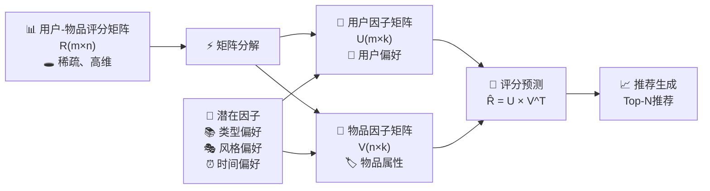
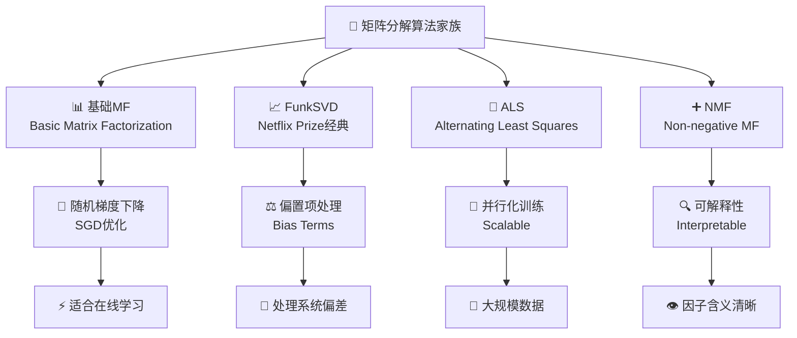

矩阵分解（Matrix Factorization, MF）是推荐系统中的重要突破，特别是在Netflix Prize竞赛中大放异彩。它通过将稀疏的用户-物品评分矩阵分解为两个低维稠密矩阵的乘积，挖掘出隐藏在数据背后的潜在因子，从而实现高质量的推荐。

## 🧠 矩阵分解的核心思想

::: tip 🎭 降维的魔力
矩阵分解的核心是"降维"：将高维稀疏的用户-物品交互数据映射到低维稠密的隐语义空间。
:::

### 基本思想

想象一个电影推荐场景：
- **用户偏好**：可能由几个潜在因子决定——喜剧偏好、动作偏好、科幻偏好等
- **电影属性**：也可以用这些因子来描述——这部电影有多少喜剧成分、动作成分等  
- **评分预测**：用户对电影的评分 = 用户在各个因子上的偏好 × 电影在各个因子上的属性



### 数学表示

给定用户-物品评分矩阵 $R_{m \times n}$，矩阵分解的目标是找到两个低维矩阵：

$$R \approx UV^T$$

其中：
- $U_{m \times k}$：用户潜在因子矩阵，每行表示一个用户在 $k$ 个潜在因子上的偏好
- $V_{n \times k}$：物品潜在因子矩阵，每行表示一个物品在 $k$ 个潜在因子上的属性
- $k \ll \min(m,n)$：潜在因子的维度

**预测评分公式**：
$$\hat{r}_{ui} = u_i^T v_j = \sum_{f=1}^{k} u_{if} \cdot v_{jf}$$

## 🎭 主要算法家族



### 基础矩阵分解 (Basic MF)

::: tip 💡 核心思想
最朴素的矩阵分解方法，通过最小化观测评分的重构误差来学习用户和物品的潜在表示。
:::

**优化目标**：
$$\min_{U,V} \sum_{(u,i) \in \Omega} (r_{ui} - u_u^T v_i)^2 + \lambda(||U||_F^2 + ||V||_F^2)$$

其中 $\Omega$ 是观测到的评分集合，$\lambda$ 是正则化参数。

**训练流程**：
1. **初始化**：随机初始化用户和物品因子矩阵
2. **迭代优化**：使用随机梯度下降更新参数
3. **正则化**：防止过拟合，提高泛化能力
4. **收敛检测**：监控损失函数或验证集性能

::: details 💻 基础MF代码实现
```python
import numpy as np
from sklearn.metrics import mean_squared_error

class BasicMF:
    def __init__(self, n_factors=50, learning_rate=0.01, 
                 reg_lambda=0.01, n_epochs=100):
        self.n_factors = n_factors
        self.learning_rate = learning_rate
        self.reg_lambda = reg_lambda
        self.n_epochs = n_epochs
        
    def fit(self, rating_matrix):
        """训练矩阵分解模型"""
        self.n_users, self.n_items = rating_matrix.shape
        
        # 初始化用户和物品因子矩阵
        self.user_factors = np.random.normal(0, 0.1, (self.n_users, self.n_factors))
        self.item_factors = np.random.normal(0, 0.1, (self.n_items, self.n_factors))
        
        # 找到非零评分的位置
        self.train_set = []
        for u in range(self.n_users):
            for i in range(self.n_items):
                if rating_matrix[u, i] > 0:
                    self.train_set.append((u, i, rating_matrix[u, i]))
        
        # 梯度下降训练
        for epoch in range(self.n_epochs):
            self._sgd_step()
            
            if epoch % 10 == 0:
                train_rmse = self._compute_rmse()
                print(f"Epoch {epoch}: RMSE = {train_rmse:.4f}")
                
    def _sgd_step(self):
        """随机梯度下降一步"""
        np.random.shuffle(self.train_set)
        
        for u, i, r in self.train_set:
            # 预测评分
            prediction = np.dot(self.user_factors[u], self.item_factors[i])
            error = r - prediction
            
            # 保存旧的因子值
            user_factor = self.user_factors[u].copy()
            
            # 更新因子
            self.user_factors[u] += self.learning_rate * (
                error * self.item_factors[i] - self.reg_lambda * self.user_factors[u]
            )
            self.item_factors[i] += self.learning_rate * (
                error * user_factor - self.reg_lambda * self.item_factors[i]
            )
            
    def predict(self, user_id, item_id):
        """预测用户对物品的评分"""
        return np.dot(self.user_factors[user_id], self.item_factors[item_id])
        
    def _compute_rmse(self):
        """计算RMSE"""
        predictions = []
        actuals = []
        
        for u, i, r in self.train_set:
            pred = self.predict(u, i)
            predictions.append(pred)
            actuals.append(r)
            
        return np.sqrt(mean_squared_error(actuals, predictions))
```
:::

### FunkSVD (Netflix Prize经典)

::: info 🏆 Netflix Prize传奇
FunkSVD由Simon Funk在Netflix Prize竞赛中提出，是推荐系统历史上的重要里程碑。
:::

**传统SVD的局限**：
- 需要完整的矩阵（无缺失值）
- 计算复杂度高：$O(mn^2)$
- 对稀疏数据效果不佳

**FunkSVD的创新**：
- 只对观测到的评分进行建模
- 使用随机梯度下降优化  
- 加入偏置项处理系统性偏差

**完整模型**：
$$\hat{r}_{ui} = \mu + b_u + b_i + u_u^T v_i$$

其中：
- $\mu$：全局平均评分
- $b_u$：用户偏置（某些用户总是给高分/低分）
- $b_i$：物品偏置（某些物品普遍受欢迎/不受欢迎）

::: details 💻 FunkSVD代码实现
```python
class FunkSVD:
    def __init__(self, n_factors=50, learning_rate=0.01, 
                 reg_lambda=0.01, n_epochs=100, use_bias=True):
        self.n_factors = n_factors
        self.learning_rate = learning_rate
        self.reg_lambda = reg_lambda
        self.n_epochs = n_epochs
        self.use_bias = use_bias
        
    def fit(self, rating_matrix):
        """FunkSVD训练"""
        self.n_users, self.n_items = rating_matrix.shape
        self.global_mean = np.mean(rating_matrix[rating_matrix > 0])
        
        # 初始化因子矩阵
        self.user_factors = np.random.normal(0, 0.1, (self.n_users, self.n_factors))
        self.item_factors = np.random.normal(0, 0.1, (self.n_items, self.n_factors))
        
        if self.use_bias:
            # 初始化偏置
            self.user_bias = np.zeros(self.n_users)
            self.item_bias = np.zeros(self.n_items)
        
        # 准备训练数据
        self.train_set = []
        for u in range(self.n_users):
            for i in range(self.n_items):
                if rating_matrix[u, i] > 0:
                    self.train_set.append((u, i, rating_matrix[u, i]))
        
        # 训练
        for epoch in range(self.n_epochs):
            self._funksvd_step()
            
    def _funksvd_step(self):
        """FunkSVD的SGD步骤"""
        np.random.shuffle(self.train_set)
        
        for u, i, r in self.train_set:
            # 预测评分
            if self.use_bias:
                prediction = (self.global_mean + self.user_bias[u] + 
                            self.item_bias[i] + 
                            np.dot(self.user_factors[u], self.item_factors[i]))
            else:
                prediction = np.dot(self.user_factors[u], self.item_factors[i])
                
            error = r - prediction
            
            # 保存旧值
            user_factor = self.user_factors[u].copy()
            
            # 更新因子
            self.user_factors[u] += self.learning_rate * (
                error * self.item_factors[i] - self.reg_lambda * self.user_factors[u]
            )
            self.item_factors[i] += self.learning_rate * (
                error * user_factor - self.reg_lambda * self.item_factors[i]
            )
            
            if self.use_bias:
                # 更新偏置
                self.user_bias[u] += self.learning_rate * (
                    error - self.reg_lambda * self.user_bias[u]
                )
                self.item_bias[i] += self.learning_rate * (
                    error - self.reg_lambda * self.item_bias[i]
                )
                
    def predict(self, user_id, item_id):
        """预测评分（带偏置）"""
        prediction = np.dot(self.user_factors[user_id], self.item_factors[item_id])
        
        if self.use_bias:
            prediction += (self.global_mean + self.user_bias[user_id] + 
                         self.item_bias[item_id])
            
        return prediction
```
:::

### ALS (Alternating Least Squares)

::: tip 🚀 并行化优势
ALS通过交替固定一个矩阵来优化另一个矩阵，便于并行化处理大规模数据，是工业界的主流选择。
:::

**核心思想**：
1. **固定V，优化U**：将用户优化问题转化为线性回归
2. **固定U，优化V**：将物品优化问题转化为线性回归  
3. **重复迭代**：直到收敛

**优化子问题**：
对于用户 $u$：
$$\min_{u_u} \sum_{i \in I_u} (r_{ui} - u_u^T v_i)^2 + \lambda ||u_u||^2$$

这是一个线性回归问题，有闭式解：
$$u_u = (V_{I_u}^T V_{I_u} + \lambda I)^{-1} V_{I_u}^T r_u$$

**ALS vs SGD对比**：

| 特性 | ALS | SGD |
|------|-----|-----|
| **并行化** | 天然支持 | 难以并行 |
| **收敛性** | 较慢但稳定 | 快速但可能震荡 |
| **内存需求** | 较高 | 较低 |
| **适用场景** | 离线大规模 | 在线实时 |

::: details 💻 ALS代码实现
```python
import numpy as np
from scipy.sparse import coo_matrix

class ALS:
    def __init__(self, n_factors=50, reg_lambda=0.01, n_iterations=10):
        self.n_factors = n_factors
        self.reg_lambda = reg_lambda
        self.n_iterations = n_iterations
        
    def fit(self, rating_matrix):
        """ALS训练"""
        self.n_users, self.n_items = rating_matrix.shape
        
        # 转换为稀疏矩阵格式
        if not isinstance(rating_matrix, coo_matrix):
            rating_matrix = coo_matrix(rating_matrix)
            
        self.train_matrix = rating_matrix.tocsr()
        
        # 初始化因子矩阵
        self.user_factors = np.random.normal(0, 0.1, (self.n_users, self.n_factors))
        self.item_factors = np.random.normal(0, 0.1, (self.n_items, self.n_factors))
        
        # 预计算正则化项
        self.reg_eye = self.reg_lambda * np.eye(self.n_factors)
        
        # 迭代优化
        for iteration in range(self.n_iterations):
            # 固定物品因子，优化用户因子
            self._update_user_factors()
            
            # 固定用户因子，优化物品因子
            self._update_item_factors()
            
            if iteration % 2 == 0:
                rmse = self._compute_rmse()
                print(f"Iteration {iteration}: RMSE = {rmse:.4f}")
                
    def _update_user_factors(self):
        """更新用户因子矩阵"""
        for u in range(self.n_users):
            # 获取用户u评分过的物品
            items = self.train_matrix[u].indices
            ratings = self.train_matrix[u].data
            
            if len(items) == 0:
                continue
                
            # 获取对应的物品因子
            item_vecs = self.item_factors[items]
            
            # ALS闭式解
            A = item_vecs.T.dot(item_vecs) + self.reg_eye
            b = item_vecs.T.dot(ratings)
            self.user_factors[u] = np.linalg.solve(A, b)
            
    def _update_item_factors(self):
        """更新物品因子矩阵"""
        # 转置矩阵以便按物品访问
        train_matrix_T = self.train_matrix.T.tocsr()
        
        for i in range(self.n_items):
            # 获取评分过物品i的用户
            users = train_matrix_T[i].indices
            ratings = train_matrix_T[i].data
            
            if len(users) == 0:
                continue
                
            # 获取对应的用户因子
            user_vecs = self.user_factors[users]
            
            # ALS闭式解
            A = user_vecs.T.dot(user_vecs) + self.reg_eye
            b = user_vecs.T.dot(ratings)
            self.item_factors[i] = np.linalg.solve(A, b)
            
    def predict(self, user_id, item_id):
        """预测评分"""
        return np.dot(self.user_factors[user_id], self.item_factors[item_id])
        
    def _compute_rmse(self):
        """计算RMSE"""
        predictions = []
        actuals = []
        
        for u in range(self.n_users):
            items = self.train_matrix[u].indices
            ratings = self.train_matrix[u].data
            
            for i, rating in zip(items, ratings):
                pred = self.predict(u, i)
                predictions.append(pred)
                actuals.append(rating)
                
        return np.sqrt(np.mean((np.array(predictions) - np.array(actuals)) ** 2))
```
:::

### NMF (Non-negative Matrix Factorization)

::: info 🔍 可解释性优势
NMF要求分解后的矩阵元素非负，使得潜在因子具有更好的可解释性，特别适用于需要理解推荐原因的场景。
:::

**🎯 核心约束**：
$$U \geq 0, V \geq 0$$

**🌟 优势特点**：
- **可解释性强**：因子可以理解为"成分"或"主题"
- **稀疏性好**：自然产生稀疏的表示
- **符合直觉**：非负约束符合现实世界的加性模型

**🔄 更新规则**：
$$U_{uf} \leftarrow U_{uf} \frac{(RV)_{uf}}{(UVV^T)_{uf}}$$
$$V_{if} \leftarrow V_{if} \frac{(R^TU)_{if}}{(VU^TU)_{if}}$$

::: details 💻 NMF代码实现
```python
class NMF:
    def __init__(self, n_factors=50, max_iter=100, tol=1e-4):
        self.n_factors = n_factors
        self.max_iter = max_iter
        self.tol = tol
        
    def fit(self, rating_matrix):
        """NMF训练"""
        # 将评分矩阵转换为非负
        R = np.maximum(rating_matrix, 0)
        self.n_users, self.n_items = R.shape
        
        # 初始化非负因子矩阵
        self.user_factors = np.random.uniform(0, 1, (self.n_users, self.n_factors))
        self.item_factors = np.random.uniform(0, 1, (self.n_items, self.n_factors))
        
        # 创建掩码（只考虑观测到的评分）
        mask = (rating_matrix > 0).astype(float)
        
        prev_error = float('inf')
        
        for iteration in range(self.max_iter):
            # 更新用户因子
            numerator = (R * mask).dot(self.item_factors)
            denominator = mask.dot(self.item_factors) * \
                         (self.user_factors.dot(self.item_factors.T).dot(self.item_factors))
            self.user_factors *= numerator / (denominator + 1e-10)
            
            # 更新物品因子
            numerator = (R * mask).T.dot(self.user_factors)
            denominator = mask.T.dot(self.user_factors) * \
                         (self.item_factors.dot(self.user_factors.T).dot(self.user_factors))
            self.item_factors *= numerator / (denominator + 1e-10)
            
            # 检查收敛
            if iteration % 10 == 0:
                error = self._compute_error(R, mask)
                if abs(prev_error - error) < self.tol:
                    break
                prev_error = error
                
    def _compute_error(self, R, mask):
        """计算重构误差"""
        R_hat = self.user_factors.dot(self.item_factors.T)
        error = np.sum(mask * (R - R_hat) ** 2)
        return error
        
    def predict(self, user_id, item_id):
        """预测评分"""
        return np.dot(self.user_factors[user_id], self.item_factors[item_id])
```
:::

## 🚀 高级矩阵分解技术

### 🔥 SVD++：融合隐式反馈

传统矩阵分解只利用显式评分，SVD++进一步融合隐式反馈信息：

$$\hat{r}_{ui} = \mu + b_u + b_i + q_i^T(p_u + |N(u)|^{-1/2} \sum_{j \in N(u)} y_j)$$

其中 $N(u)$ 是用户 $u$ 有过隐式反馈的物品集合。

### ⏰ 时间感知矩阵分解

考虑时间因素的动态推荐模型：
- **时间偏置**：$b_{ui}(t) = b_u + b_i + b_{u,time}(t)$ 
- **概念漂移**：用户偏好和物品流行度随时间变化
- **季节性模式**：节假日、促销等周期性影响

### 🎯 正则化技术

| 正则化类型 | 公式 | 特点 |
|------------|------|------|
| **L2正则化** | $\lambda_2(\\|U\\|_F^2 + \\|V\\|_F^2)$ | 平滑性，防止过拟合 |
| **L1正则化** | $\lambda_1(\\|U\\|_1 + \\|V\\|_1)$ | 稀疏性，特征选择 |
| **弹性网络** | $\lambda_1(\\|U\\|_1 + \\|V\\|_1) + \lambda_2(\\|U\\|_F^2 + \\|V\\|_F^2)$ | 兼顾稀疏性和平滑性 |

## ⚙️ 参数调优与实践技巧

### 🎛️ 超参数选择指南

| 参数 | 典型范围 | 选择建议 | 影响因素 |
|------|----------|----------|----------|
| **因子数k** | 10-200 | 从小开始，观察过拟合 | 数据稀疏性、计算资源 |
| **学习率** | 0.001-0.1 | Adam: 0.001, SGD: 0.01 | 优化算法、数据规模 |
| **正则化λ** | 0.001-0.1 | 网格搜索或贝叶斯优化 | 过拟合程度 |
| **迭代次数** | 50-500 | 早停法防止过拟合 | 收敛速度、时间预算 |

### 💡 实践技巧

::: details 🔥 矩阵分解最佳实践
**1. 数据预处理**
- 评分标准化：将评分缩放到合适的范围
- 异常值处理：去除或修正异常评分  
- 稀疏性处理：考虑隐式反馈补充显式评分

**2. 初始化策略** 
- 随机初始化：使用小的随机值（如0.1标准差的正态分布）
- 预训练初始化：使用PCA或其他方法预初始化
- 对称破缺：确保用户和物品因子不完全相同

**3. 训练技巧**
- 学习率衰减：随着训练进行逐渐降低学习率
- 早停法：在验证集上监控性能，防止过拟合
- 批处理：使用小批量SGD提高训练效率

**4. 评估方法**
- 时间分割：按时间顺序分割训练/测试集
- 用户分割：按用户分割，确保冷启动测试
- 负采样：对于隐式反馈，需要合理的负样本策略
:::


📖 **延伸阅读**
1. [Matrix Factorization Techniques for Recommender Systems](https://datajobs.com/data-science-repo/Recommender-Systems-[Netflix].pdf) - Koren等人的矩阵分解综述圣经，Netflix Prize经验总结
2. [Netflix Update: Try This at Home](https://sifter.org/~simon/journal/20061211.html) - Simon Funk的原始博客，改变推荐系统历史的FunkSVD
3. [Collaborative Filtering for Implicit Feedback Datasets](http://yifanhu.net/PUB/cf.pdf) - Hu等人关于隐式反馈处理的开创性工作
4. [Alternating Least Squares for Personalized Ranking](https://dl.acm.org/doi/10.1145/2043932.2043987) - ALS算法在个性化排序中的应用
5. [Surprise Documentation](https://surprise.readthedocs.io/) - 易于使用的Python矩阵分解库，适合快速实验
6. [Torch-RecHub: A Library for Recommender Systems](https://github.com/datawhalechina/torch-rechub) - 实现了多种矩阵分解变体的PyTorch推荐库

> 🧠 **思考题**
> 
> 1. 如何确定最优的潜在因子维度k？过大或过小的k值会带来什么问题？
> 
> 2. 矩阵分解如何处理新用户和新物品的冷启动问题？有哪些具体的解决方案？
> 
> 3. 隐式反馈和显式反馈的矩阵分解有什么区别？在损失函数设计上需要注意什么？
> 
> 4. 当有新的用户评分产生时，如何高效地更新用户和物品的潜在因子而不需要重新训练整个模型？
> 
> 5. 如何将矩阵分解扩展到多任务学习场景？比如同时预测评分和购买概率？

::: tip 🎉 章节小结
矩阵分解是推荐系统的重要基石，它用"降维"的魔力将稀疏的用户-物品交互映射到稠密的隐语义空间。从Netflix Prize的FunkSVD到工业界广泛应用的ALS，从基础的二维分解到融合时间、上下文的高级变种，矩阵分解展现了数学之美与工程实践的完美结合。掌握其核心思想和主要变种，不仅是每个推荐系统工程师的必修课，更是理解现代深度学习推荐模型的重要基础。
:::

---

> "矩阵分解虽然数学复杂，但它揭示了推荐系统的核心智慧：在高维稀疏的表象下，隐藏着低维稠密的本质规律。"
