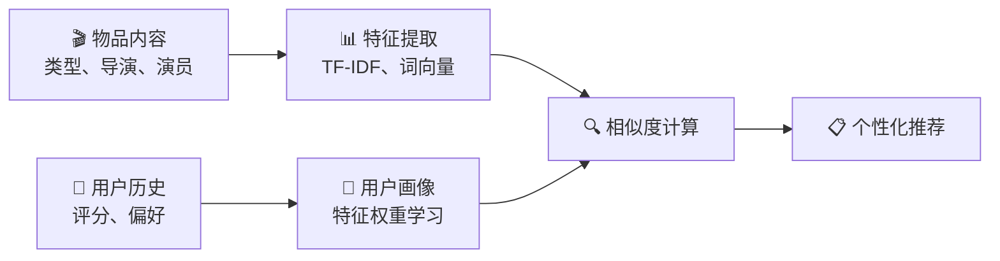
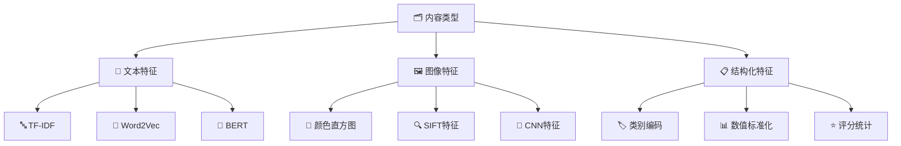
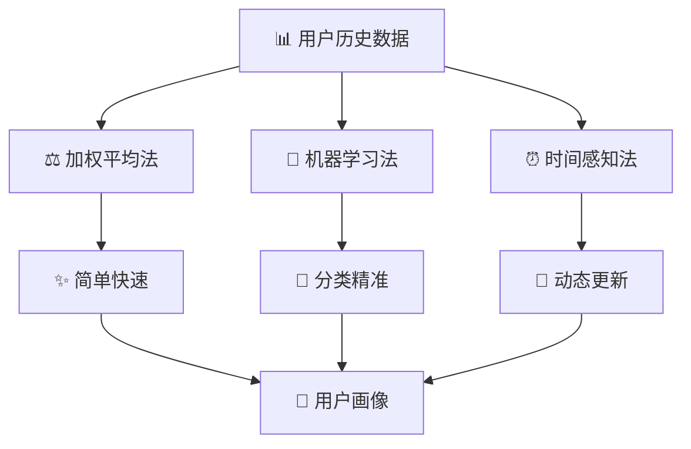
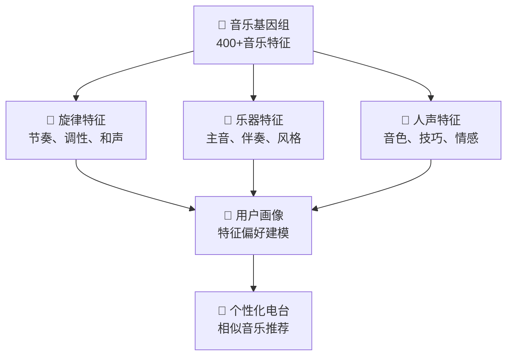
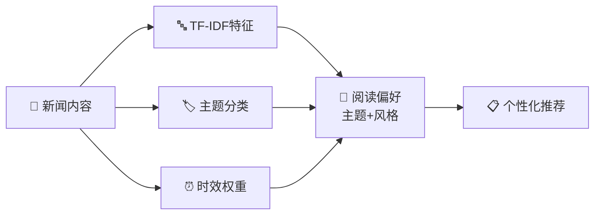

基于内容的推荐（Content-Based Filtering）是推荐系统中的另一个重要分支，其核心理念是 **"知其然，知其所以然"**。通过分析物品的内容特征和用户的历史偏好，构建用户画像，推荐具有相似内容特征的物品。

## 🧠 核心思想与工作原理

::: tip 🎨 特征驱动的智能推荐
基于内容的推荐依赖于物品的内容特征，通过学习用户对这些特征的偏好来进行推荐。
:::

### 算法直觉

想象你在选择电影：
- **类型偏好**：你喜欢科幻、动作类型的电影
- **导演偏爱**：你钟情于克里斯托弗·诺兰的作品  
- **演员喜好**：你偏爱汤姆·汉克斯主演的电影
- **智能推荐**：系统基于这些偏好特征，推荐具有相似特征的新电影



### 数学表示

设物品 $i$ 的特征向量为 $c_i \in \mathbb{R}^d$，用户 $u$ 的偏好向量为 $w_u \in \mathbb{R}^d$

**预测评分公式**：
$$\hat{r}_{ui} = w_u^T c_i = \sum_{k=1}^{d} w_{uk} \cdot c_{ik}$$

**用户偏好学习**：
$$w_u = \arg\min_w \sum_{i \in I_u} (r_{ui} - w^T c_i)^2 + \lambda ||w||^2$$

其中 $I_u$ 是用户 $u$ 评分过的物品集合。

## 📊 内容特征提取与表示



### 文本特征提取

::: info 📚 TF-IDF经典方法
TF-IDF是文本特征提取的经典方法，通过词频和逆文档频率来衡量词语的重要性。
:::

**计算公式**：
$$tfidf(t,d) = tf(t,d) \times idf(t)$$

其中：
- $tf(t,d) = \frac{count(t,d)}{\sum_{t' \in d} count(t',d)}$：词频
- $idf(t) = \log \frac{N}{df(t)}$：逆文档频率

::: details 💻 TF-IDF实现代码
```python
from sklearn.feature_extraction.text import TfidfVectorizer
import numpy as np

class ContentBasedRecommender:
    def __init__(self, max_features=5000):
        self.tfidf = TfidfVectorizer(max_features=max_features)
        self.user_profiles = {}
        
    def fit(self, items_content, user_ratings):
        """训练基于内容的推荐模型"""
        # 构建物品内容特征
        self.item_features = self.tfidf.fit_transform(items_content)
        
        # 构建用户画像
        for user_id, ratings in user_ratings.items():
            self._build_user_profile(user_id, ratings)
            
    def _build_user_profile(self, user_id, ratings):
        """构建用户画像"""
        weighted_features = np.zeros(self.item_features.shape[1])
        total_weight = 0
        
        for item_id, rating in ratings.items():
            weight = (rating - 3.0) / 2.0  # 标准化评分
            weighted_features += weight * self.item_features[item_id].toarray().flatten()
            total_weight += abs(weight)
            
        if total_weight > 0:
            self.user_profiles[user_id] = weighted_features / total_weight
            
    def predict(self, user_id, item_id):
        """预测用户对物品的评分"""
        if user_id not in self.user_profiles:
            return 3.0
            
        user_profile = self.user_profiles[user_id]
        item_features = self.item_features[item_id].toarray().flatten()
        
        # 计算余弦相似度
        similarity = np.dot(user_profile, item_features) / (
            np.linalg.norm(user_profile) * np.linalg.norm(item_features) + 1e-10
        )
        
        return 3.0 + 2.0 * similarity  # 转换为1-5评分
```
:::

### 词向量特征

::: details 💻 Word2Vec实现代码
```python
from gensim.models import Word2Vec
import numpy as np

class Word2VecContentRecommender:
    def __init__(self, vector_size=100, window=5, min_count=1):
        self.word2vec_model = None
        self.vector_size = vector_size
        self.window = window
        self.min_count = min_count
        
    def train_word2vec(self, texts):
        """训练Word2Vec模型"""
        sentences = [text.lower().split() for text in texts]
        
        self.word2vec_model = Word2Vec(
            sentences, 
            vector_size=self.vector_size,
            window=self.window,
            min_count=self.min_count,
            workers=4
        )
        
    def text_to_vector(self, text):
        """将文本转换为向量"""
        words = text.lower().split()
        word_vectors = []
        
        for word in words:
            if word in self.word2vec_model.wv:
                word_vectors.append(self.word2vec_model.wv[word])
                
        if word_vectors:
            return np.mean(word_vectors, axis=0)
        else:
            return np.zeros(self.vector_size)
```
:::

### 结构化特征处理

::: details 💻 结构化特征处理代码
```python
from sklearn.preprocessing import LabelEncoder, OneHotEncoder, StandardScaler
import pandas as pd

class StructuredFeatureProcessor:
    def __init__(self):
        self.label_encoders = {}
        self.onehot_encoders = {}
        self.scaler = None
        
    def process_categorical_features(self, df, categorical_columns):
        """处理类别特征"""
        processed_features = []
        
        for column in categorical_columns:
            if column not in df.columns:
                continue
                
            df[column] = df[column].fillna('unknown')
            
            encoder = OneHotEncoder(sparse_output=False, handle_unknown='ignore')
            encoded = encoder.fit_transform(df[[column]])
            
            feature_names = [f"{column}_{cat}" for cat in encoder.categories_[0]]
            feature_df = pd.DataFrame(encoded, columns=feature_names)
            
            processed_features.append(feature_df)
            self.onehot_encoders[column] = encoder
            
        return pd.concat(processed_features, axis=1) if processed_features else pd.DataFrame()
        
    def process_numerical_features(self, df, numerical_columns, normalize=True):
        """处理数值特征"""
        numerical_df = df[numerical_columns].copy()
        numerical_df = numerical_df.fillna(numerical_df.median())
        
        if normalize:
            scaler = StandardScaler()
            numerical_df = pd.DataFrame(
                scaler.fit_transform(numerical_df),
                columns=numerical_columns
            )
            self.scaler = scaler
            
        return numerical_df
```
:::

## 👤 用户画像构建策略



### 加权平均法

::: tip 💡 最直观的方法
根据用户的历史评分加权平均物品特征，简单有效。
:::

**公式表示**：
$$profile_u = \frac{\sum_{i \in I_u} (r_{ui} - \bar{r_u}) \cdot c_i}{\sum_{i \in I_u} |r_{ui} - \bar{r_u}|}$$

### 机器学习方法

::: details 💻 机器学习画像构建代码
```python
from sklearn.naive_bayes import GaussianNB
from sklearn.svm import SVC

class MLUserProfileBuilder:
    def __init__(self, method='naive_bayes'):
        if method == 'naive_bayes':
            self.classifier = GaussianNB()
        elif method == 'svm':
            self.classifier = SVC(probability=True)
        else:
            raise ValueError("Unsupported method")
            
    def build_profile(self, user_ratings, item_features):
        """使用机器学习构建用户画像"""
        X, y = [], []
        
        for item_id, rating in user_ratings.items():
            X.append(item_features[item_id])
            y.append(1 if rating >= 4 else 0)  # 二分类：喜欢/不喜欢
            
        if len(X) >= 2:  # 至少需要2个样本
            self.classifier.fit(X, y)
            return self.classifier
        return None
```
:::

### 时间感知画像

::: details 💻 时间感知画像构建代码
```python
class TimeAwareProfileBuilder:
    def __init__(self, decay_factor=0.9, time_window=30):
        self.decay_factor = decay_factor
        self.time_window = time_window  # 天数
        
    def build_time_aware_profile(self, user_ratings_with_time, item_features, current_time):
        """构建时间感知的用户画像"""
        user_profile = np.zeros(item_features.shape[1])
        total_weight = 0
        
        for item_id, rating, timestamp in user_ratings_with_time:
            if item_id not in item_features.index:
                continue
                
            # 计算时间衰减权重
            days_passed = (current_time - timestamp).days
            time_weight = self.decay_factor ** (days_passed / self.time_window)
            
            # 评分权重
            rating_weight = (rating - 3.0) / 2.0
            
            # 综合权重
            total_item_weight = time_weight * rating_weight
            
            user_profile += total_item_weight * item_features.loc[item_id].values
            total_weight += abs(total_item_weight)
            
        if total_weight > 0:
            user_profile /= total_weight
            
        return user_profile
```
:::

## ⚖️ 优势与局限性

### 🌟 主要优势

| 优势 | 说明 | 适用场景 |
|------|------|----------|
| **🆕 无冷启动问题** | 新物品有内容特征就能推荐 | 新闻、视频平台 |
| **🔍 可解释性强** | 基于内容特征的推荐理由 | 需要解释的场景 |
| **📊 无数据稀疏问题** | 不依赖用户行为数据 | 用户行为稀少的场景 |
| **🔄 领域适应性强** | 容易迁移到新领域 | 跨领域推荐 |

### ⚠️ 主要局限性

::: warning 🎯 过度专业化问题
基于内容的推荐容易推荐过于相似的物品，缺乏多样性和惊喜感。
:::

1. **🔂 过度专业化**：推荐物品过于相似，缺乏多样性
2. **🔧 特征提取困难**：需要高质量的内容特征工程
3. **新用户冷启动**：新用户缺乏历史数据难以画像
4. **🚫 无法发现惊喜**：难以推荐用户从未接触的新类型内容

## 🔧 改进策略与优化

### 🎨 多样性优化

::: details 💻 多样性优化代码
```python
def diversified_recommendation(user_profile, candidate_items, 
                             item_features, n_recommendations=10, 
                             diversity_factor=0.3):
    """多样性优化推荐"""
    selected_items = []
    remaining_items = list(candidate_items)
    
    # 选择第一个最相似的物品
    similarities = [cosine_similarity(user_profile, item_features[item]) 
                   for item in remaining_items]
    first_item = remaining_items[np.argmax(similarities)]
    selected_items.append(first_item)
    remaining_items.remove(first_item)
    
    # 后续选择考虑多样性
    while len(selected_items) < n_recommendations and remaining_items:
        max_score = -1
        best_item = None
        
        for item in remaining_items:
            # 相关性分数
            relevance = cosine_similarity(user_profile, item_features[item])
            
            # 多样性分数（与已选物品的平均距离）
            diversity = np.mean([
                1 - cosine_similarity(item_features[item], item_features[selected])
                for selected in selected_items
            ])
            
            # 综合分数
            score = relevance + diversity_factor * diversity
            
            if score > max_score:
                max_score = score
                best_item = item
                
        if best_item:
            selected_items.append(best_item)
            remaining_items.remove(best_item)
            
    return selected_items
```
:::

### 🎯 特征权重学习

::: details 💻 特征权重学习代码
```python
class FeatureWeightLearner:
    def __init__(self, learning_rate=0.01):
        self.learning_rate = learning_rate
        self.feature_weights = None
        
    def learn_weights(self, user_profiles, item_features, ratings):
        """学习特征权重"""
        n_features = item_features.shape[1]
        self.feature_weights = np.ones(n_features)
        
        for epoch in range(100):
            for user_id, item_id, rating in ratings:
                if user_id not in user_profiles:
                    continue
                    
                # 加权特征
                weighted_user = user_profiles[user_id] * self.feature_weights
                weighted_item = item_features[item_id] * self.feature_weights
                
                # 预测和误差
                prediction = np.dot(weighted_user, weighted_item)
                error = rating - prediction
                
                # 更新权重
                gradient = error * user_profiles[user_id] * item_features[item_id]
                self.feature_weights += self.learning_rate * gradient
                
        return self.feature_weights
```
:::

## 📈 实际应用案例

### 🎵 Pandora音乐基因组计划



**🔑 关键技术要点**：
- **深度特征分析**：400多个音乐特征维度
- **专家标注**：音乐学家手工标注每首歌曲
- **实时反馈**：用户点赞/跳过调整推荐

### 📰 Google News内容匹配



## 📖 **延伸阅读**
1. [Content-based Recommender Systems: State of the Art and Trends](https://link.springer.com/chapter/10.1007/978-0-387-85820-3_3) - Lops等人的基于内容推荐权威综述
2. [Content-Based Recommendation Systems](https://www.aaai.org/Papers/Workshops/2007/WS-07-12/WS07-12-008.pdf) - Pazzani & Billsus的内容推荐经典教材章节
3. [Content-based book recommending using learning for text categorization](https://dl.acm.org/doi/10.1145/336597.336662) - 文本分类在图书推荐中的开创性应用
4. [Scikit-learn Feature Extraction](https://scikit-learn.org/stable/modules/feature_extraction.html) - 文本特征提取和机器学习的完整指南
5. [The Music Genome Project](https://www.pandora.com/about/mgp) - Pandora音乐基因组计划的技术详解

> 🧠 **思考题**
> 
> 1. 在新闻推荐场景中，应该选择哪些内容特征？如何平衡特征重要性和计算效率？
> 
> 2. 如何为完全新的用户（没有任何历史行为）提供个性化的基于内容的推荐？
> 
> 3. 基于内容的推荐容易产生过度专业化问题，你会设计什么策略来增加推荐的多样性？
> 
> 4. 随着时间推移，用户兴趣和内容特征都会发生变化，如何设计一个能够适应这种变化的系统？
> 
> 5. 如何将基于内容的推荐与协同过滤结合，设计一个混合推荐系统？权重应该如何分配？

::: tip 🎉 章节小结
基于内容的推荐体现了"知其然，知其所以然"的哲学，通过深度分析物品内容特征和用户偏好，构建了可解释、可控制的推荐体系。从TF-IDF的经典文本分析到Word2Vec的语义理解，从简单的加权平均到复杂的机器学习画像，内容推荐展现了特征工程的艺术与科学。它不仅解决了新物品的冷启动问题，更为推荐系统提供了透明度和可解释性，是构建用户信任的重要基石。
:::

---

> "基于内容的推荐虽然直观，但它揭示了个性化服务的本质：理解用户不仅要看他做了什么，更要懂他为什么这样做。"


