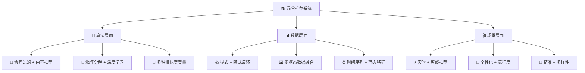
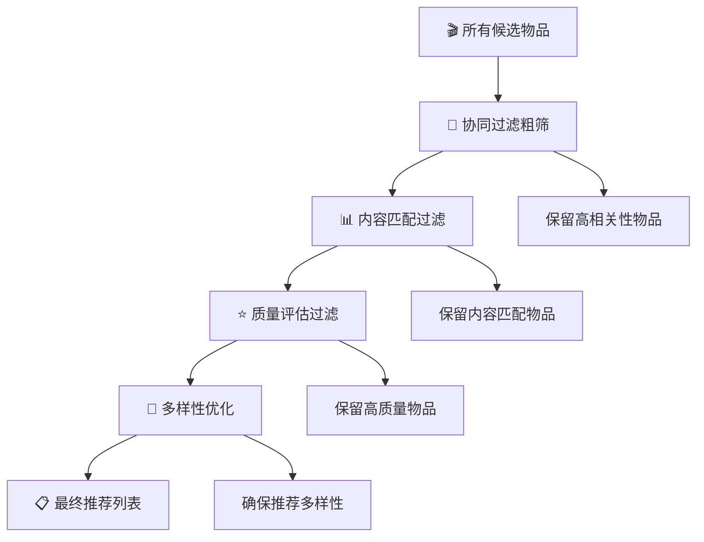
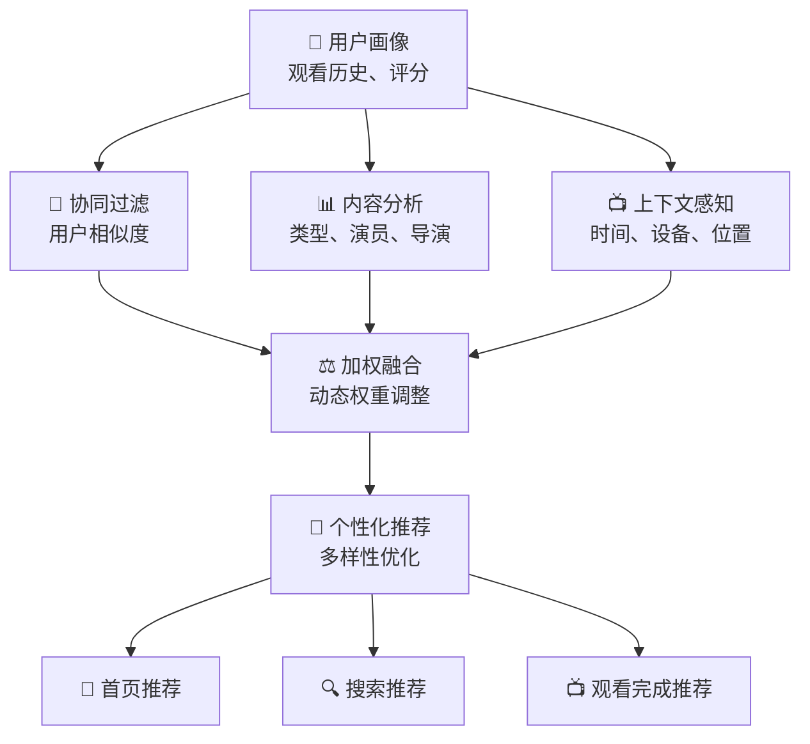
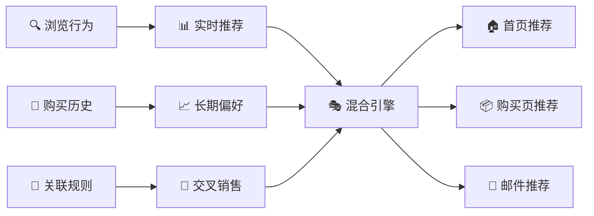

混合推荐模型（Hybrid Recommender Systems）是推荐系统发展的必然趋势，通过融合多种推荐算法的优势，克服单一算法的局限性，实现"1+1>2"的效果。正如中医的"君臣佐使"配方理念，混合推荐系统巧妙地组合不同算法，在准确性、多样性、新颖性等多个维度上达到最佳平衡。

## 🧠 核心思想与必要性

::: tip 🎯 取长补短的智慧
混合推荐的精髓在于组合不同算法的优势，同时规避各自的缺点，实现推荐效果的整体优化。
:::

### 为什么需要混合推荐？

| 单一算法局限性 | 混合策略解决方案 |
|----------------|------------------|
| **协同过滤**：冷启动、稀疏性问题 | 结合内容推荐解决新用户/物品问题 |
| **内容推荐**：过度专业化、缺乏惊喜 | 结合协同过滤增加多样性和新颖性 |
| **矩阵分解**：可解释性差 | 结合基于规则的方法提供解释 |
| **深度学习**：计算复杂、黑盒 | 结合传统方法平衡效果与效率 |

### 混合的维度



## 🎭 经典混合策略

### 加权混合 (Weighted Hybrid)

::: info 🎯 民主投票，权重为王
这就像一个专家评审团，每个评委（算法）都对候选项目（物品）打分，最后根据评委的资历（权重）综合得出最终得分。最常见也最直接，但如何确定最佳权重是关键。
:::

**数学表示**：
$$\hat{r}_{ui} = \sum_{k=1}^{K} w_k \cdot \hat{r}_{ui}^{(k)}$$

其中 $w_k$ 是第 $k$ 个算法的权重，且 $\sum_{k=1}^{K} w_k = 1$。

::: details 💻 加权混合实现代码
```python
import numpy as np
from abc import ABC, abstractmethod

class BaseRecommender(ABC):
    @abstractmethod
    def predict(self, user_id, item_id):
        pass
    
    @abstractmethod
    def recommend(self, user_id, n_recommendations=10):
        pass

class WeightedHybridRecommender:
    def __init__(self, recommenders, weights=None):
        self.recommenders = recommenders
        if weights is None:
            # 默认等权重
            weights = [1.0 / len(recommenders)] * len(recommenders)
        self.weights = np.array(weights)
        
        # 确保权重归一化
        self.weights = self.weights / np.sum(self.weights)
        
    def predict(self, user_id, item_id):
        """加权预测评分"""
        predictions = []
        for recommender in self.recommenders:
            try:
                pred = recommender.predict(user_id, item_id)
                predictions.append(pred)
            except:
                predictions.append(3.0)  # 默认评分
                
        return np.dot(self.weights, predictions)
        
    def recommend(self, user_id, n_recommendations=10):
        """加权推荐"""
        all_recommendations = {}
        
        for i, recommender in enumerate(self.recommenders):
            try:
                recs = recommender.recommend(user_id, n_recommendations * 2)
                for item_id, score in recs:
                    if item_id not in all_recommendations:
                        all_recommendations[item_id] = 0
                    all_recommendations[item_id] += self.weights[i] * score
            except:
                continue
                
        # 按分数排序
        sorted_recs = sorted(all_recommendations.items(), 
                           key=lambda x: x[1], reverse=True)
        
        return sorted_recs[:n_recommendations]
        
    def optimize_weights(self, validation_data, method='grid_search'):
        """优化权重参数"""
        if method == 'grid_search':
            return self._grid_search_weights(validation_data)
        else:
            raise ValueError(f"Unknown optimization method: {method}")
            
    def _grid_search_weights(self, validation_data, resolution=0.1):
        """网格搜索最优权重"""
        best_weights = self.weights.copy()
        best_rmse = float('inf')
        
        import itertools
        
        weight_values = np.arange(0, 1 + resolution, resolution)
        n_recommenders = len(self.recommenders)
        
        for weight_combo in itertools.product(weight_values, repeat=n_recommenders):
            if abs(sum(weight_combo) - 1.0) < 1e-6:  # 权重和为1
                self.weights = np.array(weight_combo)
                rmse = self._evaluate_rmse(validation_data)
                
                if rmse < best_rmse:
                    best_rmse = rmse
                    best_weights = self.weights.copy()
                    
        self.weights = best_weights
        return best_rmse
        
    def _evaluate_rmse(self, validation_data):
        """评估RMSE"""
        predictions = []
        actuals = []
        
        for user_id, item_id, rating in validation_data:
            pred = self.predict(user_id, item_id)
            predictions.append(pred)
            actuals.append(rating)
            
        return np.sqrt(np.mean((np.array(predictions) - np.array(actuals)) ** 2))
```
:::

### 切换混合 (Switching Hybrid)

::: info 🎯 因材施教，择优而用
这就像一个智能的调度员，它会根据具体情况（如用户是否是新手、物品是否冷门）选择最合适的专家（算法）来解决问题。例如，对新用户使用内容推荐来解决冷启动问题，对老用户则使用协同过滤。
:::

::: details 💻 切换混合实现代码
```python
class SwitchingHybridRecommender:
    def __init__(self, recommenders, switching_criteria):
        self.recommenders = recommenders
        self.switching_criteria = switching_criteria
        
    def select_recommender(self, user_id, context=None):
        """根据条件选择推荐器"""
        for criterion, recommender_idx in self.switching_criteria:
            if criterion(user_id, context):
                return self.recommenders[recommender_idx]
                
        # 默认选择第一个推荐器
        return self.recommenders[0]
        
    def predict(self, user_id, item_id, context=None):
        """切换预测"""
        selected_recommender = self.select_recommender(user_id, context)
        return selected_recommender.predict(user_id, item_id)
        
    def recommend(self, user_id, n_recommendations=10, context=None):
        """切换推荐"""
        selected_recommender = self.select_recommender(user_id, context)
        return selected_recommender.recommend(user_id, n_recommendations)

# 示例切换条件
def create_switching_criteria():
    """创建切换条件"""
    criteria = []
    
    # 新用户使用基于内容的推荐
    def is_new_user(user_id, context):
        user_rating_count = context.get('user_rating_count', {}).get(user_id, 0)
        return user_rating_count < 5
    
    # 冷门物品使用基于内容的推荐
    def is_cold_item(user_id, context):
        if context and 'item_id' in context:
            item_rating_count = context.get('item_rating_count', {}).get(context['item_id'], 0)
            return item_rating_count < 10
        return False
    
    # 高活跃用户使用协同过滤
    def is_active_user(user_id, context):
        user_rating_count = context.get('user_rating_count', {}).get(user_id, 0)
        return user_rating_count >= 20
    
    criteria.append((is_new_user, 1))      # 使用内容推荐器 (索引1)
    criteria.append((is_active_user, 0))   # 使用协同过滤器 (索引0)
    
    return criteria
```
:::

### 混合混合 (Mixed Hybrid)

::: info 🎯 百花齐放，多样呈现
这就像一个美食广场，同时为你呈现来自不同菜系（算法）的招牌菜（推荐结果），并将它们一同展示在你的面前。这种策略的优点是能够显著增加推荐结果的多样性。
:::

::: details 💻 混合混合实现代码
```python
class MixedHybridRecommender:
    def __init__(self, recommenders, mixing_ratios=None):
        self.recommenders = recommenders
        if mixing_ratios is None:
            mixing_ratios = [1.0 / len(recommenders)] * len(recommenders)
        self.mixing_ratios = mixing_ratios
        
    def recommend(self, user_id, n_recommendations=10):
        """混合推荐结果"""
        all_recommendations = []
        
        for i, recommender in enumerate(self.recommenders):
            # 计算每个推荐器应该贡献的推荐数量
            n_from_this = int(n_recommendations * self.mixing_ratios[i])
            
            try:
                recs = recommender.recommend(user_id, n_from_this * 2)
                # 标记推荐来源
                tagged_recs = [(item_id, score, f"algo_{i}") 
                              for item_id, score in recs[:n_from_this]]
                all_recommendations.extend(tagged_recs)
            except:
                continue
                
        # 去重并保留多样性
        unique_recommendations = self._remove_duplicates_preserve_diversity(
            all_recommendations
        )
        
        return unique_recommendations[:n_recommendations]
        
    def _remove_duplicates_preserve_diversity(self, recommendations):
        """去重并保持多样性"""
        seen_items = set()
        unique_recs = []
        
        # 按算法轮询，保证每个算法都有代表性
        algo_queues = {}
        for item_id, score, algo in recommendations:
            if algo not in algo_queues:
                algo_queues[algo] = []
            algo_queues[algo].append((item_id, score, algo))
            
        # 轮询选择
        max_len = max(len(queue) for queue in algo_queues.values()) if algo_queues else 0
        
        for i in range(max_len):
            for algo, queue in algo_queues.items():
                if i < len(queue):
                    item_id, score, algo_name = queue[i]
                    if item_id not in seen_items:
                        unique_recs.append((item_id, score, algo_name))
                        seen_items.add(item_id)
                        
        return unique_recs
```
:::

### 特征组合 (Feature Combination)

::: info 🎯 博采众长，模型融合
这不像前几种方法在推荐结果上做文章，而是直接在"原材料"层面进行融合。它将不同算法的预测结果作为新的特征，与其他特征（如用户画像、物品属性）一起，喂给一个更强大的"元模型"进行学习，从而做出更精准的判断。这种方法本质上是机器学习中的 Stacking 思想。
:::

::: details 💻 特征组合实现代码
```python
from sklearn.ensemble import RandomForestRegressor
import pandas as pd

class FeatureCombinationRecommender:
    def __init__(self, base_recommenders, meta_model=None):
        self.base_recommenders = base_recommenders
        if meta_model is None:
            meta_model = RandomForestRegressor(n_estimators=100, random_state=42)
        self.meta_model = meta_model
        self.is_trained = False
        
    def _extract_features(self, user_id, item_id):
        """提取特征向量"""
        features = []
        
        # 基础推荐器的预测作为特征
        for recommender in self.base_recommenders:
            try:
                pred = recommender.predict(user_id, item_id)
                features.append(pred)
            except:
                features.append(3.0)  # 默认值
                
        return np.array(features)
        
    def fit(self, training_data):
        """训练元模型"""
        X = []
        y = []
        
        for user_id, item_id, rating in training_data:
            features = self._extract_features(user_id, item_id)
            X.append(features)
            y.append(rating)
            
        X = np.array(X)
        y = np.array(y)
        
        self.meta_model.fit(X, y)
        self.is_trained = True
        
    def predict(self, user_id, item_id):
        """预测评分"""
        if not self.is_trained:
            raise ValueError("Model not trained yet")
            
        features = self._extract_features(user_id, item_id)
        return self.meta_model.predict([features])[0]
        
    def recommend(self, user_id, candidate_items, n_recommendations=10):
        """推荐物品"""
        predictions = []
        
        for item_id in candidate_items:
            pred = self.predict(user_id, item_id)
            predictions.append((item_id, pred))
            
        predictions.sort(key=lambda x: x[1], reverse=True)
        return predictions[:n_recommendations]
```
:::

## 🚀 高级混合策略

当基础的混合策略无法满足复杂的业务需求时，更精巧、更动态的高级混合策略便应运而生。它们通常是多阶段、自适应的，能够更好地平衡推荐系统中的多个目标。

### 🔄 级联混合 (Cascade Hybrid)

::: info 🎯 层层筛选，步步为营
级联混合就像一个严谨的多轮面试流程。候选物品需要依次通过协同过滤、内容匹配、质量评估等多道关卡，每一关都会淘汰掉一部分不合适的候选者，最终只有最优秀的才能进入最终推荐列表。这种方式能够有效控制计算开销，同时保证最终结果的质量。
:::

多层过滤逐步精细化：



::: details 💻 级联混合实现代码
```python
class CascadeHybridRecommender:
    def __init__(self, recommender_stages):
        """
        recommender_stages: 推荐器阶段列表
        每个阶段包含 (recommender, filter_function, stage_name)
        """
        self.stages = recommender_stages
        
    def recommend(self, user_id, n_recommendations=10, initial_candidates=None):
        """级联推荐"""
        if initial_candidates is None:
            # 获取大量候选物品
            initial_candidates = self._get_all_candidates(user_id)
            
        current_candidates = initial_candidates
        stage_results = {}
        
        for stage_idx, (recommender, filter_func, stage_name) in enumerate(self.stages):
            print(f"Stage {stage_idx + 1}: {stage_name}")
            print(f"Input candidates: {len(current_candidates)}")
            
            # 当前阶段推荐
            stage_recs = recommender.recommend(
                user_id, 
                min(len(current_candidates), n_recommendations * (stage_idx + 2))
            )
            
            # 应用过滤条件
            filtered_candidates = []
            stage_items = [item_id for item_id, _ in stage_recs]
            
            for item_id in current_candidates:
                if item_id in stage_items and filter_func(user_id, item_id):
                    # 获取该物品的评分
                    item_score = next((score for iid, score in stage_recs if iid == item_id), 0)
                    filtered_candidates.append((item_id, item_score))
                    
            # 排序并更新候选集
            filtered_candidates.sort(key=lambda x: x[1], reverse=True)
            current_candidates = [item_id for item_id, _ in filtered_candidates]
            
            stage_results[stage_name] = {
                'candidates': current_candidates.copy(),
                'count': len(current_candidates)
            }
            
            print(f"Output candidates: {len(current_candidates)}")
            
            # 如果候选数量已经满足需求，可以提前结束
            if len(current_candidates) <= n_recommendations:
                break
                
        return current_candidates[:n_recommendations], stage_results
        
    def _get_all_candidates(self, user_id):
        """获取所有候选物品"""
        # 这里应该根据实际情况实现
        # 可以是用户未评分的所有物品
        pass
```
:::

### ⚡ 动态权重混合

::: info 🎯 实时调优，与时俱进
静态权重无法适应用户兴趣的变化和环境的变迁。动态权重混合则引入了学习机制，它会根据用户的实时反馈（如点击、购买）来动态调整不同算法的权重。表现好的算法权重会增加，表现差的则会降低，使得整个系统具有自适应和持续优化的能力。
:::

::: details 💻 动态权重混合实现代码
```python
class DynamicWeightHybridRecommender:
    def __init__(self, base_recommenders, initial_weights=None, learning_rate=0.01):
        self.base_recommenders = base_recommenders
        if initial_weights is None:
            initial_weights = [1.0 / len(base_recommenders)] * len(base_recommenders)
        self.weights = np.array(initial_weights)
        self.learning_rate = learning_rate
        self.performance_history = {i: [] for i in range(len(base_recommenders))}
        
    def predict(self, user_id, item_id):
        """动态权重预测"""
        predictions = []
        for recommender in self.base_recommenders:
            pred = recommender.predict(user_id, item_id)
            predictions.append(pred)
            
        return np.dot(self.weights, predictions)
        
    def update_weights(self, user_id, item_id, actual_rating):
        """根据实际反馈更新权重"""
        predictions = []
        errors = []
        
        # 计算每个推荐器的预测和误差
        for i, recommender in enumerate(self.base_recommenders):
            pred = recommender.predict(user_id, item_id)
            error = abs(actual_rating - pred)
            
            predictions.append(pred)
            errors.append(error)
            self.performance_history[i].append(error)
            
        # 基于误差更新权重
        error_array = np.array(errors)
        
        # 计算权重调整（误差的倒数作为性能指标）
        performance = 1.0 / (error_array + 1e-10)  # 避免除零
        performance = performance / np.sum(performance)  # 归一化
        
        # 梯度更新
        weight_update = self.learning_rate * (performance - self.weights)
        self.weights += weight_update
        
        # 确保权重非负且归一化
        self.weights = np.maximum(self.weights, 0.01)  # 最小权重防止某个算法完全被忽略
        self.weights = self.weights / np.sum(self.weights)
        
    def get_performance_summary(self, window_size=100):
        """获取性能摘要"""
        summary = {}
        for i, history in self.performance_history.items():
            if len(history) > 0:
                recent_performance = history[-window_size:] if len(history) > window_size else history
                summary[f"Algorithm_{i}"] = {
                    'current_weight': self.weights[i],
                    'recent_avg_error': np.mean(recent_performance),
                    'total_predictions': len(history)
                }
        return summary
```
:::

## 📊 评估与优化

混合推荐系统的成功与否，不能仅仅依赖于离线评估的准确率。一个健壮的评估体系需要从多个维度考量，并且最终要通过在线的 A/B 测试来验证其真正价值。

### 🎯 多目标评估框架

::: info 🎯 全面体检，而非单科测试
只看准确率的评估是片面的。一个好的推荐系统还需要考虑多样性（能否推荐不同类型的物品）、新颖性（能否推荐用户不知道的新东西）和覆盖率（模型能推荐的物品范围有多广）。多目标评估框架旨在建立一个全面的"体检报告"，系统性地衡量混合策略的综合表现。
:::

::: details 💻 多目标评估代码
```python
class HybridRecommenderEvaluator:
    def __init__(self):
        self.metrics = {}
        
    def evaluate(self, recommender, test_data, diversity_threshold=0.7):
        """综合评估混合推荐系统"""
        results = {}
        
        # 准确性指标
        results['accuracy'] = self._evaluate_accuracy(recommender, test_data)
        
        # 多样性指标
        results['diversity'] = self._evaluate_diversity(recommender, test_data)
        
        # 新颖性指标
        results['novelty'] = self._evaluate_novelty(recommender, test_data)
        
        # 覆盖率指标
        results['coverage'] = self._evaluate_coverage(recommender, test_data)
        
        return results
        
    def _evaluate_accuracy(self, recommender, test_data):
        """评估准确性"""
        predictions = []
        actuals = []
        
        for user_id, item_id, rating in test_data:
            pred = recommender.predict(user_id, item_id)
            predictions.append(pred)
            actuals.append(rating)
            
        rmse = np.sqrt(np.mean((np.array(predictions) - np.array(actuals)) ** 2))
        mae = np.mean(np.abs(np.array(predictions) - np.array(actuals)))
        
        return {'rmse': rmse, 'mae': mae}
        
    def _evaluate_diversity(self, recommender, test_data):
        """评估多样性"""
        user_recommendations = {}
        
        # 为每个用户生成推荐
        for user_id in set(user for user, _, _ in test_data):
            recs = recommender.recommend(user_id, 10)
            user_recommendations[user_id] = [item_id for item_id, _ in recs]
            
        # 计算推荐列表内多样性（ILD - Intra-List Diversity）
        diversity_scores = []
        for user_id, rec_list in user_recommendations.items():
            if len(rec_list) > 1:
                total_similarity = 0
                pair_count = 0
                
                for i in range(len(rec_list)):
                    for j in range(i + 1, len(rec_list)):
                        # 这里需要实现物品相似度计算
                        similarity = self._compute_item_similarity(rec_list[i], rec_list[j])
                        total_similarity += similarity
                        pair_count += 1
                        
                avg_similarity = total_similarity / pair_count if pair_count > 0 else 0
                diversity = 1 - avg_similarity
                diversity_scores.append(diversity)
                
        return np.mean(diversity_scores) if diversity_scores else 0
        
    def _compute_item_similarity(self, item1, item2):
        """计算物品相似度（需要根据实际情况实现）"""
        # 简化实现：随机相似度
        return np.random.random()
```
:::

### 🔬 A/B测试框架

::: info 🎯 是骡子是马拉出来遛遛
离线指标表现再好，也可能只是"实验室数据"。A/B 测试是检验推荐系统真实效果的黄金标准。通过将用户随机分流到对照组（使用旧算法）和实验组（使用新混合策略），我们可以直接比较它们在真实业务指标（如点击率、转化率）上的表现差异，从而做出最可靠的决策。
:::

::: details 💻 A/B测试框架代码
```python
import time

class ABTestFramework:
    def __init__(self, control_recommender, test_recommender, traffic_split=0.5):
        self.control_recommender = control_recommender
        self.test_recommender = test_recommender
        self.traffic_split = traffic_split
        self.test_results = {'control': [], 'test': []}
        
    def get_recommendation(self, user_id, n_recommendations=10):
        """根据A/B测试分流获取推荐"""
        # 简单的哈希分流
        user_hash = hash(str(user_id)) % 100
        
        if user_hash < self.traffic_split * 100:
            group = 'test'
            recommendations = self.test_recommender.recommend(user_id, n_recommendations)
        else:
            group = 'control'
            recommendations = self.control_recommender.recommend(user_id, n_recommendations)
            
        return recommendations, group
        
    def log_interaction(self, user_id, item_id, interaction_type, group):
        """记录用户交互"""
        self.test_results[group].append({
            'user_id': user_id,
            'item_id': item_id,
            'interaction_type': interaction_type,  # 'click', 'purchase', 'rating' etc.
            'timestamp': time.time()
        })
        
    def analyze_results(self):
        """分析A/B测试结果"""
        control_metrics = self._compute_metrics(self.test_results['control'])
        test_metrics = self._compute_metrics(self.test_results['test'])
        
        return {
            'control': control_metrics,
            'test': test_metrics,
            'improvement': self._compute_improvement(control_metrics, test_metrics)
        }
        
    def _compute_metrics(self, interactions):
        """计算指标"""
        if not interactions:
            return {}
            
        total_interactions = len(interactions)
        click_rate = len([i for i in interactions if i['interaction_type'] == 'click']) / total_interactions
        purchase_rate = len([i for i in interactions if i['interaction_type'] == 'purchase']) / total_interactions
        
        return {
            'total_interactions': total_interactions,
            'click_rate': click_rate,
            'purchase_rate': purchase_rate
        }
        
    def _compute_improvement(self, control, test):
        """计算改进幅度"""
        improvements = {}
        for metric in control:
            if control[metric] > 0:
                improvement = (test[metric] - control[metric]) / control[metric] * 100
                improvements[f"{metric}_improvement"] = improvement
        return improvements
```
:::

## 📈 实际应用案例

### 🎬 Netflix的混合推荐架构



**🔑 关键技术要点**：
- **多层次融合**：矩阵分解+深度学习+内容分析
- **实时权重调整**：根据用户反馈动态优化
- **场景感知**：不同场景使用不同策略

### 🛒 Amazon的多层混合策略



## 📚 延伸阅读

### 🏛️ 经典论文
- **Burke (2002)**: "Hybrid Recommender Systems: Survey and Experiments" - 混合推荐系统权威综述
- **Adomavicius & Tuzhilin (2005)**: "Toward the next generation of recommender systems" - 推荐系统发展趋势和未来方向
- **Su & Khoshgoftaar (2009)**: "A survey of collaborative filtering techniques" - 协同过滤技术全面调研

### 📖 技术资源
- **Apache Mahout**: 大规模混合推荐系统实现框架
- **Surprise**: Python推荐系统库，支持多种混合策略
- **TensorFlow Recommenders**: Google的深度学习推荐系统框架

### 🏭 工业实践案例
- **🎬 Netflix**: 复杂的多层混合推荐系统架构
- **🛒 Amazon**: 多场景下的混合推荐策略
- **🎵 Spotify**: 音乐推荐中的创新混合方法


> 🧠 **思考题**
> 
> 1. 在加权混合中，如何动态调整不同算法的权重？设计一个基于在线学习的权重更新策略。
> 
> 2. 混合推荐系统如何更好地处理冷启动问题？不同的混合策略在冷启动场景下有什么差异？
> 
> 3. 混合推荐系统通常计算复杂度较高，如何在保证推荐质量的前提下优化计算效率？
> 
> 4. 如何在混合推荐中平衡准确性和多样性？设计一个多目标优化的混合策略。
> 
> 5. 如何设计一个能够实时适应用户行为变化的混合推荐系统？考虑概念漂移和模型更新的问题。

::: tip 🎉 章节小结
混合推荐模型体现了"取长补短"的智慧，通过巧妙组合不同算法的优势，在准确性、多样性、新颖性等多个维度上实现了显著提升。从简单的加权混合到复杂的级联策略，从静态权重到动态调整，混合推荐系统展现了推荐算法的集大成之美。掌握各种混合策略的原理和实现，不仅是构建高质量推荐系统的必备技能，更是理解如何在复杂业务场景中平衡多重目标的关键所在。
:::


> 混合推荐的本质，就是不做"偏科生"，而是集各家之长，像乐队指挥一样，让不同乐器（算法）在最合适的时机奏响，最终合奏出一曲最懂你的个性化乐章。

