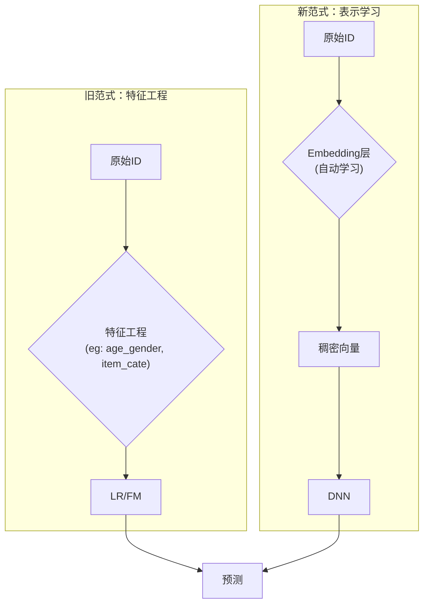

在深度学习浪潮席卷人工智能的各个领域之前，推荐系统由协同过滤、逻辑回归（LR）和因子分解机（FM）等模型主导。这些模型简洁、有效，但它们共同的"阿喀琉斯之踵"是——**特征工程（Feature Engineering）**。算法工程师们如同手工艺人，需要凭借大量的领域知识、经验和直觉，手动设计有效的交叉特征，这个过程不仅耗时耗力，而且往往难以发掘出数据中那些"反直觉"的隐藏模式。

2016年，Google一篇《Wide & Deep Learning for Recommender Systems》横空出世，如同一声号角，正式宣告了推荐系统"文艺复兴"时代的到来。这场复兴的核心，正是**用深度学习实现"端到端"的自动化特征学习**，将工程师从繁重的体力劳动中解放出来，去探索更广阔的模型结构和业务边界。

## 🚀 范式革命：从"特征工程"到"表示学习"

深度学习带来的革命，其本质是 **表示学习（Representation Learning）** 代替了手工特征工程。

-   **旧范式**：`原始数据 -> 人工特征工程 -> 简单模型（如LR） -> 预测`
-   **新范式**：`原始数据 -> 自动表示学习（Embedding） -> 复杂模型（如DNN） -> 预测`

**嵌入（Embedding）** 是这场革命的基石。它将每一个原始、高维、稀疏的特征（如每一个`user_id`或`item_id`），映射到一个低维、稠密的向量空间中。在这个神奇的空间里，相似的物品或用户在距离上会更接近。更重要的是，这些嵌入向量成为了神经网络的"通用语言"，使得端到端的学习成为可能。



## 🎯 核心模型演进之路

深度学习推荐模型的演进，清晰地反映了业界对"记忆"与"泛化"能力、以及对用户兴趣理解深度的不断追求。

### 1. Wide & Deep：记忆与泛化的首次握手

Wide & Deep模型的设计哲学充满了智慧的平衡。它没有完全抛弃传统方法的优点，而是将两者巧妙地结合起来，是"承前启后"的经典之作。

-   **Wide部分（记忆）**：本质上是一个广义线性模型。它负责"记忆"那些在历史数据中被反复验证过的、重要的、显式的交叉特征。例如，`AND(user_gender=female, item_category=cosmetics)` 这种强共现规则，可以被Wide部分快速、精准地记住。这部分通常使用需要人工设计的稀疏交叉特征。
-   **Deep部分（泛化）**：是一个标准的前馈神经网络（DNN）。它负责"泛化"，通过特征的多次非线性变换，探索那些从未或很少在历史中出现过的、潜在的特征组合。例如，一个用户从未买过"卸妆水"，但Deep模型可以根据她购买"粉底液"和"眼影"的行为，泛化出她对"卸妆水"的潜在兴趣。这部分通常使用用户的画像特征和物品的属性特征。

**最终预测是两部分的加权和**，再通过Sigmoid函数输出：
$[ P(Y=1|\mathbf{x}) = \sigma(\mathbf{w}_{wide}^T \mathbf{x} + \mathbf{w}_{deep}^T \mathbf{a}^{(l_f)} + b) ]$

::: details Wide & Deep 核心逻辑实现
```python
import torch

from ...basic.layers import LR, MLP, EmbeddingLayer


class WideDeep(torch.nn.Module):
    """Wide & Deep Learning model.

    Args:
        wide_features (list): the list of `Feature Class`, training by the wide part module.
        deep_features (list): the list of `Feature Class`, training by the deep part module.
        mlp_params (dict): the params of the last MLP module, keys include:`{"dims":list, "activation":str, "dropout":float, "output_layer":bool`}
    """

    def __init__(self, wide_features, deep_features, mlp_params):
        super(WideDeep, self).__init__()
        self.wide_features = wide_features
        self.deep_features = deep_features
        self.wide_dims = sum([fea.embed_dim for fea in wide_features])
        self.deep_dims = sum([fea.embed_dim for fea in deep_features])
        self.linear = LR(self.wide_dims)
        self.embedding = EmbeddingLayer(wide_features + deep_features)
        self.mlp = MLP(self.deep_dims, **mlp_params)

    def forward(self, x):
        input_wide = self.embedding(x, self.wide_features, squeeze_dim=True)  #[batch_size, wide_dims]
        input_deep = self.embedding(x, self.deep_features, squeeze_dim=True)  #[batch_size, deep_dims]

        y_wide = self.linear(input_wide)  #[batch_size, 1]
        y_deep = self.mlp(input_deep)  #[batch_size, 1]
        y = y_wide + y_deep
        y = torch.sigmoid(y.squeeze(1))
        return y
```
:::

### 2. DeepFM：终结手工特征交叉

Wide & Deep虽然强大，但它的Wide部分仍然依赖人工设计特征，未能完全实现端到端。**DeepFM (Deep Factorization Machine)** 的出现，优雅地解决了这个问题。

DeepFM的核心创新在于：**它将Wide部分替换为了一个因子分解机（FM）**，并且这个FM组件与Deep组件**共享同一套输入嵌入**。

-   **FM组件**：负责学习**一阶和二阶特征交叉**。它能像`Wide`部分一样捕捉特征的直接关联，但无需人工设计。例如，`user_id`的嵌入和`item_id`的嵌入向量做内积，就自动地学习了这对ID的二阶交叉特征。
-   **Deep组件**：与Wide & Deep中的Deep部分完全一样，负责学习**高阶的、隐含的特征交叉**。

这种共享嵌入的架构带来了两大好处：
1.  **端到端训练**：不再需要任何人工特征工程。
2.  **效率与效果**：模型从原始特征中同时学习了一阶、二阶和高阶的交叉，效果更好，且参数共享使得训练更高效。

::: details DeepFM 核心逻辑实现
```python
import torch

from ...basic.layers import FM, MLP, LR, EmbeddingLayer


class DeepFM(torch.nn.Module):
    """Deep Factorization Machine Model

    Args:
        deep_features (list): the list of `Feature Class`, training by the deep part module.
        fm_features (list): the list of `Feature Class`, training by the fm part module.
        mlp_params (dict): the params of the last MLP module, keys include:`{"dims":list, "activation":str, "dropout":float, "output_layer":bool`}
    """

    def __init__(self, deep_features, fm_features, mlp_params):
        super(DeepFM, self).__init__()
        self.deep_features = deep_features
        self.fm_features = fm_features
        self.deep_dims = sum([fea.embed_dim for fea in deep_features])
        self.fm_dims = sum([fea.embed_dim for fea in fm_features])
        self.linear = LR(self.fm_dims)  # 1-odrder interaction
        self.fm = FM(reduce_sum=True)  # 2-odrder interaction
        self.embedding = EmbeddingLayer(deep_features + fm_features)
        self.mlp = MLP(self.deep_dims, **mlp_params)

    def forward(self, x):
        input_deep = self.embedding(x, self.deep_features, squeeze_dim=True)  #[batch_size, deep_dims]
        input_fm = self.embedding(x, self.fm_features, squeeze_dim=False)  #[batch_size, num_fields, embed_dim]

        y_linear = self.linear(input_fm.flatten(start_dim=1))
        y_fm = self.fm(input_fm)
        y_deep = self.mlp(input_deep)  #[batch_size, 1]
        y = y_linear + y_fm + y_deep
        return torch.sigmoid(y.squeeze(1))
```
:::


### 3. DIN：洞察用户动态兴趣

无论是Wide&Deep还是DeepFM，它们在处理用户历史行为时，通常只是将行为序列的嵌入向量进行简单的池化（如求和或平均），这等于把用户丰富多彩的兴趣（如"爱看篮球"、"刚买了相机"、"最近在听古典乐"）压缩成了一个模糊的平均兴趣。

**DIN (Deep Interest Network)** 革命性地指出：**用户的兴趣是动态的，应该根据当前的"目标"来决定关注历史中的哪部分信息。** 当向一个用户推荐"篮球鞋"时，他最近浏览"篮球比赛"的行为就应该比他上周购买"相机"的行为获得更高的权重。

DIN为此设计了**注意力机制（Attention Mechanism）**：
-   它将**候选物品（Target Item）** 作为"查询（Query）"。
-   将用户的**历史行为序列（History Behaviors）** 作为"键（Keys）"和"值（Values）"。
-   通过一个"注意力激活单元"（本质是个小型MLP），计算候选物品与每一条历史行为的"相关性得分"。
-   最后，用这些得分作为权重，对历史行为序列的嵌入进行加权求和，得到一个为当前候选物品"量身定制"的用户兴趣表示。

$$ \text{UserInterest}(\mathbf{c}) = \sum_{i=1}^{T} \alpha_i \cdot \mathbf{h}_i = \sum_{i=1}^{T} \text{attention}(\mathbf{c}, \mathbf{h}_i) \cdot \mathbf{h}_i $$

DIN标志着推荐模型从对"静态用户画像"的理解，迈向了对"动态用户意图"的捕捉。

## 🏙️ 应对真实世界的复杂性：多任务学习

在真实的业务场景中，我们往往不只关心**点击率（CTR）**，还关心**转化率（CVR）**、**观看时长**、**分享率**等多个指标。多任务学习（Multi-Task Learning, MTL）就是为了同时优化这些目标而设计的。

最经典的模型之一是 **ESMM (Entire Space Multi-task Model)**，它巧妙地利用了任务间的依赖关系。在电商场景中，用户必须先"点击"商品，才可能"购买"商品。因此，转化（Purchase）行为必然发生在点击（Click）行为之后。ESMM利用这个关系，将预测目标分解为：
$$ p(\text{conversion} | \text{impression}) = p(\text{click} | \text{impression}) \times p(\text{conversion} | \text{click}) $$

$$ pCTCVR = pCTR \times pCVR $$

模型通过构建两个独立的预测塔（一个预测pCTR，一个预测pCVR），并共享底层的特征嵌入。关键在于，pCVR塔的训练信号来自于pCTCVR的预测结果，从而巧妙地解决了直接对CVR建模时存在的**样本选择偏差**（只有点击样本才有转化标签）和**数据稀疏**问题。

## 📖 延伸阅读

1.  [Wide & Deep Learning for Recommender Systems (DLRS'16)](https://arxiv.org/abs/1606.07792) - 深度学习推荐的开山之作。
2.  [DeepFM: A Factorization-Machine based Neural Network for CTR Prediction (IJCAI'17)](https://arxiv.org/abs/1703.04247) - 优雅地统一了低阶和高阶特征交叉。
3.  [Deep Interest Network for Click-Through Rate Prediction (KDD'18)](https://arxiv.org/abs/1706.06978) - 将注意力机制成功引入推荐领域。
4.  [Entire Space Multi-Task Model: An Effective Approach for Estimating Post-Click Conversion Rate (SIGIR'18)](https://arxiv.org/abs/1804.07931) - 多任务学习的经典范式。

> 🧠 **思考题**
> 
> 1. **特征选择**：在设计Wide & Deep模型时，你会如何划分特征进入Wide部分和Deep部分？请举例说明并陈述你的理由。
> 2. **冷启动问题**：对于一个没有任何历史行为的新用户，你认为DeepFM和DIN哪个模型能更好地处理他的推荐请求？为什么？
> 3. **注意力失效**：在什么情况下，你认为DIN的注意力机制可能会"失效"或者说不起作用？（例如，用户的行为序列非常短，或者行为非常单一）
> 4. **多任务的挑战**：除了ESMM，你还能想到哪些方法来解决多任务学习中可能出现的"跷跷板效应"（即一个任务性能提升，另一个任务性能下降）？（提示：可以思考MMoE等模型）
> 5. **超越ID**：本章讨论的模型主要基于用户的行为ID序列。如果你的物品有丰富的文本或图像内容，你会如何改造这些模型来利用这些多模态信息？

::: tip 🎉 章节小结
深度学习在推荐系统中的"文艺复兴"，本质上是从手工特征工程向自动表示学习的范式转变。Wide & Deep开启了记忆与泛化并重的时代，DeepFM实现了真正的端到端学习，DIN则让我们理解了用户兴趣的动态性。这场革命不仅解放了算法工程师的双手，更重要的是让推荐系统具备了理解复杂用户行为模式的能力。从静态画像到动态意图，从单一目标到多任务优化，深度学习为推荐系统注入了前所未有的智能。
:::

---

> "The best way to predict the future is to invent it." —— Alan Kay  
> 深度学习不仅预测了推荐系统的未来，更是亲手创造了这个智能化的未来。 