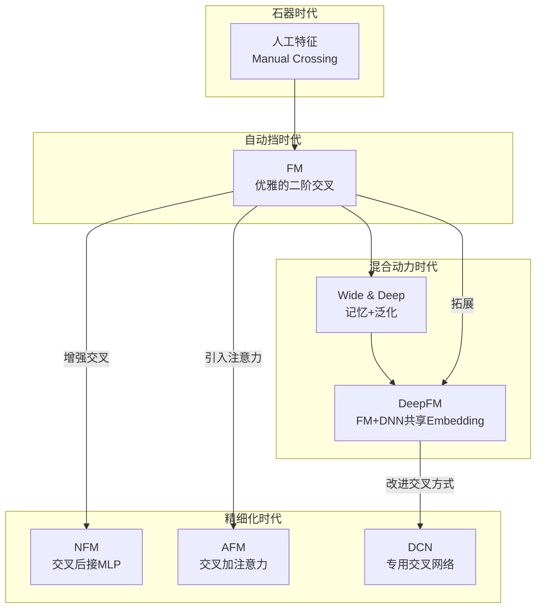

想象一下，一个推荐系统如果只会单独看特征，会发生什么？
- 它看到"用户A是女性"，可能会推荐所有女性化的商品。
- 它看到"商品B是口红"，可能会推荐给所有用户。

这显然不够聪明。一个好的推荐系统，必须理解特征之间的"化学反应"：
- **"用户是年轻女性" + "商品是口红" → 点击率飙升**
- **"时间是深夜" + "商品是零食" → 转化率提高**
- **"用户刚买了手机" + "商品是手机壳" → 强关联**

这种挖掘特征之间隐藏关系的能力，就是**特征交叉**。它决定了模型效果的天花板，是推荐系统从"能用"到"好用"的关键，堪称推荐模型的"灵魂"。

## 🗿 石器时代：人工特征交叉的"辛酸泪"

在早期，工程师们扮演着"炼丹师"的角色，依靠领域知识和经验，手动创造交叉特征。

- **方法**：`IF user.gender='female' AND item.category='makeup' THEN feature_A=1`
- **优点**：可解释性强，直观可控。
- **痛点**：
    1.  **组合爆炸**：几个特征就能组合出成千上万的新特征，无法穷举。
    2.  **依赖经验**：高度依赖工程师的业务理解，容易遗漏关键交叉。
    3.  **难以泛化**：对训练集中未出现过的组合无能为力。

这个阶段费时费力，且效果难以保证，我们迫切需要一种能自动学习特征交叉的方法。

## 🚗 自动挡革命：FM，优雅地推开新世界大门

FM (Factorization Machines) 的出现，如同给推荐系统装上了"自动挡"，优雅地解决了特征交叉问题。

### FM的核心思想

FM的构思堪称天才：**为每个特征学习一个隐向量（Embedding），用向量内积来代表特征间的交叉强度。**

- **特征**：`用户=小明`，`性别=男`，`物品=游戏机`，`类别=电子产品`...
- **隐向量**：
    - `v(小明)` = [0.1, -0.5, ...]
    - `v(游戏机)` = [0.2, -0.4, ...]
- **交叉强度**：`v(小明)` · `v(游戏机)` 的点积结果。如果点积值大，说明"小明"和"游戏机"的关联性强。

由于所有特征都被映射到了同一个隐空间，即使"小明"从未买过"PS5"，模型也能通过`v(小明)`和`v(PS5)`的相似性，推断出他对PS5的兴趣，完美解决了数据稀疏和泛化问题。

### 数学之美

FM的公式简洁而强大：
$$\hat{y}(\mathbf{x}) = w_0 + \sum_{i=1}^{n} w_i x_i + \sum_{i=1}^{n} \sum_{j=i+1}^{n} \langle \mathbf{v}_i, \mathbf{v}_j \rangle x_i x_j$$

- **第一部分** ($w_0$): 全局偏置，模型的基准线。
- **第二部分** ($\sum w_i x_i$): 传统线性模型部分，建模单个特征的权重。
- **第三部分** ($\sum \sum \langle \mathbf{v}_i, \mathbf{v}_j \rangle x_i x_j$): FM的精髓，用隐向量内积自动计算所有二阶特征交叉的强度。

FM通过一个巧妙的公式变换，将计算复杂度从 $O(kn^2)$ 降到了 $O(kn)$，使其在工业界得以广泛应用。

## ⛽️ 混合动力时代：当"记忆"遇上"泛化"

FM虽然强大，但它主要捕捉的是二阶交叉。对于更高阶、更抽象的模式（例如"'年轻女性'在'周末'喜欢'户外运动品牌'"这种三阶关系），FM就显得力不从心。于是，结合了"记忆"与"泛化"的混合动力模型登场了。

### Wide & Deep：经典范式

Google提出的Wide & Deep模型是这一思想的开创者。
- **Wide部分 (记忆)**：一个广义线性模型，使用原始特征和少量人工交叉特征。它负责"记住"那些频繁出现、有明确业务含义的规则，比如"买了A又买B"的用户，下次直接推荐C。
- **Deep部分 (泛化)**：一个DNN，将稀疏特征Embedding后输入，负责学习高阶、抽象的特征交叉，探索那些隐藏的、意想不到的关联。

**问题**：Wide和Deep部分像两套独立的发动机，输入和训练都有所分离，不够优雅。

### DeepFM：无缝衔接的集大成者

DeepFM对Wide & Deep进行了完美升级。
- **共享Embedding**：Wide部分（这里由FM替代）和Deep部分共享同一套特征Embedding。
- **端到端训练**：FM负责低阶（一阶和二阶）交叉，DNN负责高阶交叉，两者共同训练，无缝结合。

DeepFM就像一套真正的一体化混合动力系统，不再需要人工为Wide部分设计特征，实现了真正的端到端学习，成为工业界应用最广泛的模型之一。

## 🔬 精细化打磨：如何让交叉更"智能"？

DeepFM之后，研究者们开始思考：所有的特征交叉都应该被平等对待吗？能不能让模型更"智能"地进行交叉？

### NFM：用神经网络"增强"交叉

NFM (Neural Factorization Machines) 认为，FM用一个简单的内积来表示交叉强度，可能太"草率"了。
- **核心改进**：它在FM的隐向量交叉后，不直接求和，而是先对每对交叉向量做**元素积 (Element-wise Product)**，得到一个"交叉向量"，然后将这些"交叉向量"喂给一个DNN。
- **效果**：相当于用一个更复杂的非线性网络来学习交叉模式，而不仅仅是简单的内积，理论上表达能力更强。

### AFM：给重要的交叉"加个鸡腿"

AFM (Attentional Factorization Machines) 的思路更直接：**不是所有交叉都同等重要！**
- **核心改进**：引入**注意力机制 (Attention Mechanism)**。在得到所有二阶交叉向量后，用一个Attention网络去学习每个交叉向量的"重要性权重"。
- **效果**：模型可以自动识别出哪些特征组合在当前预测中更关键（比如"女性+口红"的权重就应该高于"女性+刮胡刀"），并赋予它们更高的权重。这让模型不仅效果好，还具备了一定的可解释性。

## 🗺️ 演进之路：一张图看懂特征交叉的进化

> **DCN (Deep & Cross Network)** 是另一条重要的演进路线，它设计了一个独特的Cross Network来显式地、逐层地进行高阶特征交叉，我们将在后续章节中详细探讨。

📖 **延伸阅读**
1. [Factorization Machines](https://www.csie.ntu.edu.tw/~b97053/paper/Rendle2010FM.pdf) - FM 原始论文
2. [DeepFM: A Factorization-Machine based Neural Network for CTR Prediction](https://arxiv.org/abs/1703.04247) - DeepFM 论文
3. [Attentional Factorization Machines: Learning the Weight of Feature Interactions via Attention Networks](https://arxiv.org/abs/1708.04617) - AFM 论文
4. [Wide & Deep Learning for Recommender Systems](https://arxiv.org/abs/1606.07792) - Google 的 Wide&Deep 模型

> 🧠 **思考题**
> 
> 1. 为什么说DeepFM中的Embedding共享是其相比Wide&Deep的核心优势？
> 2. 在你的理解中，AFM的注意力和Transformer中的自注意力，它们的目标和机制有何异同？
> 3. 如果让你设计一个新的特征交叉模型，你会从哪个角度对现有模型进行改进？

::: tip 🎉 章节小结
特征交叉的演进史是推荐系统从"手工艺"走向"工业化"的缩影。从人工设计交叉特征的"炼丹时代"，到FM优雅地用隐向量内积自动学习二阶交叉，再到DeepFM将低阶记忆与高阶泛化完美融合，每一步都在追求更智能、更高效的特征组合方式。AFM和NFM等模型进一步证明了"不是所有交叉都生而平等"的道理。特征交叉的艺术，本质上是在有限的数据中发现无限的模式，让推荐系统具备洞察用户复杂偏好的能力。
:::

---

> "The whole is greater than the sum of its parts." —— Aristotle  
> 在特征交叉的世界里，1+1永远大于2，组合的力量远超个体的简单相加。

