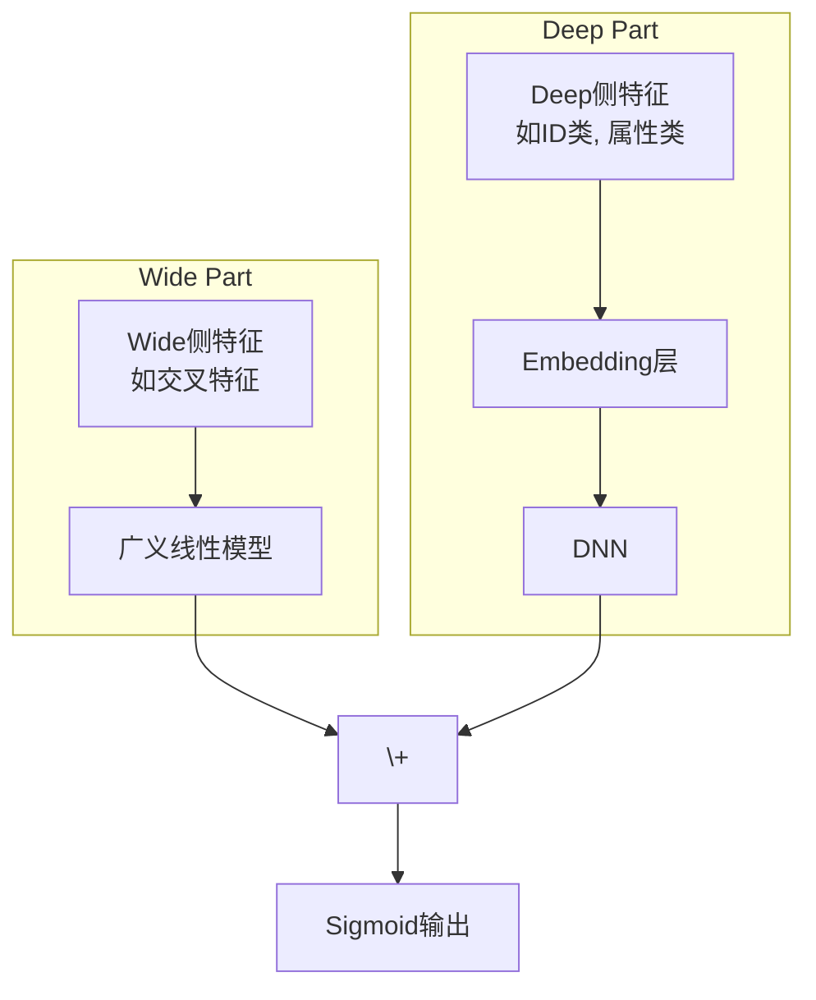

如果说召回是从亿万物料中"大海捞针"，那么**排序（Ranking）** 就是在这几百根"针"里找出最亮的那一根。它是推荐流程的"最后一公里"，负责对召回的候选集进行精准打分，预测用户对每个物品的偏好程度（如点击率pCTR、转化率pCVR），然后按分值高低呈现给用户。

排序模型的好坏，直接决定了用户的最终体验和平台的商业目标。这是一个于细微处见真章的"炼金"过程，模型的每一次微小迭代，都可能带来巨大的收益。

## 🏛️ 模型演进之路：从分立到融合，从人工到自动

深度排序模型的演进，是一部追求"更高、更快、更强"的特征工程与模型结构创新史。

### 奠基时代：Wide & Deep —— "记忆"与"泛化"的首次联姻

Google在2016年提出的 `Wide & Deep` 模型，是深度学习在推荐领域里程碑式的作品，它奠定了现代排序模型的基本范式。

-   **核心思想**：任何推荐场景都离不开"记忆"（Memorization）和"泛化"（Generalization）。
    -   **Wide部分（记忆）**：一个广义线性模型，负责记忆那些频繁共现的、重要的交叉特征，比如"用户爱喝拿铁 & 城市是上海"。它的优点是简单、可解释性强。
    -   **Deep部分（泛化）**：一个标准的前馈神经网络（DNN），负责将稀疏特征嵌入到低维稠密空间，学习那些从未或很少出现的特征组合，探索未知的可能性。
-   **精髓**：将两者联合训练，让模型同时具备记住"历史经验"和探索"新鲜事物"的能力。



::: details 💻 Wide&Deep 模型实现 
```python
import torch
import torch.nn as nn
from torch_rechub.models.layers import MLP, EmbeddingLayer

class WideDeep(nn.Module):
    """
    Wide & Deep Model
    
    Args:
        wide_features (list): Wide侧的特征列表.
        deep_features (list): Deep侧的特征列表.
        mlp_params (dict): Deep侧MLP的参数.
    """
    def __init__(self, wide_features, deep_features, mlp_params):
        super().__init__()
        
        # Wide部分
        self.wide_feature_layer = EmbeddingLayer(wide_features)
        
        # Deep部分
        self.deep_feature_layer = EmbeddingLayer(deep_features)
        self.deep_mlp = MLP(self.deep_feature_layer.input_dim, **mlp_params)
        
        # 最终输出层
        self.output_layer = nn.Linear(mlp_params["output_dim"] + self.wide_feature_layer.input_dim, 1)

    def forward(self, x):
        """
        Args:
            x (dict): 输入特征, a dictionary with keys being feature names.
        """
        # Wide侧逻辑
        wide_input = self.wide_feature_layer(x) # (batch_size, wide_embed_dim)
        
        # Deep侧逻辑
        deep_input = self.deep_feature_layer(x) # (batch_size, deep_embed_dim)
        deep_output = self.deep_mlp(deep_input) # (batch_size, mlp_output_dim)
        
        # 拼接Wide和Deep的输出
        concat_out = torch.cat([wide_input, deep_output], dim=1)
        
        # 最终预测
        y_pred = self.output_layer(concat_out)
        return torch.sigmoid(y_pred)
```
:::

### 交叉时代：告别"人工炼丹"，拥抱"自动驾驶"

`Wide & Deep` 的一个痛点是，Wide部分的交叉特征仍然需要大量的人工设计和筛选，这是一项繁琐且经验依赖的"炼丹"工作。于是，一系列能**自动学习特征交叉**的模型应运而生。

#### DeepFM：FM与DNN的珠联璧合

`DeepFM` 是这个时代最耀眼的明星，至今仍是许多公司线上模型的主力。它巧妙地将因子分解机（FM）和DNN结合在了一个框架中。

-   **核心思想**：
    -   **FM部分**：与Wide部分类似，但它能自动学习所有特征之间的二阶交叉，无需人工指定。
    -   **Deep部分**：与`Wide & Deep`中的Deep部分一致，学习高阶交叉特征。
-   **精髓**：FM部分和Deep部分的输入Embedding是**共享**的！这带来了两大好处：
    1.  模型更小，训练更快。
    2.  Embedding层能被低阶和高阶交叉信号同时训练，学习更充分。

::: details 💻 DeepFM 模型实现 
```python
import torch
import torch.nn as nn
from torch_rechub.models.layers import MLP, FM, EmbeddingLayer

class DeepFM(nn.Module):
    """
    DeepFM Model
    
    Args:
        deep_features (list): 用于Deep和FM部分的特征列表.
        mlp_params (dict): Deep侧MLP的参数.
    """
    def __init__(self, deep_features, mlp_params):
        super().__init__()
        # DeepFM中，所有特征都用于Deep和FM部分
        self.feature_layer = EmbeddingLayer(deep_features)
        
        # FM部分
        self.fm = FM(reduce_sum=True)
        
        # Deep部分
        self.deep_mlp = MLP(self.feature_layer.input_dim, **mlp_params)
        
        # 最终输出层
        # 1 (来自FM) + mlp_output_dim (来自Deep)
        self.output_layer = nn.Linear(mlp_params["output_dim"] + 1, 1)

    def forward(self, x):
        """
        Args:
            x (dict): 输入特征字典.
        """
        # 获取所有特征的Embedding
        embed_x = self.feature_layer(x) # (batch_size, n_fields, embed_dim)
        
        # FM部分输出
        fm_out = self.fm(embed_x) # (batch_size, 1)
        
        # Deep部分输入需要将Embedding展平
        deep_input = embed_x.flatten(start_dim=1) # (batch_size, n_fields * embed_dim)
        deep_out = self.deep_mlp(deep_input) # (batch_size, mlp_output_dim)
        
        # 拼接FM和Deep的输出
        concat_out = torch.cat([fm_out, deep_out], dim=1)
        
        # 最终预测
        y_pred = self.output_layer(concat_out)
        return torch.sigmoid(y_pred)
```
:::

#### DCN V2：更强大的显式交叉网络

`DCN` (Deep & Cross Network) 提供了另一种显式学习特征交叉的思路。它设计的`Cross Network`可以在每一层都保留之前所有层的交叉结果，并与原始输入进行新一轮的交叉。`DCN V2` 是其改进版，结构更稳定，表现更优。

-   **核心思想**：
    -   **Cross部分**：用一个特定的网络结构，在每一层都显式地、自动地进行特征交叉，交叉的阶数由网络深度决定。
    -   **Deep部分**：一个标准的DNN，与Cross部分并行。
-   **精髓**：相比于FM只能做二阶交叉，Cross网络能以一种高效且有界的方式，学习更高阶的交叉特征。

::: details 💻 DCN V2 模型实现 
```python
import torch
import torch.nn as nn
from torch_rechub.models.layers import MLP, CrossNetworkV2, EmbeddingLayer

class DCNv2(nn.Module):
    """
    Deep & Cross Network V2
    
    Args:
        features (list): 所有特征列表.
        cross_layer_num (int): Cross网络的层数.
        mlp_params (dict): Deep侧MLP的参数.
    """
    def __init__(self, features, cross_layer_num, mlp_params):
        super().__init__()
        self.feature_layer = EmbeddingLayer(features)
        self.input_dim = self.feature_layer.input_dim
        
        # Cross部分
        self.cross_net = CrossNetworkV2(self.input_dim, cross_layer_num)
        
        # Deep部分
        self.deep_mlp = MLP(self.input_dim, **mlp_params)
        
        # 拼接Cross和Deep的输出
        self.output_layer = nn.Linear(self.input_dim + mlp_params["output_dim"], 1)

    def forward(self, x):
        embed_x = self.feature_layer(x).flatten(start_dim=1) # (batch_size, n_fields * embed_dim)
        
        # Cross部分输出
        cross_out = self.cross_net(embed_x)
        
        # Deep部分输出
        deep_out = self.deep_mlp(embed_x)
        
        # 拼接
        concat_out = torch.cat([cross_out, deep_out], dim=1)
        
        # 最终预测
        y_pred = self.output_layer(concat_out)
        return torch.sigmoid(y_pred)
```
:::

### 注意力时代：让模型知道该"看"哪里

之前的模型在处理用户历史行为时，通常是将所有行为的Embedding做简单的Pooling（如Sum/Average），这显然是不合理的——用户看过的100个视频，跟当前要推荐的"跑鞋"广告，相关性必然有高有低。**注意力机制（Attention）** 的引入，就是为了解决这个问题。

#### DIN：为用户兴趣动态"聚焦"

`DIN` (Deep Interest Network) 是阿里提出的、在工业界影响深远的模型。

-   **核心思想**：用户的兴趣是多样的，并且在面对不同的候选商品时，相关的兴趣点也不同。
-   **精髓**：
    1.  不再对用户历史行为做简单的Pooling。
    2.  引入一个"注意力单元"，将**候选商品**（Target Ad）作为查询（Query），去动态地计算用户历史行为序列中每个行为的"注意力得分"。
    3.  对历史行为的Embedding做加权求和，权重就是注意力得分。这样，与当前候选商品越相关的历史行为，权重就越高。
    4.  最后，将这个"聚焦"后的用户兴趣向量，与其他特征一起送入DNN进行预测。

::: details 💻 DIN 模型实现 
```python
import torch
import torch.nn as nn
from torch_rechub.models.layers import MLP, ActivationUnit, EmbeddingLayer

class DIN(nn.Module):
    """
    Deep Interest Network
    
    Args:
        features (list): 特征列表，需要区分目标物品、历史序列和其他特征.
        history_features (list): 历史行为序列的特征名列表.
        target_features (list): 目标物品的特征名列表.
        mlp_params (dict): MLP的参数.
        attention_mlp_params (dict): 注意力单元MLP的参数.
    """
    def __init__(self, features, history_features, target_features, mlp_params, attention_mlp_params):
        super().__init__()
        self.feature_layer = EmbeddingLayer(features)
        
        # 注意力单元
        self.attention_unit = ActivationUnit(
            embedding_dim=self.feature_layer.get_embedding_dim(target_features),
            **attention_mlp_params
        )
        
        # 最终的MLP
        # 输入维度 = (目标物品+上下文特征) + 历史序列特征(attention之后)
        self.mlp = MLP(self.get_mlp_input_dim(), **mlp_params)
        
    def forward(self, x):
        # 提取各类特征的Embedding
        target_item_emb = self.feature_layer(x, self.target_features)
        history_seq_emb = self.feature_layer(x, self.history_features)
        context_emb = self.feature_layer(x, self.get_context_features())
        
        # 通过注意力单元计算用户兴趣向量
        user_interest_emb = self.attention_unit(target_item_emb, history_seq_emb)
        
        # 拼接所有特征
        mlp_input = torch.cat([target_item_emb, user_interest_emb, context_emb], dim=1)
        
        # 最终预测
        y_pred = self.mlp(mlp_input)
        return torch.sigmoid(y_pred)
```
:::

### 多目标时代：一个模型，多种使命

在真实的业务中，我们往往不只关心"点击率"，还关心"转化率"、"观看时长"、"分享率"等多个指标。**多任务学习（Multi-Task Learning, MTL）** 就是为了同时优化这些目标而生。

#### MMoE：巧妙平衡多个任务的"专家网络"

`MMoE` (Multi-gate Mixture-of-Experts) 是Google提出的经典多任务学习框架。

-   **核心思想**：不同的任务之间，既有共性，也有特性。强行让所有任务共享一个底层网络（Shared-Bottom）可能会导致"跷跷板效应"（一个任务提升，另一个任务下降）。
-   **精髓**：
    1.  设置多个**专家网络（Experts）**，每个专家都是一个独立的子网络，可以学习到某方面的共同知识。
    2.  为每个任务设置一个**门控网络（Gate）**。这个门控网络会根据当前输入，动态地为所有专家分配权重。
    3.  每个任务的最终输入，是所有专家输出的加权和。这样，每个任务都可以按需、灵活地组合专家的能力，既能共享信息，又能保留个性，有效避免了负迁移。

::: details 💻 MMoE 模型实现 
```python
import torch
import torch.nn as nn
from torch_rechub.models.layers import MLP, EmbeddingLayer

class MMoE(nn.Module):
    """
    Multi-gate Mixture-of-Experts Model
    
    Args:
        features (list): 所有输入特征列表.
        task_types (list): 任务类型列表, e.g., ['binary', 'binary'].
        n_expert (int): 专家数量.
        expert_params (dict): 每个专家网络的MLP参数.
        tower_params_list (list): 每个任务塔的MLP参数列表.
    """
    def __init__(self, features, task_types, n_expert, expert_params, tower_params_list):
        super().__init__()
        self.feature_layer = EmbeddingLayer(features)
        self.input_dim = self.feature_layer.input_dim
        self.n_task = len(task_types)
        
        # 专家网络
        self.experts = nn.ModuleList([
            MLP(self.input_dim, **expert_params) for _ in range(n_expert)
        ])
        
        # 门控网络
        self.gates = nn.ModuleList([
            nn.Linear(self.input_dim, n_expert, bias=False) for _ in range(self.n_task)
        ])
        
        # 任务塔
        self.towers = nn.ModuleList([
            MLP(expert_params["output_dim"], **tower_params) for tower_params in tower_params_list
        ])
        
    def forward(self, x):
        input_emb = self.feature_layer(x).flatten(start_dim=1)
        
        # 专家输出
        expert_outputs = [expert(input_emb) for expert in self.experts]
        expert_outputs = torch.stack(expert_outputs, dim=1) # (batch, n_expert, expert_dim)
        
        # 门控和任务塔计算
        outputs = []
        for i in range(self.n_task):
            gate_value = self.gates[i](input_emb).softmax(dim=1).unsqueeze(-1) # (batch, n_expert, 1)
            
            # 门控加权
            task_input = torch.sum(expert_outputs * gate_value, dim=1) # (batch, expert_dim)
            
            # 任务塔输出
            task_output = self.towers[i](task_input)
            outputs.append(task_output)
            
        return outputs
```
:::


## 📖 **延伸阅读**
1. [Wide & Deep Learning for Recommender Systems](https://arxiv.org/abs/1606.07792) - Wide&Deep的开山之作。
2. [DeepFM: A Factorization-Machine based Neural Network for CTR Prediction](https://arxiv.org/abs/1703.04247) - DeepFM的经典论文。
3. [Deep Interest Network for Click-Through Rate Prediction](https://arxiv.org/abs/1706.06978) - DIN的经典论文，开启了深度兴趣建模的时代。
4. [Modeling Task Relationships in Multi-task Learning with Multi-gate Mixture-of-Experts](https://dl.acm.org/doi/10.1145/3219819.3220007) - MMoE的经典论文，多任务学习的必读文献。
5. [Torch-RecHub Ranking Models](https://github.com/datawhalechina/torch-rechub/tree/main/torch_rechub/models/ranking) - Datawhale开源的torch-rechub项目中，包含了多种经典排序模型的PyTorch实现。

> 🧠 **思考题**
> 
> 1. DeepFM的Embedding共享机制是其亮点，但也可能带来参数更新的冲突。你认为在什么情况下，FM和Deep部分使用独立的Embedding可能会更好？
> 
> 2. DCN和xDeepFM都致力于显式地学习高阶特征交叉，它们的核心区别是什么？在计算效率和效果上各有什么取舍？
> 
> 3. DIN的注意力机制是针对"用户历史"和"候选商品"来计算的。你还能想到哪些特征可以引入到这个注意力计算中，来进一步提升效果？（比如，上下文特征？）
> 
> 4. MMoE中的"专家"数量是一个超参，你认为它应该如何设置？是越多越好吗？它和任务的相关性有什么关系？

::: tip 🎉 章节小结
深度排序模型的演进历程展现了推荐系统从"手工炼丹"到"自动驾驶"的华丽转身。Wide&Deep奠定了记忆与泛化并重的基础范式，DeepFM实现了特征交叉的自动化突破，DIN引入注意力机制捕获动态兴趣，MMoE将单一目标扩展为多任务协同优化。每一次模型创新，都是对用户复杂偏好的更深层理解，也是对推荐精度极限的不懈追求。掌握这些模型的精髓，就是掌握了在推荐系统"最后一公里"中精雕细琢的艺术。
:::

---

> "The devil is in the details." —— Ludwig Mies van der Rohe  
> 在排序模型的世界里，魔鬼藏在细节中，而天使也在细节中诞生。

