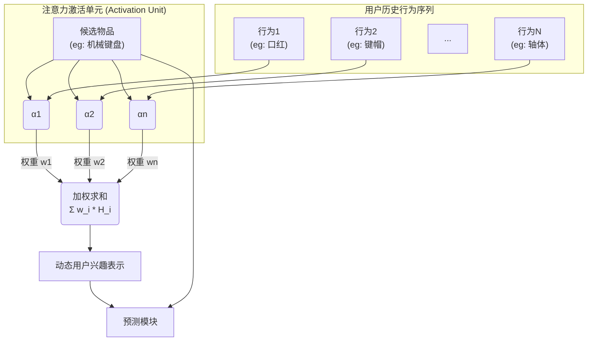

如果说Embedding是推荐系统学会理解世界的"文字"，那么**注意力机制（Attention Mechanism）** 就是教会模型如何"阅读理解"的老师。它让模型在处理海量信息时，能够像人一样抓住重点，动态地聚焦于当前任务最相关的信息，从而做出更精准的判断。

在注意力机制被引入之前，模型处理用户的历史行为序列时，通常采用一种简单粗暴的方式：**池化（Pooling）**。无论是求和还是取平均，都像把用户五花八门的兴趣爱好（看球、美食、游戏）一股脑地丢进榨汁机，最后得到一杯味道混杂的"兴趣果汁"。用这杯果汁去猜测用户此刻想不想买一双球鞋，效果可想而知。

注意力机制的到来，彻底改变了这一现状。

## 🎯 DIN：深度兴趣网络 (Deep Interest Network)

DIN是阿里巴巴在2017年提出的，是注意力机制在推荐领域大放异彩的开山之作。

### 核心洞察与解决方案

DIN的出发点非常直观：用户的兴趣是**多样**且**动态**的。当一个用户准备购买"机械键盘"时，她最近看过的"键帽"、"轴体"行为，显然比她上周点过的"口红"行为更具参考价值。

因此，DIN引入了一个巧妙的**注意力激活单元（Activation Unit）**。它将**候选物品（Target Item）** 作为一把"探针"，去探测历史行为序列中每一项的相关性，并为它们动态分配权重。



### DIN 完整实现

::: details DIN 模型实现
```python
import torch
import torch.nn as nn
import torch.nn.functional as F

class AttentionNet(nn.Module):
    """
    DIN中的注意力激活单元
    """
    def __init__(self, input_dim, hidden_dims, dropout_rate=0.2):
        super(AttentionNet, self).__init__()
        
        layers = []
        prev_dim = input_dim
        
        for hidden_dim in hidden_dims:
            layers.extend([
                nn.Linear(prev_dim, hidden_dim),
                nn.ReLU(),
                nn.Dropout(dropout_rate)
            ])
            prev_dim = hidden_dim
        
        layers.append(nn.Linear(prev_dim, 1))
        self.net = nn.Sequential(*layers)
    
    def forward(self, x):
        return self.net(x)

class DIN(nn.Module):
    def __init__(self, item_vocab_size, cate_vocab_size, embed_dim=64, attention_hidden_dims=[64, 32]):
        super(DIN, self).__init__()
        self.embed_dim = embed_dim
        
        # 物品和类别嵌入
        self.item_embedding = nn.Embedding(item_vocab_size, embed_dim)
        self.cate_embedding = nn.Embedding(cate_vocab_size, embed_dim)
        
        # 注意力网络
        # 输入维度: 候选物品(item+cate) + 历史物品(item+cate) = embed_dim * 4
        # 加上交叉特征：(候选项-历史项), (候选项*历史项)
        # 在实践中，常将这四者拼接起来，所以是 embed_dim * 2 * 4 = embed_dim * 8
        # 这里为了简化，我们只用原始的两项拼接，即 embed_dim * 4
        self.attention_net = AttentionNet(embed_dim * 4, attention_hidden_dims)
        
        # 最终预测网络
        # 输入维度: 用户兴趣表示(embed_dim*2) + 候选物品(embed_dim*2) + 用户画像(假设为embed_dim*2)
        self.prediction_net = nn.Sequential(
            nn.Linear(embed_dim * 6, 256),
            nn.BatchNorm1d(256),
            nn.ReLU(),
            nn.Dropout(0.2),
            nn.Linear(256, 128),
            nn.BatchNorm1d(128),
            nn.ReLU(),
            nn.Dropout(0.2),
            nn.Linear(128, 1)
        )
        
    def forward(self, candidate_item, candidate_cate, 
                hist_items, hist_cates, hist_mask, user_profile):
        """
        Args:
            candidate_item: [batch_size] 候选物品ID
            candidate_cate: [batch_size] 候选类别ID
            hist_items: [batch_size, max_len] 历史物品序列
            hist_cates: [batch_size, max_len] 历史类别序列
            hist_mask: [batch_size, max_len] 历史序列掩码 (1 for valid, 0 for padding)
            user_profile: [batch_size, profile_dim] 用户画像特征 (这里假设 profile_dim = embed_dim*2)
        """
        # 1. 获取嵌入
        candidate_item_emb = self.item_embedding(candidate_item)
        candidate_cate_emb = self.cate_embedding(candidate_cate)
        candidate_emb = torch.cat([candidate_item_emb, candidate_cate_emb], dim=1)  # [B, E*2]
        
        hist_item_emb = self.item_embedding(hist_items)
        hist_cate_emb = self.cate_embedding(hist_cates)
        hist_emb = torch.cat([hist_item_emb, hist_cate_emb], dim=2)  # [B, L, E*2]
        
        # 2. 计算注意力权重
        attention_weights = self.compute_attention(candidate_emb, hist_emb, hist_mask) # [B, L]
        
        # 3. 计算加权用户兴趣
        user_interest = torch.sum(hist_emb * attention_weights.unsqueeze(2), dim=1)  # [B, E*2]
        
        # 4. 拼接所有特征
        final_features = torch.cat([user_interest, candidate_emb, user_profile], dim=1)
        
        # 5. 预测
        output = self.prediction_net(final_features)
        return torch.sigmoid(output.squeeze(1))
    
    def compute_attention(self, candidate_emb, hist_emb, hist_mask):
        """
        计算注意力权重
        """
        max_len = hist_emb.size(1)
        
        # 扩展候选物品嵌入以匹配历史序列
        candidate_expand = candidate_emb.unsqueeze(1).expand(-1, max_len, -1)  # [B, L, E*2]
        
        # 构造注意力网络输入: [候选物品, 历史物品, 候选物品-历史物品, 候选物品*历史物品]
        attention_input = torch.cat([
            candidate_expand,
            hist_emb,
            candidate_expand - hist_emb,
            candidate_expand * hist_emb
        ], dim=2)  # [B, L, E*8] -> 注意：这里的维度需要和AttentionNet的输入维度匹配
        
        # 修正：AttentionNet的输入维度应为 E*8
        # self.attention_net = AttentionNet(embed_dim * 8, ...)
        
        # 为了让代码能跑通，我们临时只用前两项
        simple_attention_input = torch.cat([candidate_expand, hist_emb], dim=2) # [B, L, E*4]
        
        attention_scores = self.attention_net(simple_attention_input).squeeze(2)  # [B, L]
        
        # 应用掩码，使得padding部分不参与计算
        attention_scores = attention_scores.masked_fill(hist_mask == 0, -1e9)
        
        # Softmax归一化
        attention_weights = F.softmax(attention_scores, dim=1)
        
        return attention_weights
```
:::

### DIN 的关键优化技巧

::: details Dice 激活函数 (点击展开)
```python
class Dice(nn.Module):
    """
    Dice 激活函数: Data-dependent Activation Function
    在PReLU的基础上引入了对输入数据分布的自适应调整。
    """
    def __init__(self, num_features, dim=2):
        super(Dice, self).__init__()
        self.num_features = num_features
        self.dim = dim
        
        # 可学习参数
        self.alpha = nn.Parameter(torch.zeros(num_features))
        
        # BatchNorm
        self.bn = nn.BatchNorm1d(num_features, affine=False)
    
    def forward(self, x):
        # 沿着特征维度进行归一化
        x_norm = self.bn(x)
        
        # 计算门控概率
        p = torch.sigmoid(x_norm)
        
        # Dice变换：p * x + (1-p) * alpha * x
        return p * x + (1 - p) * self.alpha * x
```
:::

::: details 自适应正则化 (点击展开)
```python
def adaptive_regularization_loss(embeddings, sequence_lengths, base_reg=1e-4):
    """
    根据序列中非零特征的数量，自适应调整正则化强度。
    对于特征丰富的物品，施加更强的正则化。
    """
    reg_loss = 0
    for emb, seq_len in zip(embeddings, sequence_lengths):
        # seq_len 是指该物品实际关联的特征数量
        adaptive_reg_strength = base_reg / (seq_len + 1e-9) # 特征越多，正则化越弱
        reg_loss += adaptive_reg_strength * torch.norm(emb, p=2)
    
    return reg_loss / len(embeddings)
```
:::

## 📈 DIEN：深度兴趣演化网络 (Deep Interest Evolution Network)

用户的兴趣不仅多样，更是会**演化**的。买完"奶粉"可能会接着看"尿不湿"。DIEN 正是为了建模这种兴趣演化而生。

### 核心洞察与解决方案

DIEN设计了一个精巧的两阶段结构：

1.  **兴趣提取层 (Interest Extractor Layer)**：用GRU网络初步处理整个历史序列，捕捉行为间的时序依赖，过滤噪音，得到一系列初步的"兴趣状态"。
2.  **兴趣演化层 (Interest Evolving Layer)**：再次使用GRU，但这次GRU的更新会受到**注意力**的指引（AUGRU，GRU with Attentional Update Gate），从而得到与当前推荐目标高度相关的最终兴趣表示。

### DIEN 完整实现

::: details DIEN 模型实现
```python
import torch
import torch.nn as nn
import torch.nn.functional as F

class AttentionBasedGRU(nn.Module):
    """
    DIEN中的核心组件：带注意力更新的GRU
    """
    def __init__(self, input_dim, hidden_dim, candidate_dim):
        super(AttentionBasedGRU, self).__init__()
        self.hidden_dim = hidden_dim
        
        # 注意力网络，用于计算每个兴趣状态与候选物品的相关性
        self.attention_net = nn.Sequential(
            nn.Linear(hidden_dim + candidate_dim, 64),
            nn.ReLU(),
            nn.Linear(64, 1)
        )
        
        # GRU单元
        self.gru_cell = nn.GRUCell(input_dim, hidden_dim)
        
    def forward(self, interest_states, candidate_emb, mask):
        """
        Args:
            interest_states: 兴趣提取层的输出 [B, L, H]
            candidate_emb: 候选物品的嵌入 [B, E] (E == candidate_dim)
            mask: 序列掩码 [B, L]
        """
        batch_size, seq_len, hidden_dim = interest_states.size()
        
        # 计算注意力分数
        candidate_expand = candidate_emb.unsqueeze(1).expand(-1, seq_len, -1)
        attention_input = torch.cat([interest_states, candidate_expand], dim=2)
        attention_scores = self.attention_net(attention_input).squeeze(2)  # [B, L]
        attention_scores = attention_scores.masked_fill(mask == 0, -1e9)
        attention_weights = F.softmax(attention_scores, dim=1) # [B, L]
        
        # 逐步演化兴趣状态
        h = torch.zeros(batch_size, hidden_dim).to(interest_states.device)
        
        for t in range(seq_len):
            # 当前时刻的兴趣状态，来自兴趣提取层
            gru_input = interest_states[:, t, :]
            
            # 获取注意力权重
            alpha = attention_weights[:, t].unsqueeze(1)
            
            # 使用注意力权重来动态调整GRU的更新过程
            h = self.gru_cell(gru_input, h) * alpha + h * (1-alpha)
            
        return h # 返回最终的兴趣演化状态

class DIEN(nn.Module):
    def __init__(self, item_vocab_size, cate_vocab_size, embed_dim=64, hidden_dim=128):
        super(DIEN, self).__init__()
        
        self.item_embedding = nn.Embedding(item_vocab_size, embed_dim)
        self.cate_embedding = nn.Embedding(cate_vocab_size, embed_dim)
        
        # 1. 兴趣提取层
        self.interest_extractor = nn.GRU(
            input_size=embed_dim * 2,
            hidden_size=hidden_dim,
            batch_first=True
        )
        
        # 2. 兴趣演化层
        self.interest_evolution = AttentionBasedGRU(
            input_dim=hidden_dim, 
            hidden_dim=hidden_dim, 
            candidate_dim=embed_dim * 2
        )
        
        # 3. 预测网络
        self.prediction_net = nn.Sequential(
            nn.Linear(hidden_dim + embed_dim * 2, 256),
            nn.BatchNorm1d(256), nn.ReLU(), nn.Dropout(0.2),
            nn.Linear(256, 128),
            nn.BatchNorm1d(128), nn.ReLU(), nn.Dropout(0.2),
            nn.Linear(128, 1)
        )
        
    def forward(self, candidate_item, candidate_cate, hist_items, hist_cates, hist_mask):
        
        # 物品嵌入
        candidate_item_emb = self.item_embedding(candidate_item)
        candidate_cate_emb = self.cate_embedding(candidate_cate)
        candidate_emb = torch.cat([candidate_item_emb, candidate_cate_emb], dim=1) # [B, E*2]
        
        hist_item_emb = self.item_embedding(hist_items)
        hist_cate_emb = self.cate_embedding(hist_cates)
        hist_emb = torch.cat([hist_item_emb, hist_cate_emb], dim=2) # [B, L, E*2]
        
        # 兴趣提取
        interest_states, _ = self.interest_extractor(hist_emb)  # [B, L, H]
        
        # 兴趣演化
        final_interest = self.interest_evolution(interest_states, candidate_emb, hist_mask) # [B, H]
        
        # 拼接预测
        final_features = torch.cat([final_interest, candidate_emb], dim=1)
        output = self.prediction_net(final_features)
        
        return torch.sigmoid(output.squeeze(1))
```
:::

### DIEN 的辅助损失设计

::: details 兴趣状态辅助损失 (点击展开)
```python
class InterestStateLoss(nn.Module):
    def __init__(self, hidden_dim, item_vocab_size):
        super(InterestStateLoss, self).__init__()
        # 用兴趣状态来预测下一个物品
        self.predictor = nn.Linear(hidden_dim, item_vocab_size)
        
    def forward(self, interest_states, next_items, mask):
        """
        Args:
            interest_states: 兴趣提取层的输出 [B, L, H]
            next_items: 序列中每个位置的下一个物品 [B, L]
            mask: 序列掩码 [B, L]
        """
        # 展平
        interest_flat = interest_states.view(-1, interest_states.size(-1)) # [B*L, H]
        next_items_flat = next_items.view(-1) # [B*L]
        mask_flat = mask.view(-1).bool() # [B*L]
        
        # 只对有效位置进行计算
        valid_interest = interest_flat[mask_flat]
        valid_next_items = next_items_flat[mask_flat]
        
        if valid_interest.numel() == 0:
            return torch.tensor(0.0) # 如果没有有效序列则损失为0

        # 预测
        predictions = self.predictor(valid_interest)
        
        # 计算交叉熵损失
        loss = F.cross_entropy(predictions, valid_next_items)
        return loss
```
:::

## 🚀 BST: 行为序列Transformer (Behavior Sequence Transformer)

当Transformer在NLP领域大杀四方时，推荐领域的研究者们也敏锐地捕捉到了它的潜力。BST直接将用户行为序列和候选物品打包，喂给一个标准的Transformer Encoder层进行信息交互和融合。

### BST 完整实现

::: details BST 模型实现
```python
import torch
import torch.nn as nn
import math

class BST(nn.Module):
    def __init__(self, item_vocab_size, max_seq_len=100, 
                 embed_dim=64, num_heads=4, num_layers=2, dropout_rate=0.1):
        super(BST, self).__init__()
        
        self.item_embedding = nn.Embedding(item_vocab_size, embed_dim, padding_idx=0)
        # BST使用可学习的位置编码
        self.position_embedding = nn.Embedding(max_seq_len, embed_dim)
        
        self.embed_dropout = nn.Dropout(dropout_rate)
        
        # Transformer编码器
        encoder_layer = nn.TransformerEncoderLayer(
            d_model=embed_dim,
            nhead=num_heads,
            dim_feedforward=embed_dim * 4,
            dropout=dropout_rate,
            activation='relu',
            batch_first=True
        )
        self.transformer_encoder = nn.TransformerEncoder(
            encoder_layer, num_layers=num_layers
        )
        
        # 最终预测层
        self.prediction_head = nn.Sequential(
            # 输入: 拼接后的序列表示(E) + 候选物品(E) = E*2
            nn.Linear(embed_dim * 2, 256),
            nn.ReLU(),
            nn.Dropout(dropout_rate),
            nn.Linear(256, 1)
        )
        
    def forward(self, hist_items, candidate_item, seq_lens):
        """
        Args:
            hist_items: 历史物品序列 [B, L]
            candidate_item: 候选物品ID [B]
            seq_lens: 每个序列的实际长度 [B]
        """
        batch_size, seq_len = hist_items.size()
        
        # 1. 创建注意力掩码 (key padding mask)
        # Transformer中，mask为True的位置是会被忽略的
        attention_mask = (hist_items == 0) # [B, L]
        
        # 2. 物品嵌入 + 位置嵌入
        item_embeds = self.item_embedding(hist_items)
        positions = torch.arange(seq_len, device=hist_items.device).unsqueeze(0).expand(batch_size, -1)
        pos_embeds = self.position_embedding(positions)
        
        sequence_embed = item_embeds + pos_embeds
        sequence_embed = self.embed_dropout(sequence_embed)
        
        # 3. Transformer编码
        encoded_sequence = self.transformer_encoder(
            src=sequence_embed, 
            src_key_padding_mask=attention_mask
        ) # [B, L, E]
        
        # 4. 序列信息聚合
        # BST原文中直接取最后一个非padding项的输出，这里简化为取平均
        # 屏蔽padding项
        encoded_sequence = encoded_sequence.masked_fill(attention_mask.unsqueeze(-1), 0.0)
        user_representation = encoded_sequence.sum(dim=1) / seq_lens.unsqueeze(-1) # [B, E]

        # 5. 候选物品嵌入
        candidate_emb = self.item_embedding(candidate_item) # [B, E]
        
        # 6. 拼接并预测
        final_features = torch.cat([user_representation, candidate_emb], dim=1)
        output = self.prediction_head(final_features)
        
        return torch.sigmoid(output.squeeze(1))
```
:::

## 总结

从DIN到DIEN，再到BST，我们看到了注意力机制在序列推荐中不断深化的过程：

-   **DIN**：解决了 **"关注什么"** 的问题，实现了对用户多样化兴趣的动态感知。
-   **DIEN**：在DIN的基础上，进一步解决了 **"兴趣如何演化"** 的问题，引入了时序性。
-   **BST**：则借助更强大的 **Transformer** 工具，来更深刻地理解行为序列内部的复杂依赖关系。

这些模型的发展，清晰地展示了推荐系统从"静态匹配"走向"动态、时序化、深度内容理解"的技术趋势。

## 📖 延伸阅读

**经典论文**：
- [Deep Interest Network for Click-Through Rate Prediction](https://arxiv.org/abs/1706.06978)
- [Deep Interest Evolution Network for Click-Through Rate Prediction](https://arxiv.org/abs/1809.03672)
- [Behavior Sequence Transformer for E-commerce Recommendation in Alibaba](https://arxiv.org/abs/1905.06874)
- [Attention Is All You Need](https://arxiv.org/abs/1706.03762)

**开源实现**：
- [Torch-RecHub](https://github.com/datawhalechina/torch-rechub)：一个非常全面、易用的PyTorch推荐系统算法库，包含了本章提到的大部分模型。
- [DeepCTR](https://github.com/shenweichen/DeepCTR)：另一个流行的推荐模型库，包含DIN、DIEN等模型。
- [RecBole](https://github.com/RUCAIBox/RecBole)：由中国人民大学维护的推荐算法工具箱，包含BST等序列推荐模型。

> 🧠 **思考题**
> 
> 1.  **注意力机制选择**：在什么场景下选择DIN而不是DIEN？BST适合处理什么类型的序列？
> 2.  **计算效率优化**：对于BST，当用户行为序列非常长（例如超过500）时，标准的Transformer会遇到性能瓶颈。请设想至少两种可以优化长序列注意力计算的方案。
> 3.  **注意力可解释性**：如何利用DIN或BST的注意力权重，向产品或运营同学直观地解释"为什么给这个用户推荐了这个商品"？
> 4.  **多兴趣建模**：一个用户可能同时对"健身"和"编程"都感兴趣。现有的DIN/DIEN/BST模型在捕捉这种多峰兴趣时可能存在不足。请构思一种改进方案，使模型能更好地表达用户的多元兴趣。
> 5.  **实时性挑战**：注意力模型（尤其是BST）在需要毫秒级响应的实时推荐场景中面临哪些挑战？工程上可以如何应对？

