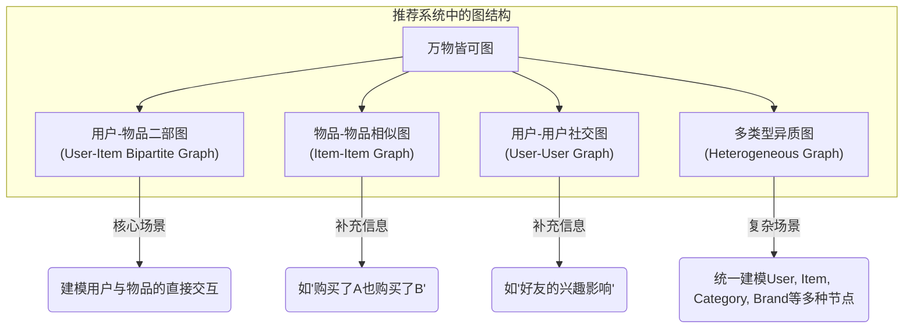

在推荐系统的世界里，我们一直在寻找能更深刻理解用户与物品之间复杂关系的方法。传统的协同过滤关注共现关系，而深度学习模型（如DIN、BST）则精于捕捉序列依赖。然而，它们在某种程度上都将用户和物品视为独立的个体，忽略了一个至关重要的信息维度——**连接（Connections）**。

**图神经网络（Graph Neural Network, GNN）** 为推荐系统带来了全新的世界观。它不再将系统视为用户的集合和物品的集合，而是看作一个由用户、物品以及它们之间纷繁复杂的交互关系共同构成的巨大**图（Graph）**。在这个视角下，用户的兴趣不再仅仅由其历史行为序列定义，更由其在整个"信息生态"中的位置所决定。

### 为什么图视角如此强大？

1.  **超越一阶关系**：你的兴趣不仅和你直接点击过的物品（一阶邻居）有关，也和"点击过同样物品的其他人"（二阶邻居）以及"那些人还喜欢的其他物品"（三阶邻居）有关。GNN通过在图上传播信息，能够自然地捕捉这种**高阶依赖（High-order Proximity）**，发掘出更深层次的关联。
2.  **结构化信息的力量**：图本身就是一种强大的结构化信息。节点的度数、聚类情况、在图中的中心性等拓扑特征，都为理解节点（用户/物品）的属性提供了丰富线索。
3.  **统一的建模框架**：无论是用户与物品的交互（二部图）、物品与物品的相似关系（同质图），还是用户之间的社交关系（社交网络），甚至是包含品牌、类别等多种节点的复杂场景（异质图），GNN都能提供一个统一的建模框架。



## 🚀 LightGCN：大道至简，返璞归真

在GNN的早期探索中，研究者们倾向于将用于计算机视觉或自然语言处理的复杂GNN模型（如GCN, GAT）直接迁移到推荐场景。这些模型通常包含三个核心操作：**特征变换**（通过权重矩阵`W`）、**邻居聚合**（如求和或取平均）和**非线性激活**（如`ReLU`）。

然而，何向南教授团队在2020年提出的 **LightGCN** 颠覆了这一思路。他们通过大量的实验敏锐地发现，在推荐系统的协同过滤场景下，特征变换和非线性激活这两个操作对于性能的提升是**非必要甚至有害的**。

### 核心思想：减法即是加法

LightGCN的核心思想是：在推荐的ID类特征上，我们真正需要的是纯粹的、无损的**信息传播（Information Propagation）**，而不是复杂的特征变换。用户的最终嵌入，应该是其自身原始嵌入与从邻居节点（如其交互过的物品）传播过来的信息的线性组合。

因此，LightGCN大胆地去除了特征变换和非线性激活，其核心传播公式极其简洁：

$$ e_u^{(k+1)} = \sum_{i \in N_u} \frac{1}{\sqrt{|N_u||N_i|}} e_i^{(k)} \quad \text{和} \quad e_i^{(k+1)} = \sum_{u \in N_i} \frac{1}{\sqrt{|N_i||N_u|}} e_u^{(k)} $$

其中，$e_u^{(k)}$ 是用户 $u$ 在第 $k$ 层的嵌入，$\mathcal{N}_u$ 是用户 $u$ 的邻居（物品）集合。这个公式本质上就是在做**归一化后的邻居信息聚合**。经过 $K$ 层传播后，LightGCN将每一层的嵌入进行加权求和（通常是简单平均），得到最终的用户和物品表示，用于计算推荐分数。

::: details LightGCN 完整 PyTorch 实现
```python
import torch
import torch.nn as nn

class LightGCN(nn.Module):
    def __init__(self, num_users, num_items, adj_matrix, embed_dim=64, num_layers=3):
        """
        Args:
            num_users (int): 用户数量
            num_items (int): 物品数量
            adj_matrix (torch.sparse.Tensor): 标准化的邻接矩阵 D^(-1/2)AD^(-1/2)
            embed_dim (int): 嵌入维度
            num_layers (int): 图卷积层数
        """
        super(LightGCN, self).__init__()
        self.num_users = num_users
        self.num_items = num_items
        self.adj_matrix = adj_matrix
        self.embed_dim = embed_dim
        self.num_layers = num_layers
        
        # 定义用户和物品的初始嵌入 E_0
        self.user_embedding = nn.Embedding(num_users, embed_dim)
        self.item_embedding = nn.Embedding(num_items, embed_dim)
        
        # 初始化嵌入权重
        nn.init.xavier_uniform_(self.user_embedding.weight)
        nn.init.xavier_uniform_(self.item_embedding.weight)
        
    def forward(self):
        # 获取所有节点的初始嵌入
        # E_0 = [E_U, E_I]
        ego_embeddings = torch.cat([self.user_embedding.weight, self.item_embedding.weight], dim=0)
        
        # 用于存储每一层传播后的嵌入
        all_layer_embeddings = [ego_embeddings]
        
        # 进行多层图卷积 (信息传播)
        for layer in range(self.num_layers):
            # E_k+1 = A_hat * E_k
            ego_embeddings = torch.sparse.mm(self.adj_matrix, ego_embeddings)
            all_layer_embeddings.append(ego_embeddings)
        
        # 将所有层的嵌入进行加权求和（这里是平均）
        # E_final = (1/K+1) * (E_0 + E_1 + ... + E_K)
        final_embeddings = torch.mean(torch.stack(all_layer_embeddings, dim=1), dim=1)
        
        # 从最终嵌入中分离出用户和物品的嵌入
        users_emb, items_emb = torch.split(final_embeddings, [self.num_users, self.num_items])
        
        return users_emb, items_emb

    def compute_loss(self, users_emb, items_emb, user_ids, pos_item_ids, neg_item_ids):
        """
        计算BPR损失
        """
        u_embeds = users_emb[user_ids]
        pos_i_embeds = items_emb[pos_item_ids]
        neg_i_embeds = items_emb[neg_item_ids]
        
        pos_scores = torch.sum(u_embeds * pos_i_embeds, dim=1)
        neg_scores = torch.sum(u_embeds * neg_i_embeds, dim=1)
        
        # BPR Loss
        loss = -torch.mean(torch.log(torch.sigmoid(pos_scores - neg_scores)))
        return loss
```
:::

LightGCN的成功证明了，在特定任务中，**针对性的简化远胜于盲目的堆砌复杂模块**。它为推荐领域的GNN设计提供了一个优雅、高效且强大的基线。

## 🏭 PinSage：应对Web-Scale挑战的工业巨人

LightGCN虽然强大，但它依赖于对整个图进行全量计算（full-batch training），这在动辄数十亿节点、数百亿边的工业级大图（如Pinterest、淘宝、微信）面前是完全不可行的。

**PinSage** 是由Pinterest团队在2018年提出的，是第一个真正意义上成功应用到超大规模图上的GNN推荐模型，是GNN工业落地的重要里程碑。它的一系列设计，核心都是为了解决一个问题：**可扩展性（Scalability）**。

### 核心思想：采样与聚合

PinSage的架构完全摒弃了全图计算的思路，转而采用**基于采样的小批量（mini-batch）训练**模式。其核心创新可以概括为以下几点：

1.  **邻居采样（Neighbor Sampling）**：对于一个中心节点，不是聚合它所有的邻居信息，而是只**采样固定数量的邻居**（比如20个）。这样，无论一个节点有多少邻居，它的计算量都是恒定的，从而解决了"度数爆炸"问题。

2.  **基于随机游走的采样策略**：如何采样到"重要"的邻居？PinSage没有使用均匀采样，而是设计了一种巧妙的**基于随机游走的采样**。从中心节点出发，进行多次短距离的随机游走，并将游走经过的节点作为邻居。这种方法能更有效地采样到与中心节点**结构更相似、关系更紧密**的节点，而不是仅仅是直接相连的节点。

3.  **多层聚合（On-the-fly Computation）**：PinSage的计算是"即时"的。当计算一个节点的表示时，它会先采样其一阶邻居，然后为这些邻居采样它们的邻居（即中心节点的二阶邻居），层层递进。整个计算图是在一个批次中动态构建的，这被称为"on-the-fly"卷积。

::: details PinSage 核心思想实现
```python
import torch
import torch.nn as nn
import torch.nn.functional as F
import random

# 注意：这是一个简化的实现，旨在说明PinSage的核心思想，
# 工业级的实现会复杂得多，并需要高效的图数据库支持。

class SAGEConv(nn.Module):
    """
    PinSage的核心卷积层，聚合采样到的邻居信息
    """
    def __init__(self, in_dim, out_dim):
        super(SAGEConv, self).__init__()
        # 聚合后的邻居信息和节点自身信息拼接，所以是 in_dim * 2
        self.agg_layer = nn.Linear(in_dim * 2, out_dim)
        
    def forward(self, self_feats, neighbor_feats):
        """
        Args:
            self_feats (Tensor): 中心节点自身的特征 [batch_size, in_dim]
            neighbor_feats (Tensor): 采样并聚合后的邻居特征 [batch_size, in_dim]
        """
        # 拼接
        combined = torch.cat([self_feats, neighbor_feats], dim=1)
        # 更新
        output = F.relu(self.agg_layer(combined))
        # 标准化
        return F.normalize(output, p=2, dim=1)

class PinSage(nn.Module):
    def __init__(self, in_dim, hidden_dim, num_layers=2):
        super(PinSage, self).__init__()
        self.num_layers = num_layers
        self.layers = nn.ModuleList()
        # 创建多层SAGEConv
        for i in range(num_layers):
            layer_in_dim = in_dim if i == 0 else hidden_dim
            self.layers.append(SAGEConv(layer_in_dim, hidden_dim))

    def forward(self, node_ids, full_feature_matrix, adj_list, num_samples_per_layer):
        """
        PinSage的前向传播
        Args:
            node_ids (list): 一个mini-batch的中心节点ID
            full_feature_matrix (Tensor): 包含所有节点特征的矩阵
            adj_list (dict): 图的邻接表表示 {node_id: [neighbor1, neighbor2, ...]}
            num_samples_per_layer (list): 每层要采样的邻居数量, e.g., [20, 10] for 2 layers
        """
        # h_l 是第 l 层需要的节点特征
        h = full_feature_matrix[node_ids]
        
        # 从最外层 (第 k 层) 向内层 (第 1 层) 聚合
        for l in range(self.num_layers - 1, -1, -1):
            # 获取当前层计算所需要的所有节点（上一层聚合的结果）
            current_nodes = h.size(0) # 假设h包含了当前层需要的所有节点的特征
            
            # 1. 采样邻居
            sampled_neighbors = []
            for node_id in node_ids: # 遍历批次中的每个中心节点
                neighbors = adj_list.get(node_id, [])
                if len(neighbors) > num_samples_per_layer[l]:
                    sampled = random.sample(neighbors, num_samples_per_layer[l])
                else:
                    sampled = neighbors # 不足则全部采样
                sampled_neighbors.append(sampled)
            
            # 2. 获取邻居特征并聚合（这里简化为平均聚合）
            neighbor_feats_list = []
            for neighbors in sampled_neighbors:
                if neighbors:
                    neighbor_feats_list.append(torch.mean(full_feature_matrix[neighbors], dim=0))
                else: # 处理孤立点
                    neighbor_feats_list.append(torch.zeros_like(full_feature_matrix[0]))
            
            aggregated_neighbors = torch.stack(neighbor_feats_list)

            # 3. 聚合自身与邻居，通过SAGEConv层更新
            # 注意：这里的 h 需要正确对应上
            self_feats = full_feature_matrix[node_ids] # 获取中心节点当前层的特征
            h = self.layers[l](self_feats, aggregated_neighbors)
            node_ids = # ... 更新下一层需要计算的节点 ...
        
        return h
```
:::

PinSage不仅提供了一个可扩展的GNN架构，更重要的是，它展示了一整套将GNN应用于真实、海量、复杂工业场景的**工程范式**，包括采样、负采样、模型部署等，影响深远。

## 🌈 HAN：拥抱世界的异质性

现实世界的图很少是同质的。一个电商推荐场景的图，至少包含用户、物品、品牌、类别等多种类型的节点，以及点击、购买、属于（物品属于某类别）等多种类型的边。这种图被称为**异质信息网络（Heterogeneous Information Network, HIN）**。

用同质图模型（如LightGCN）来处理HIN，会丢失掉节点和边的类型信息，无法区分"用户购买物品"和"物品属于某品牌"这两种关系的语义差异。**HAN (Heterogeneous Graph Attention Network)** 就是为解决这一问题而设计的。

### 核心思想：基于元路径的层次化注意力

HAN的精髓在于其**层次化注意力（Hierarchical Attention）**机制，它分为两个层级：

1.  **节点级注意力（Node-level Attention）**：首先，定义若干条**元路径（Meta-path）**。元路径是连接不同类型节点的路径，例如 `用户-物品-用户` (U-I-U) 这条元路径可以捕捉到"购买了相同物品"的相似用户。沿着每一条元路径，HAN使用注意力机制聚合邻居节点的信息，为每个节点生成一个基于特定元路径的嵌入。

2.  **语义级注意力（Semantic-level Attention）**：一个节点通过不同的元路径，会得到多个不同语义的嵌入（如基于U-I-U的嵌入和基于U-C-U的嵌入）。这些不同语义的重要性显然是不同的。因此，HAN引入了第二层注意力，即语义级注意力，来学习不同元路径的重要性权重，最终将多个语义嵌入加权融合成一个统一的节点表示。

通过这种方式，HAN能够智能地识别并融合来自不同类型关系的信息，从而学习到更丰富、更具表现力的节点表示。

::: details HAN 核心思想实现
```python
import torch
import torch.nn as nn
import torch.nn.functional as F

class SemanticAttention(nn.Module):
    """
    HAN中的语义层注意力，用于融合不同元路径带来的嵌入
    """
    def __init__(self, in_dim, hidden_dim=128):
        super(SemanticAttention, self).__init__()
        self.project = nn.Sequential(
            nn.Linear(in_dim, hidden_dim),
            nn.Tanh(),
            nn.Linear(hidden_dim, 1, bias=False)
        )

    def forward(self, z): # z是 [num_nodes, num_metapaths, in_dim]
        # 计算每个元路径的重要性 w_phi = q^T * tanh(W*z_phi + b)
        w = self.project(z).mean(0)                    # [num_metapaths, 1]
        beta = torch.softmax(w, dim=0)                 # [num_metapaths, 1]
        beta = beta.expand((z.shape[0],) + beta.shape) # [num_nodes, num_metapaths, 1]
        
        # 加权求和
        return (beta * z).sum(1)                       # [num_nodes, in_dim]

class HANLayer(nn.Module):
    def __init__(self, num_metapaths, in_dim, out_dim, num_heads):
        super(HANLayer, self).__init__()
        # 节点级注意力层 (为每种元路径创建一个GAT层)
        self.gat_layers = nn.ModuleList([
            # 这里的GATConv需要能处理异质图的边
            # 在实践中会用PyG或DGL等库中的HANConv或HGTConv
            # GraphAttentionLayer(in_dim, out_dim, num_heads) for _ in range(num_metapaths)
        ])
        # 语义级注意力层
        self.semantic_attention = SemanticAttention(in_dim=out_dim * num_heads)

    def forward(self, g, h): # g是异质图, h是节点特征字典
        semantic_embeddings = []
        # 对每个元路径（边类型）
        for i, gat_layer in enumerate(self.gat_layers):
            # 使用对应的GAT层进行节点级聚合
            # semantic_embeddings.append(gat_layer(g.edge_type_subgraph([edge_type]), h))
            pass # 伪代码
        
        # 将不同元路径的嵌入堆叠起来
        semantic_embeddings = torch.stack(semantic_embeddings, dim=1) # [N, num_metapaths, D_out]
        
        # 通过语义注意力进行融合
        return self.semantic_attention(semantic_embeddings)
```
:::


## ⚔️ GNN的现代训练心法

除了模型架构，GNN的训练方式也在不断演进。现代的GNN训练，尤其是自监督学习的引入，极大地提升了模型的性能和鲁棒性。

### 图对比学习（Graph Contrastive Learning）

其核心思想是：**在嵌入空间中，一个节点的"增强视图"应该与它自身的其他"增强视图"尽可能相似，而与其他节点的视图尽可能远离。**

-   **图增强（Graph Augmentation）**：如何创造"增强视图"？通常通过对原图进行随机扰动，如**随机删边（Edge Dropping）**、 **随机节点丢弃（Node Dropping）** 或 **特征掩码（Feature Masking）** 来生成两个相关的子图。
-   **对比损失（Contrastive Loss）** ：将来自同一原始节点的表示作为**正样本对**，来自不同节点的表示作为**负样本对**。然后使用InfoNCE等对比损失函数，在嵌入空间中拉近正样本，推开负样本。

这种自监督的训练方式，可以帮助GNN学习到对噪声不敏感的、更具本质性的结构信息，即使在标签数据稀疏的情况下也能取得优异效果。

::: details 图对比学习损失 (InfoNCE)
```python
class GraphContrastiveLoss(nn.Module):
    def __init__(self, temperature=0.1):
        super(GraphContrastiveLoss, self).__init__()
        self.temperature = temperature
        self.criterion = nn.CrossEntropyLoss()

    def forward(self, z1, z2):
        """
        Args:
            z1, z2: 两个图增强视图的节点嵌入, shape [N, D]
        """
        # 计算相似度矩阵
        sim = torch.mm(F.normalize(z1), F.normalize(z2).T) / self.temperature
        
        # 正样本在对角线上
        labels = torch.arange(sim.size(0)).to(sim.device)
        
        # 计算损失
        loss = self.criterion(sim, labels)
        return loss
```
:::

## 📖 延伸阅读

**经典论文**：
- [LightGCN: Simplifying and Powering Graph Convolution Network for Recommendation (SIGIR'20)](https://arxiv.org/abs/2002.02126)
- [Graph Convolutional Neural Networks for Web-Scale Recommender Systems (KDD'18, PinSage)](https://arxiv.org/abs/1806.01973)
- [Heterogeneous Graph Attention Network (WWW'19, HAN)](https://arxiv.org/abs/1903.07293)
- [Self-supervised Graph Learning for Recommendation (SIGIR'21, SGL)](https://arxiv.org/abs/2010.10783)

**开源框架**：
- [PyTorch Geometric (PyG)](https://github.com/pyg-team/pytorch_geometric)：最流行的GNN库之一，提供了大量GNN模型和工具。
- [DGL (Deep Graph Library)](https://github.com/dmlc/dgl)：另一个强大的图学习框架，支持多种后端。
- [RecBole](https://github.com/RUCAIBox/RecBole)：一个统一、全面的推荐算法复现库，包含了多种GNN模型。

> 🧠 **思考题**
> 
> 1. **LightGCN vs. GCN**：你认为LightGCN移除的非线性和特征变换，为什么在协同过滤场景下是"多余"的？它可能在什么类型的图数据上表现不佳？
> 2. **采样策略的权衡**：PinSage的随机游走采样相比均匀邻居采样，其优势和劣势分别是什么？在什么场景下你可能会选择后者？
> 3. **冷启动问题**：对于一个没有任何交互的新用户（"冷启动"用户），GNN模型（特别是LightGCN）将如何为他生成嵌入并进行推荐？你有什么改进的思路吗？
> 4. **元路径的设计**：在一个包含"用户-搜索-物品-购买"行为的电商场景中，请你设计至少三条有意义的元路径，并说明它们各自能捕捉到什么推荐信号。
> 5. **图增强的风险**：图对比学习中的数据增强（如删边、删点）如果操作不当，可能会破坏图的关键结构信息。你认为该如何设置增强的强度（比如删除比例），以在"创造多样性"和"保持结构"之间取得平衡？


