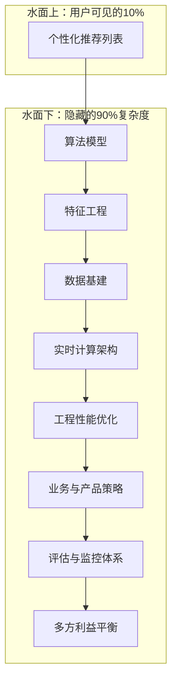

在掌握了协同过滤、矩阵分解乃至复杂的深度学习模型后，我们很容易产生一种错觉：只要模型够准，推荐系统就无懈可击了。然而，工业界的现实远比离线数据集要复杂得多。一个推荐系统在生产环境中能否成功，90%的复杂度隐藏在算法模型这片"冰山"的水面之下。

### 推荐系统的"冰山模型"

用户看到的推荐结果，仅仅是冰山一角。水面之下，是庞大而精密的系统工程、产品策略与商业考量。

本章将带你潜入水下，探索那些决定推荐系统成败的关键命题。这些话题不再是单纯追求准确率的"技术竞赛"，而是融合了**用户心理学、系统工程、商业智慧和社会责任**的"综合艺术"。

### 探索五大进阶命题

我们将深入探讨推荐系统在工业界必须面对的五个核心挑战：

1.  **🎮 冷启动：新手村的生存指南**
    *   当新用户、新物品或新系统"初来乍到"，没有任何历史数据时，我们该如何进行有效的推荐？这不仅仅是技术问题，更是用户"第一印象"的管理学。

2.  **🌈 多样性：推荐结果的调色板**
    *   如果推荐列表里全是同一种风格的内容，用户很快就会感到乏味。如何在精准"猜你喜欢"和"带你发现"之间取得平衡，让推荐充满惊喜？

3.  **⚖️ 公平性：技术向善的责任**
    *   算法本身没有价值观，但其产生的结果却可能加剧现实世界的不公。如何避免推荐系统产生歧视，保护弱势群体，并确保平台生态的健康？

4.  **⚡ 实时性：毫秒必争的技术艺术**
    *   用户的兴趣瞬息万变。如何让系统在毫秒之间捕捉用户的最新意图，并立刻体现在下一次推荐中？这是对系统架构和工程能力的极致考验。

5.  **🎯 多目标优化：推荐系统的平衡术**
    *   现代推荐系统早已不是只优化"点击率"这么简单。它需要在用户满意度、平台收益、内容多样性、长期价值等多个甚至相互冲突的目标间"走钢丝"。

---

> 通过本章的学习，你将不再仅仅是一个"调参侠"，而是能够：
> - 理解工业级推荐系统面临的真实挑战与权衡。
> - 掌握解决这些挑战的经典策略与核心思想。
> - 建立从技术、产品到商业多维度的系统性思维。
> - 为构建一个真正成熟、可靠且负责任的推荐系统打下坚实基础。

准备好了吗？让我们一起从"算法工程师"向"推荐系统架构师"迈出关键一步！

