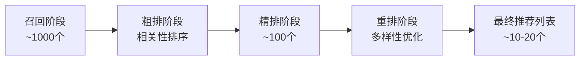

想象一个场景：你因为喜欢周杰伦的《晴天》，某个音乐APP便在首页给你推荐了《七里香》《稻香》《青花瓷》……没错，这些推荐非常"精准"，但如果整个屏幕刷下来都是周杰伦，你是否会感到一丝"信息茧房"式的窒息？

这就是多样性（Diversity）要解决的问题：在保证相关性的前提下，为用户提供更丰富、更有探索性的推荐结果，从而提升长期用户体验和平台价值。

## 🎨 为什么需要多样性？

多样性不仅仅是为了"好看"，它具有深刻的用户价值和商业价值。

| 价值维度 | 具体表现 |
| :--- | :--- |
| **提升用户体验** | 避免内容同质化，防止用户审美疲劳，带来"发现新大陆"的惊喜感 |
| **发掘潜在兴趣** | 用户对自己兴趣的认知往往是局限的，多样性推荐能帮助他们拓宽视野，找到新的热爱 |
| **增加平台价值** | 促进长尾内容（非热门）的曝光和消费，提升整个平台的内容动销率，让生态更健康 |
| **增强系统鲁棒性** | 如果系统过度推荐某个类别，一旦用户对该类别失去兴趣，推荐效果将断崖式下跌。多样性可以分散风险 |

### 精准性与多样性的权衡

这是推荐系统中的经典权衡问题：

$$\text{总体价值} = \text{精准性} + \text{多样性}$$

关键在于找到两者的最佳平衡点。

## 📏 如何衡量多样性？

要优化多样性，首先要能度量它。常用的度量方法有两种。

### 1. 物品间非相似性 (ILD)

这是最直观的度量方式。它计算推荐列表中，所有物品两两之间不相似度的平均值。值越高，代表列表内物品的差异越大，多样性越好。

**示例计算**：
假设我们有3个物品，它们的相似度如下：
- A与B相似度: 0.8
- A与C相似度: 0.2  
- B与C相似度: 0.3

那么不相似度就是 `1 - 相似度`：
- A与B不相似度: 0.2
- A与C不相似度: 0.8
- B与C不相似度: 0.7

平均不相似度 (ILD) = (0.2 + 0.8 + 0.7) / 3 = 0.57

### 2. 类别覆盖度与均衡度

我们可以统计一个推荐列表中覆盖了多少个不同的类别，以及这些类别的分布是否均衡。

**示例对比**：
- **列表A** (10个物品): 8个"动作片"，2个"喜剧片" → 覆盖2个类别，但分布不均
- **列表B** (10个物品): 5个"动作片"，5个"喜剧片" → 覆盖2个类别，分布均衡
- **列表C** (10个物品): 3个"动作片"，3个"喜剧片"，4个"科幻片" → 覆盖3个类别，分布相对均衡

通常认为，列表C的多样性最好（覆盖更多类别且分布相对均衡）。

## 🎯 如何提升多样性？

提升多样性通常在推荐系统的**重排（Re-ranking）**阶段进行。也就是说，我们先由精排模型产出一个较长的、以精准度为目标的候选列表，然后在这个列表上通过多样性算法进行"重新洗牌"，得到最终呈现给用户的列表。

### 多样性优化的一般流程

### 核心思想：引入惩罚项

几乎所有的多样性算法，其核心思想都是在选择下一个要推荐的物品时，不仅考虑它自身的质量（或与用户的相关性），还要考虑它与**已选择**的物品是否过于相似。如果太相似，就给予一个"惩罚"。

## 🔧 经典算法：最大边际相关性 (MMR)

MMR (Maximal Marginal Relevance) 是一个非常经典的多样性控制算法。它在选择下一个物品时，会综合考虑两个因素：

1. **相关性 (Relevance)**：该物品与用户需求的匹配程度
2. **边际性 (Marginal)**：该物品能提供多少"新信息"，即它与已选物品的差异性

### MMR算法原理

**核心公式**：
$$\text{MMR得分} = λ × \text{相关性得分} - (1-λ) × \text{与已选物品的最大相似度}$$

其中：
- λ 是平衡参数（0到1之间）
- 当 λ=1 时，完全只考虑相关性，没有多样性
- 当 λ=0 时，完全只考虑多样性，可能推荐一些不相关的物品

### MMR算法步骤

**贪心选择算法**：
1. **初始化**：已选列表为空，候选列表包含所有待选物品
2. **迭代选择**：重复以下步骤直到选够 k 个物品
   - 对每个候选物品，计算 MMR得分
   - 选择得分最高的物品加入已选列表
   - 从候选列表中移除该物品
3. **返回**：最终推荐列表

### MMR算法示例

假设我们要从5部电影中选择3部推荐给用户：

| 电影 | 相关性得分 | 与已选电影的最大相似度 | MMR得分 (λ=0.6) |
|------|------------|------------------------|-----------------|
| A: 动作片1 | 0.9 | 0 (首选) | 0.6×0.9 = 0.54 |
| B: 动作片2 | 0.8 | 0.9 (与A相似) | 0.6×0.8 - 0.4×0.9 = 0.12 |
| C: 喜剧片 | 0.7 | 0.2 (与A不同类型) | 0.6×0.7 - 0.4×0.2 = 0.34 |
| D: 科幻片 | 0.6 | 0.1 (与A,C都不同) | 0.6×0.6 - 0.4×0.1 = 0.32 |
| E: 动作片3 | 0.75 | 0.85 (与A相似) | 0.6×0.75 - 0.4×0.85 = 0.11 |

**选择过程**：
1. 第1轮：选择A（得分最高0.54）
2. 第2轮：重新计算，选择C（考虑多样性后得分最高）
3. 第3轮：重新计算，选择D（进一步增加多样性）

最终推荐列表：[A: 动作片1, C: 喜剧片, D: 科幻片]

通过调节 λ，我们就能在"精准"和"多样"之间自由地控制平衡。

## 🎪 个性化多样性：千人千面的调色盘

不是所有用户都需要同样的多样性。现代推荐系统需要根据用户特征来个性化多样性策略。

### 用户多样性偏好建模

**用户类型分类**：
- **探索型用户**：喜欢尝试新内容，对多样性需求高
- **专注型用户**：专注于特定领域，对多样性需求低
- **平衡型用户**：介于两者之间

### 上下文感知的多样性

不同场景下用户对多样性的需求也不同：

| 场景 | 多样性需求 | λ值建议 | 原因 |
|------|------------|---------|------|
| 首页浏览 | 高 | 0.3-0.5 | 用户处于探索状态 |
| 搜索结果 | 中 | 0.6-0.7 | 有明确意图但也需要选择 |
| 相关推荐 | 低 | 0.7-0.9 | 用户已表现出明确偏好 |
| 新用户冷启动 | 高 | 0.2-0.4 | 需要探索用户兴趣 |

## 📖 **延伸阅读**

1. [Diversity in Recommender Systems](https://link.springer.com/chapter/10.1007/978-1-4899-7637-6_21) - 推荐系统手册中关于多样性的权威章节
2. [Improving Recommendation Lists Through Topic Diversification](https://dl.acm.org/doi/10.1145/1060745.1060754) - Ziegler等人关于主题多样化的经典论文
3. [The Use of MMR, Diversity-Based Reranking for Reordering Documents](https://dl.acm.org/doi/10.1145/290941.291025) - MMR算法的原始论文
4. [Determinantal Point Processes for Machine Learning](https://arxiv.org/abs/1207.6083) - DPP在机器学习中的应用综述
5. [Beyond Accuracy: Evaluating Recommender Systems by Coverage and Serendipity](https://dl.acm.org/doi/10.1145/1864708.1864761) - 推荐系统评估中的覆盖度和意外发现

> 🧠 **思考题**
>
> 1. 在一个新闻App中，"突发新闻"和"深度报道"两个栏目，你认为哪一个更需要多样性？为什么？
> 2. 如果要为用户建立一个"多样性偏好"画像，你会考虑用户的哪些行为特征？
> 3. 过度的多样性可能会损害用户体验（比如推荐了用户完全不感兴趣的东西），你认为应该如何设定多样性的"安全边界"？

::: tip 🎉 章节小结

多样性是衡量推荐系统长期健康度的关键指标，是"精准"之外的必要补充。它要求我们在推荐时，不仅要低头看好眼前的"相关性"，还要抬头看看远方的"新世界"。

- **为何重要**：提升用户体验，挖掘潜在兴趣，促进平台生态健康
- **如何度量**：通过**物品间非相似性（ILD）**来衡量差异，通过**类别覆盖与均衡度**来衡量广度
- **如何实现**：核心是在排序时引入**惩罚项**，惩罚与已选物品过于相似的候选项。**MMR算法**是实现这一思想的经典代表
- **进阶方向**：实现**个性化多样性**，为不同偏好的用户提供不同程度的探索

:::

> 多样性，就是推荐系统在你耳边进行的温柔蛊惑：它一边递上你最爱吃的"满汉全席"（精准推荐），一边又忍不住悄悄塞给你一张"世界美食地图"（多样化探索），因为他知道，真正的满足，源自已知领域的深深扎根，和对未知世界的心动一瞥。

