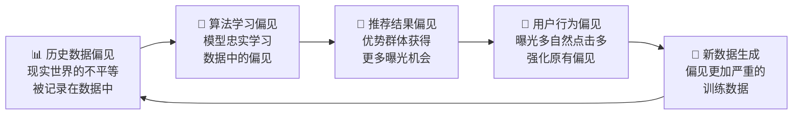
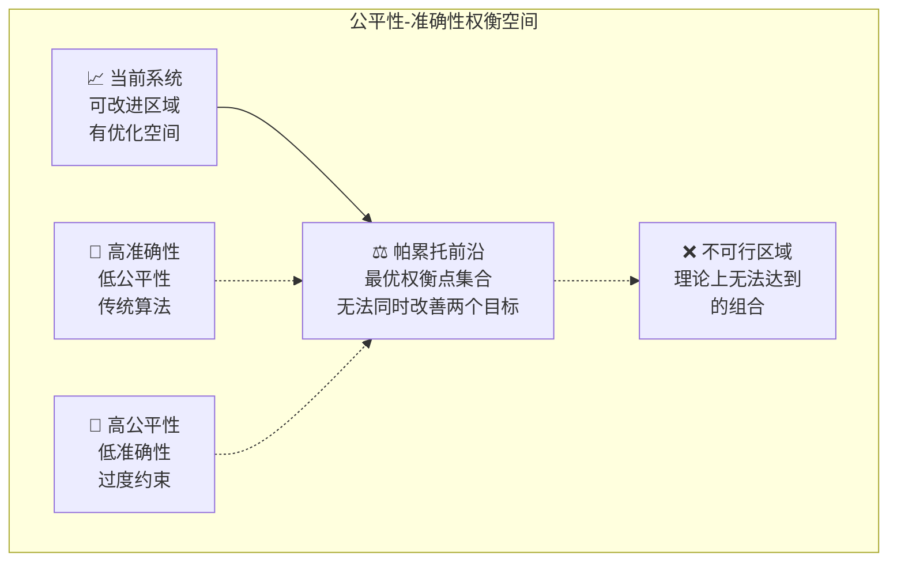

如果一个招聘网站的推荐算法，因为历史数据中男性程序员更多，就倾向于向男性用户推荐更高薪的职位，这是否公平？如果一个新闻APP，因为用户更爱点击"刺激性"内容，就不断推送耸人听闻的标题，这是否会加剧社会对立？

::: tip 🔍 核心定义
**推荐系统公平性（Fairness）**：确保推荐算法不会因为用户的敏感属性（如性别、种族、年龄等）或其他因素，对不同群体产生系统性的歧视或不公正对待。
:::

这些问题引出了推荐系统中一个深刻且重要的议题：**公平性（Fairness）**。它探讨的是如何避免算法因为数据、模型或策略的偏见，而对不同群体或内容产生不公正的对待，从而造成消极的社会影响。

公平性不仅仅是技术问题，更是企业的社会责任和"技术向善"的直接体现。

## 🔍 偏见从何而来？反馈闭环的陷阱

推荐系统中的不公平，其根源往往是"偏见"（Bias）。偏见像一个幽灵，潜藏在数据和算法的各个角落，并通过"反馈闭环"被不断放大。

上图揭示了这个恶性循环：
1. **历史数据偏见**：现实世界中存在的不平等（如性别、种族、地域等）被原封不动地记录在数据里
2. **模型学习偏见**：算法"忠实"地从数据中学习到了这些偏见
3. **推荐加剧偏见**：系统根据模型的偏见进行推荐，使得优势群体获得更多曝光，劣势群体机会更少
4. **偏见数据再生产**：用户的行为数据被收集起来，作为新的训练数据，进一步加深了原有的偏见

长此以往，马太效应愈演愈烈，系统不仅没有修正现实的不公，反而成了不公的"放大器"。

## ⚖️ 公平性的三个层次

讨论公平性时，我们通常关心三个层面：

| 层面 | 关注对象 | 核心问题 | 示例 |
| :--- | :--- | :--- | :--- |
| **用户公平性** | 不同的**用户群体** | 不同群体是否得到了同等质量的推荐服务？ | 不能因为性别或地域，就给某些用户推荐质量更差的内容 |
| **生产者/物品公平性**| 不同的**内容创作者或物品** | 不同生产者/物品是否获得了公平的曝光机会？ | 不能因为创作者是新人，就完全不给曝光机会，导致其无法成长 |
| **多方利益公平性** | **用户、平台、生产者**三方 | 如何在三者的利益间取得平衡？ | 不能为了平台收益最大化，而牺牲用户体验和生产者的健康生态 |

### 公平性的量化指标

**1. 人口统计学平等**：不同群体获得推荐的概率应该相等

**2. 机会均等**：在同等资质下，不同群体获得推荐的概率应该相等

**3. 校准公平性**：预测为正例时，不同群体的真实正例率应该相等

## 🛠️ 如何干预？三大策略详解

既然偏见是核心问题，那么我们的干预手段也主要围绕着"消除偏见"来展开。学术界和工业界主流的公平性干预策略分为三类：预处理、训练中和后处理。

### 1. 预处理 (Pre-processing)：从"干净"的数据开始

这是最直接的思路：在将数据喂给模型之前，就先对它进行"清洗"，消除其中的偏见。

#### 重加权 (Reweighing)

**核心思想**：给弱势群体的样本赋予更高的权重，让模型在训练时更加"重视"它们。

#### 重采样 (Resampling)

**过采样**：复制弱势群体的样本
**欠采样**：减少优势群体的样本

#### 数据增强 (Data Augmentation)

为弱势群体创造"合理"的伪数据，使用生成模型（如GAN）或数据变换技术。

### 2. 训练中 (In-processing)：在"学习"的过程中约束

这种方法在模型训练的目标函数（损失函数）中，直接加入一个"公平性约束项"。

**约束优化目标**：
$$\text{总损失} = \text{原始损失} + λ × \text{公平性惩罚项}$$

其中：
- 原始损失：预测准确性
- 公平性惩罚项：衡量不公平程度的指标
- λ：平衡参数，控制公平性的重要程度

### 3. 后处理 (Post-processing)：在"结果"上进行修正

这种方法不改变数据和模型，而是在模型已经给出了推荐结果之后，对这个结果列表进行"二次加工"。

- **结果重排 (Re-ranking)**：类似于多样性的处理方式。我们先生成一个较长的候选列表，然后根据公平性目标（如保证不同创作者的内容都能得到一定曝光），对列表进行重新排序。
- **校准 (Calibration)**：对不同群体的打分进行"校正"。例如，如果发现模型系统性地给女性创作者的内容打分偏低，我们可以对她们的得分进行一个"补偿性"的向上调整。

| 策略 | 优点 | 缺点 | 适用场景 |
| :--- | :--- | :--- | :--- |
| **预处理** | 与模型解耦，实施相对简单 | 可能会丢失部分原始数据信息 | 数据偏见明显，模型固定 |
| **训练中** | 直接优化公平性目标，可能效果最好 | 需要修改模型结构，实现复杂，训练成本高 | 有充足开发资源，追求最优效果 |
| **后处理** | 灵活，不影响核心模型，易于部署和调整 | 无法从根本上解决问题，可能只是"治标不治本" | 快速部署，A/B测试验证 |

在工业界，由于其灵活性和低成本，**后处理**是最常用的公平性干预策略。

## 📊 公平性与准确性的权衡

公平性的提升往往伴随着准确性的下降，这是一个经典的权衡问题。

### 帕累托前沿

在公平性-准确性的二维空间中，存在一个帕累托前沿，表示在不损害一个目标的情况下无法改善另一个目标的点集合。

### 权衡策略

**1. 阈值调整法**：为不同群体设置不同的推荐阈值

**2. 多目标优化**：使用进化算法或其他多目标优化方法寻找帕累托最优解

**3. 约束优化**：在保证公平性约束的前提下最大化准确性

## 📖 **延伸阅读**

1. [Fairness and Machine Learning: Limitations and Opportunities](https://fairmlbook.org/) - Barocas等人关于机器学习公平性的权威教科书
2. [Algorithmic Fairness](https://arxiv.org/abs/1808.00023) - Mehrabi等人关于算法公平性的全面综述
3. [Fairness in Recommendation Systems](https://dl.acm.org/doi/10.1145/3240323.3240373) - Burke关于推荐系统公平性的经典论文
4. [The Fairness of Risk Scores Beyond Classification](https://arxiv.org/abs/1611.01439) - Kleinberg等人关于风险评分公平性的重要研究
5. [Google AI Principles](https://ai.google/principles/) - 谷歌AI原则，包含公平性和偏见避免的实践指南

> 🧠 **思考题**
>
> 1. 在一个短视频平台，一个"高颜值"的博主和一个"有深度但颜值普通"的博主，平台应该如何给予他们公平的曝光机会？这属于我们讨论的哪一类公平性问题？
> 2. "结果平等" vs "机会平等"是公平性讨论中一个经典的话题。你认为推荐系统应该追求给所有内容相同的曝光量（结果平等），还是给所有内容一个被用户检验的机会（机会平等）？
> 3. 如果为了实现公平性，需要牺牲一部分推荐的精准度（例如，推荐一些用户不那么喜欢但符合公平性要求的内容），你认为这个"度"应该如何把握？

::: tip 🎉 章节小结

公平性是推荐系统从"工具"走向"责任"的必修课。它要求我们正视算法的局限性，并主动承担起修正偏见、促进平等的社会责任。

- **偏见来源**：核心是**历史数据偏见**与**反馈闭环**的相互作用，导致不公平被持续放大
- **公平性层次**：包括**用户公平性**、**生产者公平性**和**多方利益公平性**三个层面
- **干预策略**：主要有三类——在数据端进行**预处理**、在模型端进行**训练中约束**、在结果端进行**后处理**
- **核心权衡**：公平性的实现往往需要在**精准度、商业利益和社会价值**之间做出权衡和取舍

:::

> "公平性不是算法的约束，而是算法的良心——它让技术真正成为推动社会进步的力量。"

