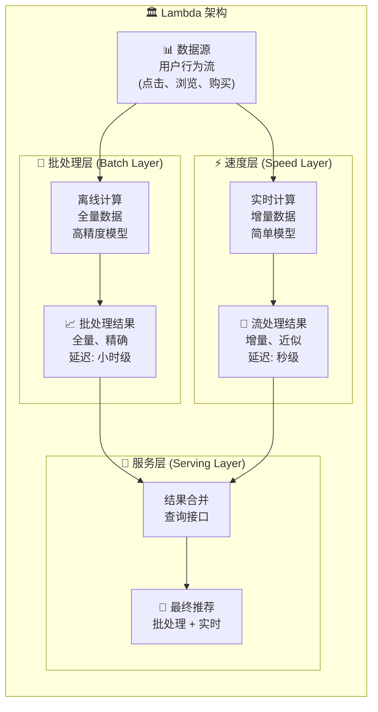
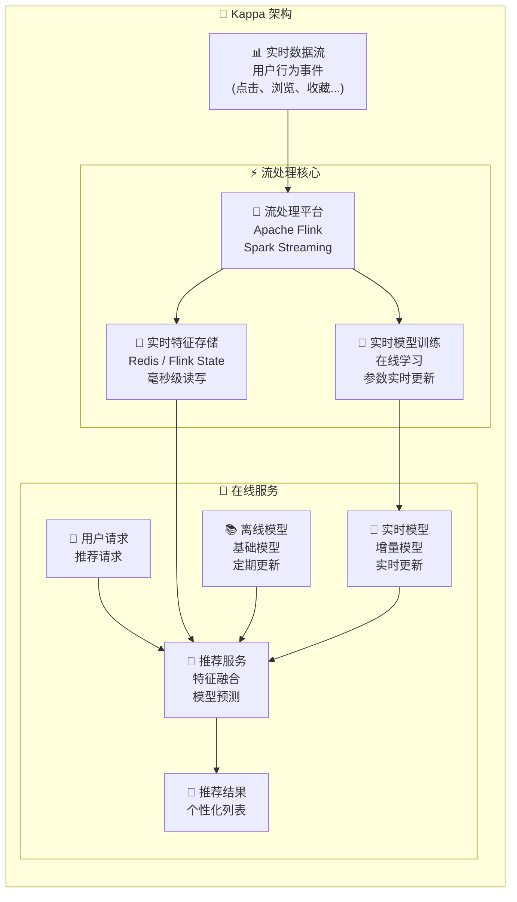

用户的兴趣是流动的，就像河水一样，永不停歇。上一分钟你可能还在看搞笑视频，下一分钟就可能被一条科技新闻所吸引。如果推荐系统不能及时捕捉到这种变化，它推荐的内容就会永远"慢半拍"。

**实时性（Real-time）**，正是衡量推荐系统这种"反应速度"的核心指标。它指的是系统从**捕捉到用户最新的行为**，到**将该行为的影响体现在下一次推荐结果中**所需的时间。这个时间越短，实时性就越好。

追求极致的实时性，是所有顶级互联网公司推荐技术的"兵家必争之地"。

## ⚡ 为什么实时性如此重要？

| 维度 | 解释 | 生活化比喻 |
| :--- | :--- | :--- |
| **捕捉短期兴趣** | 用户很多行为反映的是即时、短暂的兴趣，过期即失效 | 你刚搜了"今晚电影票"，系统就应该立刻给你推荐影院和场次，而不是第二天再推荐 |
| **提升用户体验** | "即时反馈"能让用户感觉到系统"懂我"，从而极大地增强用户粘性 | 一个能立刻对你的话做出回应的朋友，远比一个半天才回复的人更让你愿意交流 |
| **增加商业价值** | 在电商、新闻、短视频等场景，实时性直接关系到点击率、转化率和用户时长 | 在"双十一"零点，谁能最快根据用户的抢购行为调整推荐，谁就能获得更多订单 |

### 实时性的业务价值

**点击率提升**：实时推荐通常能带来 10-30% 的点击率提升

**用户留存**：响应延迟每增加 100ms，用户流失率可能增加 1-3%

## 🏗️ 实时推荐的架构演进

实现实时推荐，不是单一算法能解决的，它本质上是一个复杂的**系统架构**问题。

### 传统架构：Lambda 架构

早期的推荐系统大多采用Lambda架构，它试图兼顾"全面性"和"速度"。

**Lambda架构组件**：

- **批处理层**：离线运行，使用**全部**历史数据训练一个复杂而精准的"全局模型"。这个过程可能需要数小时甚至一天
- **速度层**：实时运行，处理最新的增量数据，训练一个相对简单的"增量模型"，用于对批处理层的结果进行小幅修正
- **服务层**：合并批处理层和速度层的结果，生成最终的推荐列表

**痛点**：Lambda架构需要维护两套独立的代码和系统，逻辑复杂，开发和运维成本极高。

### 现代架构：Kappa 架构

为了解决Lambda架构的痛点，Kappa架构被提了出来。它的核心思想是：**所有的数据处理，都可以在一个流处理系统中完成。**

**Kappa架构的流程**：
1. 所有用户行为数据都以**事件流**的形式进入系统
2. 一个强大的**流处理平台**（如 Flink）是整个架构的心脏，它同时承担了实时特征计算和模型训练的任务
3. **实时特征**（如用户最近1分钟点击的类目、最近5分钟观看的视频标签）被快速计算并存入高速缓存（如 Redis）
4. 用户的下一次请求到来时，推荐服务会同时拉取该用户的**实时特征**和**长期/离线特征**，共同输入给模型进行预估
5. 模型本身也可以被实时地更新（**在线学习**），以最快速度响应数据分布的变化

**架构对比**：

| 特性 | Lambda架构 | Kappa架构 |
|------|------------|-----------|
| **复杂度** | 高（双系统） | 低（单系统） |
| **一致性** | 难保证 | 天然保证 |
| **开发成本** | 高 | 中等 |
| **运维成本** | 高 | 中等 |
| **实时性** | 中等 | 高 |
| **准确性** | 高 | 中等 |

Kappa架构用一套系统解决了所有问题，大大简化了技术栈，成为当前主流的实时推荐架构。

## 🧠 在线学习：让模型"边跑边学"

架构提供了"高速公路"，而**在线学习（Online Learning）**则是路上跑的"赛车"。它指的是模型参数可以根据新来的每一个或每一批样本进行**实时更新**，而无需等待全量数据的离线重训。

### FTRL算法：工业界的明星

最经典的在线学习算法是 **FTRL (Follow The Regularized Leader)**，它在逻辑回归（LR）等线性模型上取得了巨大成功。

**FTRL的优势**：
- **稀疏性**：自动进行特征选择
- **自适应**：学习率根据历史梯度自动调整
- **高效性**：计算复杂度低，适合大规模在线场景

### 深度学习的在线更新

对于深度模型，在线学习面临更大挑战：

**小批量更新**：每次用一小批新样本更新模型参数

**经验重放**：维护一个经验缓冲区，随机采样历史样本与新样本一起训练

## 📊 实时性能指标与监控

### 关键性能指标（KPI）

| 指标类别 | 具体指标 | 目标值 |
|----------|----------|--------|
| **延迟指标** | 端到端延迟 | < 100ms |
| **吞吐指标** | 处理QPS | > 10K |
| **新鲜度指标** | 特征新鲜度 | < 1min |
| **准确性指标** | 在线CTR | 持续提升 |

### 监控与告警

**实时监控大盘**：
- **流量监控**：QPS、延迟分布、错误率
- **资源监控**：CPU、内存、网络、存储
- **业务监控**：CTR、转化率、用户满意度

## 📖 **延伸阅读**

1. [Streaming Systems: The What, Where, When, and How of Large-Scale Data Processing](https://www.oreilly.com/library/view/streaming-systems/9781491983867/) - Tyler Akidau等人关于流处理系统的权威著作
2. [Apache Flink Documentation](https://flink.apache.org/learn-flink/) - Apache Flink官方文档，流处理技术的完整指南
3. [The Kappa Architecture](https://milinda.pathirage.org/kappa-architecture.com/) - Kappa架构的详细介绍和实践指南
4. [Online Learning for Recommender Systems](https://dl.acm.org/doi/10.1145/2043932.2043987) - McMahan等人关于推荐系统在线学习的经典论文
5. [Real-time Personalization using Embeddings for Search Ranking at Airbnb](https://dl.acm.org/doi/10.1145/3219819.3219885) - Airbnb关于实时个性化搜索排序的实践分享

> 🧠 **思考题**
>
> 1. 在"为你推荐"和"排行榜"这两个常见的推荐模块中，你认为哪一个对实时性的要求更高？为什么？
> 2. Kappa架构看似完美，但它对流处理平台的稳定性和性能要求极高。你能想到它可能存在哪些潜在的风险或挑战吗？
> 3. 除了用户的行为，还有哪些"实时信号"可以被用在推荐系统中？（例如，时间、天气、突发热点事件等）

::: tip 🎉 章节小结

实时性是推荐系统从"静态画像"走向"动态对话"的关键一步。它将用户与系统的交互，从"你猜"变成了"我懂"。

- **为何重要**：为了**捕捉短期兴趣**、**提升用户体验**和**创造商业价值**
- **核心技术**：本质是**系统架构**的升级。主流架构已从复杂的 **Lambda 架构**演进为更简洁高效的 **Kappa 架构**
- **架构心脏**：强大的 **流处理平台（如Flink）** 是现代实时推荐架构的基石
- **算法引擎**： **在线学习（Online Learning）** 技术，如FTRL，是让模型能够"边跑边学"、快速响应数据变化的核心

:::

> 实时推荐，就像给推荐系统装上了一套"神经反射弧"：当你的指尖（用户行为）触碰到火热的内容时，它不再需要等大脑（离线批处理）思考半天再下指令，而是能瞬间完成"感知-决策-反馈"的闭环，让你感受到"心意相通"般的默契。

