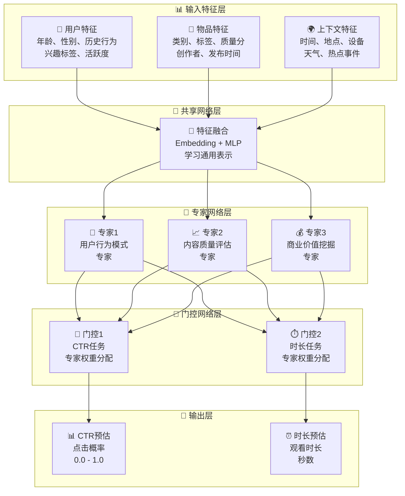
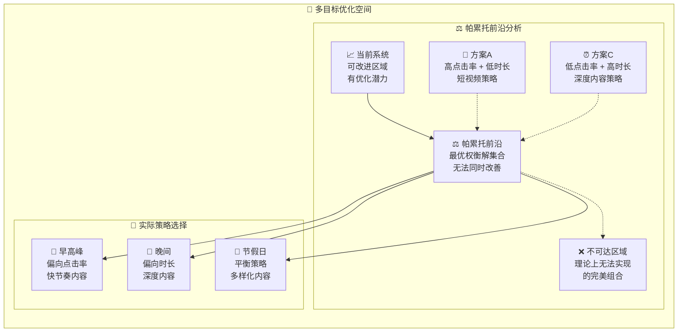

一个只追求"点击率"的推荐系统，可能会变成一个"标题党"的温床；一个只追求"用户时长"的系统，可能会让用户沉迷于低质量的"杀时间"内容。现代推荐系统早已不是单细胞生物，它需要在多个甚至相互冲突的目标之间寻找最佳平衡点。

这就是 **多目标优化（Multi-Objective Optimization, MOO）** 要解决的核心问题。它指的是在推荐过程中，同时优化两个或两个以上的目标，以实现更综合、更长期的平台价值。

## 🎯 常见的优化目标有哪些？

现代推荐系统通常需要同时考虑以下多个目标：

| 目标类型 | 具体指标 | 业务价值 | 潜在冲突 |
| :--- | :--- | :--- | :--- |
| **用户体验** | 点击率(CTR)、停留时长、用户满意度 | 提升用户粘性和活跃度 | 高CTR内容可能质量不高 |
| **平台收益** | 广告收入、会员转化、商品销售 | 直接的商业价值 | 过度商业化影响用户体验 |
| **内容生态** | 内容多样性、创作者公平性、新内容曝光 | 维护健康的内容生态 | 新内容质量可能不如热门内容 |
| **长期价值** | 用户留存、品牌形象、社会责任 | 可持续发展 | 短期收益与长期价值的权衡 |

### 目标冲突的典型案例

**案例一：点击率 vs 用户时长**
- 短视频容易获得点击，但用户可能很快划走
- 长视频点击门槛高，但一旦点击用户会观看更久

**案例二：精准性 vs 多样性**
- 推荐用户最喜欢的内容类型能保证高点击率
- 但过度精准会导致信息茧房，长期损害用户体验

**案例三：用户体验 vs 商业收入**
- 纯内容推荐用户体验最好
- 但适当的广告推荐是平台收入的重要来源

## 🔧 解决方案一：加权线性组合

这是最直观、最常用的多目标优化方法。

### 基本思路

1. 为每个目标分别训练一个预估模型（如CTR预估、时长预估、转化率预估）
2. 每个模型给出一个得分
3. 最终的排序分，就是所有目标得分的加权和

- **优点**：简单、灵活、易于实现和调整。业务方可以根据不同时期的运营重点，快速调整权重
- **缺点**：
  - **权重难以确定**：权重的设置非常依赖经验和大量的人工A/B测试，很难找到最优解
  - **线性假设过强**：现实中，不同目标之间的关系往往是非线性的，简单的线性组合可能无法捕捉到这种复杂关系
  - **无法处理约束**：有些目标可能存在硬约束（如广告比例不能超过20%），线性组合难以处理

## 🧠 解决方案二：多任务学习

这是一种更先进的方法，它在**模型层面**就试图同时学习多个目标。核心思想是：让不同的学习任务（目标）在模型的底层共享一部分网络结构，从而相互借鉴、相互补充信息，提升整体学习效果。

### MMoE模型详解

**MMoE (Multi-gate Mixture-of-Experts)** 是多任务学习在推荐系统中最成功的应用之一。

**核心组件**：

1. **专家网络 (Expert Networks)**：多个独立的神经网络，每个专家负责学习数据的不同方面
2. **门控网络 (Gate Networks)**：为每个任务分配一个门控网络，决定该任务应该"听取"哪些专家的意见
3. **任务塔 (Task Towers)**：每个任务的专用输出层

**工作原理**：
- 不同的专家网络会自动学习到数据的不同模式
- 门控网络为每个任务动态分配专家权重
- 相关性高的任务会倾向于使用相似的专家组合

### 多任务学习的优势

- **参数共享**：底层特征可以被多个任务共享，提高数据利用效率
- **正则化效果**：多个任务的联合训练起到了隐式正则化的作用，减少过拟合
- **知识迁移**：任务间可以相互借鉴，提升整体性能

## ⚖️ 解决方案三：帕累托优化

当多个目标确实存在根本性冲突时，我们需要寻找**帕累托最优解**。

### 帕累托前沿

在多目标优化中，帕累托前沿是指这样一个解集合：对于前沿上的任意一个解，我们无法在不损害其他目标的情况下改善某个目标。

### 寻找帕累托最优解的方法

**1. 进化算法**：如NSGA-II，通过模拟自然选择过程寻找多个帕累托最优解

**2. 约束优化**：将部分目标作为约束条件，优化主要目标

**3. 权重扫描**：系统性地改变权重组合，绘制帕累托前沿

## 🎪 实际应用中的策略

### 分层优化策略

在实际应用中，通常采用分层的方式处理多目标优化：

1. **召回层**：主要优化相关性，保证基础质量
2. **粗排层**：引入多样性和新颖性考虑
3. **精排层**：精细化多目标平衡
4. **重排层**：处理业务约束和公平性

### 动态权重调整

根据不同的场景和时间，动态调整各目标的权重：

| 场景 | 主要目标 | 权重策略 |
|------|----------|----------|
| **新用户** | 用户体验、留存 | 降低商业化权重 |
| **活跃用户** | 平衡各目标 | 标准权重配置 |
| **促销期间** | 转化率、收入 | 提高商业化权重 |
| **内容冷启动** | 多样性、公平性 | 提高探索权重 |

## 📖 **延伸阅读**

1. [Multi-Task Learning in Deep Neural Networks](https://arxiv.org/abs/1706.05098) - Ruder关于多任务学习的全面综述
2. [Modeling Task Relationships in Multi-task Learning](https://dl.acm.org/doi/10.1145/3097983.3098052) - MMoE模型的原始论文
3. [Multi-Objective Optimization Using Evolutionary Algorithms](https://www.wiley.com/en-us/Multi+Objective+Optimization+Using+Evolutionary+Algorithms-p-9780471873396) - Deb关于多目标进化算法的经典教材
4. [Recommender Systems Handbook](https://link.springer.com/book/10.1007/978-1-4899-7637-6) - 推荐系统手册中关于多目标优化的章节
5. [YouTube Recommendations: Multi-Objective Optimization](https://research.google/pubs/pub46488/) - YouTube推荐系统的多目标优化实践

> 🧠 **思考题**
>
> 1. 在一个新闻推荐系统中，"用户点击率"和"新闻质量"这两个目标可能存在冲突。你会如何设计一个平衡机制？
> 2. MMoE模型中的"专家网络"是如何自动分工的？你认为在推荐系统中，不同的专家可能会学到什么样的模式？
> 3. 如果你是一个短视频平台的算法负责人，面临"用户时长"和"创作者收入"的权衡，你会如何设计目标函数？

::: tip 🎉 章节小结

多目标优化是现代推荐系统的"必修课"，它将推荐从单一的"猜你喜欢"升级为复杂的"平衡艺术"。

- **目标冲突**：现代推荐系统需要在**用户体验、商业价值、内容生态、长期发展**等多个目标间寻找平衡
- **解决方案**：主要有三类——**加权线性组合**（简单直接）、**多任务学习**（如MMoE，技术先进）、**帕累托优化**（理论完备）
- **实践策略**：通常采用**分层优化**和**动态权重调整**的方式，在不同场景下灵活应对
- **核心挑战**：如何在保证系统整体健康的前提下，最大化各方利益的综合价值

:::

> 多目标优化，就是推荐系统在钢丝上的"平衡表演"：一手要抓住用户的心（体验），一手要抓住老板的钱包（收益），脚下还要踩稳内容生态的平衡木，稍有不慎就会"顾此失彼"，但正是这种"如履薄冰"的精妙平衡，才成就了真正卓越的推荐系统。 